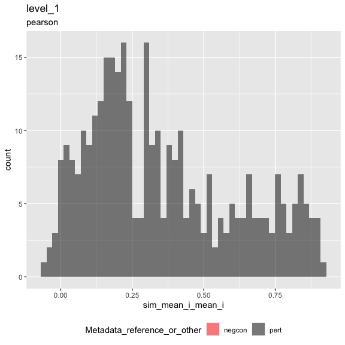
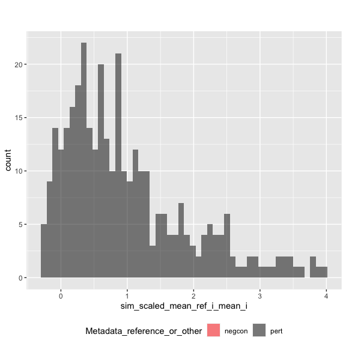
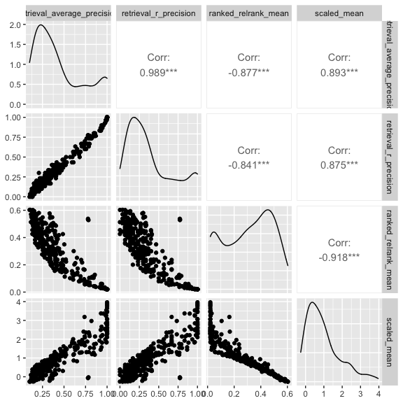

Inspect metrics
================

-   [1 Setup](#setup)
-   [2 Load metrics](#load-metrics)
-   [3 Inspect metrics](#inspect-metrics)
    -   [3.1 Functions](#functions)
    -   [3.2 Process metrics](#process-metrics)
        -   [3.2.1 Level 1](#level-1)
    -   [3.3 Plot metrics](#plot-metrics)
        -   [3.3.1 Level 1](#level-1-1)

# 1 Setup

``` r
library(magrittr)
library(tidyverse)
library(glue)
library(arrow)
library(matric)
library(logger)
source("utils.R")
```

``` r
knitr::opts_chunk$set(fig.height = 8, fig.width = 8, rows.print = 20)
```

``` r
cat(yaml::as.yaml(params))
```

    ## input_metrics_file_prefix: results/211ae0e1/metrics

# 2 Load metrics

``` r
metric_set_names <- c("level_1")

metric_sets <-
  map(metric_set_names, function(metric_set) {
    parquet_file <-
      with(params, glue("{input_metrics_file_prefix}_{metric_set}.parquet"))

    log_info("Reading {parquet_file} ...")

    arrow::read_parquet(glue(parquet_file))
  })

names(metric_sets) <- paste(metric_set_names, "metrics", sep = "_")

all_same_cols_rep <- attr(metric_sets[[1]], "all_same_cols_rep")
```

# 3 Inspect metrics

## 3.1 Functions

``` r
color_map <- c(
  "negcon" = "red",
  "pert" = "black"
)

plot_metric <-
  function(metrics,
           metric_name,
           plot_title,
           plot_subtitle) {
    # metrics <- level_1_metrics
    # metric_name <- "sim_scaled_mean_ref_i_mean_i"
    # plot_title <- experiment_tag
    # plot_subtitle <- data_level

    metric_sym <- sym(metric_name)

    p <-
      metrics %>%
      mutate(point_order = as.numeric(factor(
        Metadata_reference_or_other,
        levels = c("negcon", "pert"),
        ordered = TRUE
      ))) %>%
      arrange(desc(point_order)) %>%
      ggplot(aes(!!metric_sym,
        fill = Metadata_reference_or_other
      )) +
      geom_histogram(
        position = "identity",
        alpha = 0.5,
        bins = 50
      ) +
      scale_fill_manual(values = color_map) +
      ggtitle(plot_title, subtitle = plot_subtitle) +
      theme(legend.position = "bottom")

    list(fig1 = p)
  }
```

``` r
knitr::opts_chunk$set(fig.height = 6, fig.width = 6, rows.print = 20)
```

## 3.2 Process metrics

### 3.2.1 Level 1

``` r
level_1_metrics <-
  metric_sets[["level_1_metrics"]]
```

``` r
cat(yaml::as.yaml(attr(level_1_metrics, "params")))
```

    ## prepare_data:
    ##   input_profile_files:
    ##   - tag: ''
    ##     filename: https://github.com/broadinstitute/grit-benchmark/raw/main/1.calculate-metrics/cell-health/data//cell_health_merged_feature_select.csv.gz
    ##   output_profile_file: results/211ae0e1/profiles.parquet
    ##   data_path: https://github.com/broadinstitute/grit-benchmark/raw/main/1.calculate-metrics/cell-health/data/
    ##   reference_gene_codes:
    ##     Metadata_gene_name: Chr2
    ##   subsample_fraction: 1
    ##   shuffle: yes
    ## calculate_index:
    ##   input_profile_file: results/211ae0e1/profiles.parquet
    ##   output_index_file: results/211ae0e1/index.parquet
    ##   output_collatedindex_file: results/211ae0e1/collatedindex.parquet
    ##   sim_params:
    ##     drop_group:
    ##       Metadata_gene_name: EMPTY
    ##     reference:
    ##       Metadata_reference_or_other: reference
    ##     all_same_cols_ref:
    ##     - Metadata_cell_line
    ##     - Metadata_Plate
    ##     all_same_cols_rep:
    ##     - Metadata_cell_line
    ##     - Metadata_gene_name
    ##     - Metadata_pert_name
    ##     - Metadata_reference_or_other
    ##     all_same_cols_rep_ref: ~
    ##     any_different_cols_non_rep: ~
    ##     all_same_cols_non_rep: ~
    ##     all_different_cols_non_rep: ~
    ##     all_same_cols_group: ~
    ##     any_different_cols_group: ~
    ##     annotation_cols:
    ##     - Metadata_cell_line
    ##     - Metadata_gene_name
    ##     - Metadata_pert_name
    ##     - Metadata_reference_or_other
    ## calculate_metrics:
    ##   input_profile_file: results/211ae0e1/profiles.parquet
    ##   input_collatedindex_file: results/211ae0e1/collatedindex.parquet
    ##   output_collatedsim_file: results/211ae0e1/collatedsim.parquet
    ##   output_metrics_file_prefix: results/211ae0e1/metrics
    ##   similarity_method: pearson
    ##   parallel_workers: 8

## 3.3 Plot metrics

### 3.3.1 Level 1

``` r
result <-
  plot_metric(
    level_1_metrics,
    "sim_mean_i_mean_i",
    "level_1",
    attr(level_1_metrics, "metric_metadata")$method
  )
result$fig1
```

<!-- -->

``` r
result <-
  plot_metric(
    level_1_metrics,
    "sim_scaled_mean_ref_i_mean_i",
    "",
    ""
  )
result$fig1
```

<!-- -->

``` r
level_1_metrics %>%
  arrange(across(everything())) %>%
  head()
```

<div class="kable-table">

| Metadata\_cell\_line | Metadata\_gene\_name | Metadata\_pert\_name | Metadata\_reference\_or\_other | sim\_scaled\_mean\_ref\_i\_mean\_i | sim\_scaled\_mean\_ref\_i\_median\_i | sim\_scaled\_median\_ref\_i\_mean\_i | sim\_scaled\_median\_ref\_i\_median\_i | sim\_ranked\_relrank\_mean\_ref\_i\_mean\_i | sim\_ranked\_relrank\_mean\_ref\_i\_median\_i | sim\_ranked\_relrank\_median\_ref\_i\_mean\_i | sim\_ranked\_relrank\_median\_ref\_i\_median\_i | sim\_mean\_i\_mean\_i | sim\_mean\_i\_median\_i | sim\_median\_i\_mean\_i | sim\_median\_i\_median\_i | sim\_mean\_stat\_ref\_i\_mean\_i | sim\_mean\_stat\_ref\_i\_median\_i | sim\_sd\_stat\_ref\_i\_mean\_i | sim\_sd\_stat\_ref\_i\_median\_i | sim\_retrieval\_average\_precision\_ref\_i\_mean\_i | sim\_retrieval\_average\_precision\_ref\_i\_median\_i | sim\_retrieval\_r\_precision\_ref\_i\_mean\_i | sim\_retrieval\_r\_precision\_ref\_i\_median\_i |
|:---------------------|:---------------------|:---------------------|:-------------------------------|-----------------------------------:|-------------------------------------:|-------------------------------------:|---------------------------------------:|--------------------------------------------:|----------------------------------------------:|----------------------------------------------:|------------------------------------------------:|----------------------:|------------------------:|------------------------:|--------------------------:|---------------------------------:|-----------------------------------:|-------------------------------:|---------------------------------:|----------------------------------------------------:|------------------------------------------------------:|----------------------------------------------:|------------------------------------------------:|
| A549                 | AKT1                 | CHEK2-1              | pert                           |                          0.3324293 |                            0.1121111 |                            0.4786494 |                              0.2804689 |                                   0.4395833 |                                     0.4708333 |                                     0.3854167 |                                       0.4479167 |             0.1252860 |               0.2003604 |               0.1608522 |                 0.2442458 |                        0.0585171 |                          0.0583568 |                      0.2909307 |                        0.2967794 |                                           0.2321799 |                                             0.1262525 |                                     0.1666667 |                                       0.1000000 |
| A549                 | AKT1                 | KRAS-1               | pert                           |                          1.4782308 |                            1.4763000 |                            1.1598531 |                              1.2136648 |                                   0.1458333 |                                     0.1250000 |                                     0.1631944 |                                       0.1145833 |             0.5151567 |               0.5451372 |               0.4265651 |                 0.4294195 |                        0.1197381 |                          0.1169542 |                      0.2750371 |                        0.2788445 |                                           0.5189170 |                                             0.5200013 |                                     0.4000000 |                                       0.4000000 |
| A549                 | ARID1B               | EGFR-1               | pert                           |                          0.4137437 |                            0.7810374 |                            0.8363033 |                              1.5031119 |                                   0.4458333 |                                     0.3270833 |                                     0.3368056 |                                       0.1145833 |             0.1228602 |               0.1909307 |               0.2339611 |                 0.3673720 |                        0.0106936 |                          0.0197587 |                      0.2647873 |                        0.2502281 |                                           0.3174333 |                                             0.3267192 |                                     0.3333333 |                                       0.4000000 |
| A549                 | ARID1B               | MCL1-2               | pert                           |                         -0.1583051 |                           -0.3781036 |                           -0.1720371 |                             -0.4183913 |                                   0.5708333 |                                     0.6312500 |                                     0.5972222 |                                       0.7187500 |            -0.0204229 |              -0.0256380 |              -0.0252848 |                -0.0816272 |                        0.0301875 |                          0.0397173 |                      0.2602318 |                        0.2576446 |                                           0.1169126 |                                             0.0914993 |                                     0.0333333 |                                       0.0000000 |
| A549                 | ATF4                 | CCNE1-2              | pert                           |                          1.1667932 |                            1.1962561 |                            1.1890425 |                              1.1982313 |                                   0.1194444 |                                     0.1020833 |                                     0.0937500 |                                       0.0833333 |             0.7721245 |               0.7795367 |               0.7808501 |                 0.7945972 |                        0.3397504 |                          0.3380323 |                      0.3770050 |                        0.3712730 |                                           0.6093914 |                                             0.6523611 |                                     0.4333333 |                                       0.4000000 |
| A549                 | ATF4                 | Luc-1                | pert                           |                          0.7475640 |                            1.2127206 |                            0.9520216 |                              1.5251683 |                                   0.3499008 |                                     0.2038690 |                                     0.2861111 |                                       0.1145833 |             0.1590024 |               0.2213034 |               0.2174528 |                 0.3432120 |                       -0.0520173 |                         -0.1128108 |                      0.2698059 |                        0.2642779 |                                           0.5031543 |                                             0.5758293 |                                     0.4666667 |                                       0.5714286 |

</div>

``` r
level_1_metrics %>%
  select(
    sim_retrieval_average_precision_ref_i_mean_i,
    sim_retrieval_r_precision_ref_i_mean_i,
    sim_ranked_relrank_mean_ref_i_mean_i,
    sim_scaled_mean_ref_i_mean_i
  ) %>%
  rename_with(~ str_remove_all(., "sim_|_ref_i_mean_i"), matches("sim_")) %>%
  GGally::ggpairs(progress = FALSE)
```

<!-- -->
