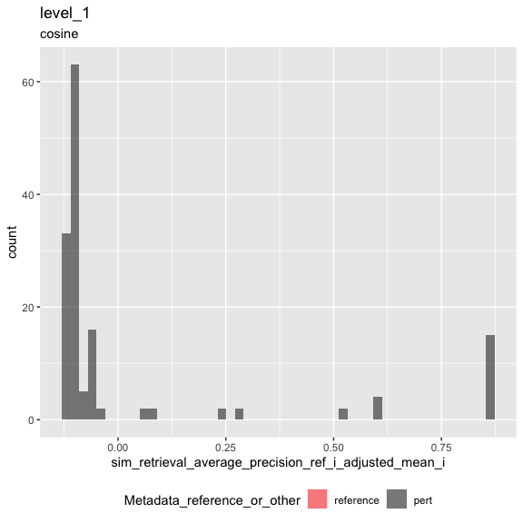
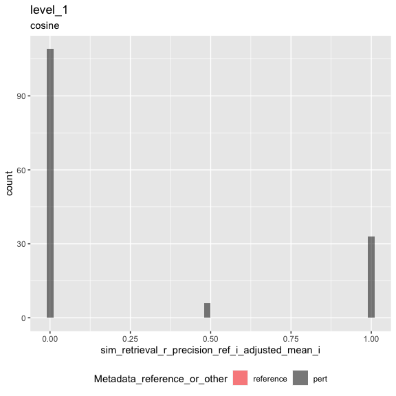
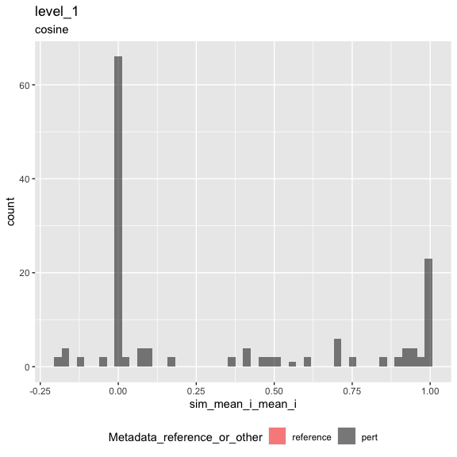
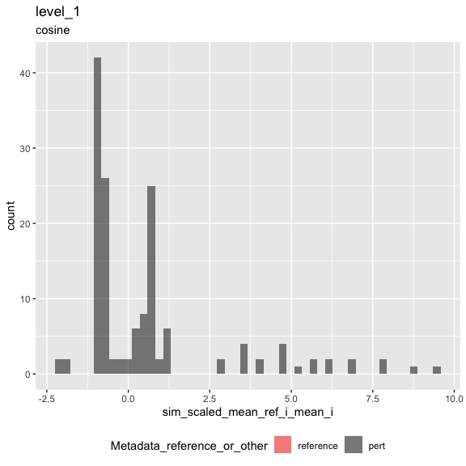
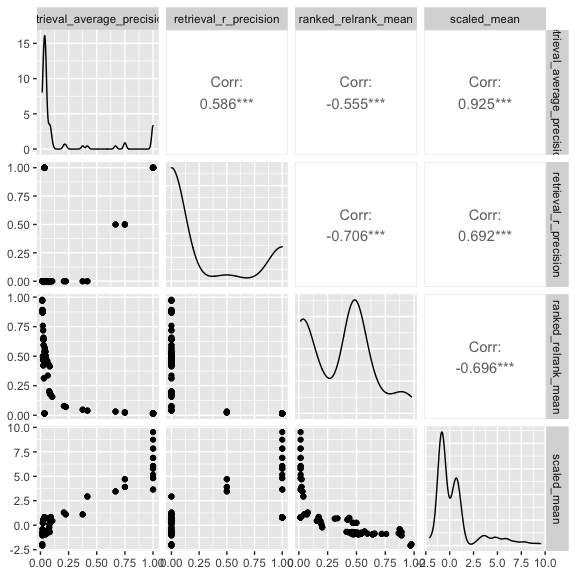

Inspect metrics
================

- <a href="#setup" id="toc-setup">1 Setup</a>
- <a href="#load-metrics" id="toc-load-metrics">2 Load metrics</a>
- <a href="#inspect-metrics" id="toc-inspect-metrics">3 Inspect
  metrics</a>
  - <a href="#functions" id="toc-functions">3.1 Functions</a>
  - <a href="#process-metrics" id="toc-process-metrics">3.2 Process
    metrics</a>
    - <a href="#level-1_0" id="toc-level-1_0">3.2.1 Level 1_0</a>
  - <a href="#process-metrics-1" id="toc-process-metrics-1">3.3 Process
    metrics</a>
    - <a href="#level-1" id="toc-level-1">3.3.1 Level 1</a>
  - <a href="#compute-null-thresholds" id="toc-compute-null-thresholds">3.4
    Compute null thresholds</a>
    - <a href="#level-1_0-1" id="toc-level-1_0-1">3.4.1 Level 1_0</a>
  - <a href="#plot-metrics" id="toc-plot-metrics">3.5 Plot metrics</a>
    - <a href="#level-1-1" id="toc-level-1-1">3.5.1 Level 1</a>

# 1 Setup

``` r
library(magrittr)
library(tidyverse)
library(glue)
library(arrow)
library(matric)
library(logger)
source("utils.R")
```

``` r
set.seed(42)
```

``` r
knitr::opts_chunk$set(fig.height = 8, fig.width = 8, rows.print = 20)
```

``` r
cat(yaml::as.yaml(params))
```

    ## input_metrics_file_prefix: results/217d5f86/metrics

# 2 Load metrics

``` r
metric_set_names <- c("level_1_0", "level_1")

metric_sets <-
  map(metric_set_names, function(metric_set) {
    parquet_file <-
      with(params, glue("{input_metrics_file_prefix}_{metric_set}.parquet"))

    log_info("Reading {parquet_file} ...")

    arrow::read_parquet(glue(parquet_file))
  })

names(metric_sets) <- paste(metric_set_names, "metrics", sep = "_")

all_same_cols_rep <- attr(metric_sets[[1]], "all_same_cols_rep")
```

# 3 Inspect metrics

## 3.1 Functions

``` r
color_map <- c(
  "reference" = "red",
  "pert" = "black"
)

plot_metric <-
  function(metrics,
           metric_name,
           plot_title,
           plot_subtitle) {

    metric_sym <- sym(metric_name)

    p <-
      metrics %>%
      mutate(point_order = as.numeric(factor(
        Metadata_reference_or_other,
        levels = c("reference", "pert"),
        ordered = TRUE
      ))) %>%
      arrange(desc(point_order)) %>%
      ggplot(aes(!!metric_sym,
        fill = Metadata_reference_or_other
      )) +
      geom_histogram(
        position = "identity",
        alpha = 0.5,
        bins = 50
      ) +
      scale_fill_manual(values = color_map) +
      ggtitle(plot_title, subtitle = plot_subtitle) +
      theme(legend.position = "bottom")

    list(fig1 = p)
  }
```

``` r
knitr::opts_chunk$set(fig.height = 6, fig.width = 6, rows.print = 20)
```

## 3.2 Process metrics

### 3.2.1 Level 1_0

``` r
level_1_0_metrics <-
  metric_sets[["level_1_0_metrics"]]
```

``` r
cat(yaml::as.yaml(attr(level_1_0_metrics, "params")))
```

    ## prepare_data:
    ##   input_profile_files:
    ##   - tag: ''
    ##     filename: /Users/shsingh/work/projects/2019_07_11_JUMP-CP/workspace/software/pilot-cpjump1-data/collated/2020_11_04_CPJUMP1/2020_11_04_CPJUMP1_U2OS_48_Compound_Standard_normalized_feature_select_negcon.parquet
    ##   output_profile_file: results/217d5f86/profiles.parquet
    ##   data_path: /Users/shsingh/work/projects/2019_07_11_JUMP-CP/workspace/software/pilot-cpjump1-data/collated/2020_11_04_CPJUMP1
    ##   reference_set:
    ##     Metadata_negcon_or_other: negcon
    ##   random_seed: 42
    ##   subsample_fraction: 1
    ##   subsample_pert_strata: ~
    ##   subsample_reference_strata: ~
    ##   shuffle: no
    ##   shuffle_bad_groups_threshold: ~
    ##   shuffle_group: ~
    ##   shuffle_strata: ~
    ##   shuffle_exclude: ~
    ##   aggregate_by:
    ##   - Metadata_cell_line
    ##   - Metadata_timepoint
    ##   - Metadata_experiment_type
    ##   - Metadata_experiment_condition
    ##   - Metadata_target
    ##   - Metadata_broad_sample
    ##   - Metadata_negcon_or_other
    ##   - Metadata_Well
    ##   filter_by:
    ##     input_metrics_file_prefix: results/43ef7f7c/metrics
    ##     metric_set: level_1_null_adjusted
    ##     metric: sim_retrieval_average_precision_ref_i_adjusted_mean_i
    ##     threshold: 0
    ## calculate_index:
    ##   input_profile_file: results/217d5f86/profiles.parquet
    ##   output_index_file: results/217d5f86/index.parquet
    ##   output_collatedindex_file: results/217d5f86/collatedindex.parquet
    ##   sim_params:
    ##     reference:
    ##       Metadata_reference_or_other: reference
    ##     all_same_cols_ref:
    ##     - Metadata_cell_line
    ##     - Metadata_timepoint
    ##     - Metadata_experiment_type
    ##     - Metadata_experiment_condition
    ##     all_same_cols_rep:
    ##     - Metadata_cell_line
    ##     - Metadata_timepoint
    ##     - Metadata_experiment_type
    ##     - Metadata_experiment_condition
    ##     - Metadata_target
    ##     - Metadata_reference_or_other
    ##     all_same_cols_rep_ref: ~
    ##     any_different_cols_non_rep: Metadata_broad_sample
    ##     all_same_cols_non_rep:
    ##     - Metadata_cell_line
    ##     - Metadata_timepoint
    ##     - Metadata_experiment_type
    ##     - Metadata_experiment_condition
    ##     all_different_cols_non_rep: Metadata_broad_sample
    ##     all_same_cols_group: ~
    ##     any_different_cols_group: ~
    ##     annotation_cols:
    ##     - Metadata_cell_line
    ##     - Metadata_timepoint
    ##     - Metadata_experiment_type
    ##     - Metadata_experiment_condition
    ##     - Metadata_target
    ##     - Metadata_broad_sample
    ##     - Metadata_reference_or_other
    ## calculate_metrics:
    ##   input_profile_file: results/217d5f86/profiles.parquet
    ##   input_collatedindex_file: results/217d5f86/collatedindex.parquet
    ##   output_collatedsim_file: results/217d5f86/collatedsim.parquet
    ##   output_metrics_file_prefix: results/217d5f86/metrics
    ##   similarity_method: cosine
    ##   parallel_workers: 8

## 3.3 Process metrics

### 3.3.1 Level 1

``` r
level_1_metrics <-
  metric_sets[["level_1_metrics"]]
```

``` r
cat(yaml::as.yaml(attr(level_1_metrics, "params")))
```

    ## prepare_data:
    ##   input_profile_files:
    ##   - tag: ''
    ##     filename: /Users/shsingh/work/projects/2019_07_11_JUMP-CP/workspace/software/pilot-cpjump1-data/collated/2020_11_04_CPJUMP1/2020_11_04_CPJUMP1_U2OS_48_Compound_Standard_normalized_feature_select_negcon.parquet
    ##   output_profile_file: results/217d5f86/profiles.parquet
    ##   data_path: /Users/shsingh/work/projects/2019_07_11_JUMP-CP/workspace/software/pilot-cpjump1-data/collated/2020_11_04_CPJUMP1
    ##   reference_set:
    ##     Metadata_negcon_or_other: negcon
    ##   random_seed: 42
    ##   subsample_fraction: 1
    ##   subsample_pert_strata: ~
    ##   subsample_reference_strata: ~
    ##   shuffle: no
    ##   shuffle_bad_groups_threshold: ~
    ##   shuffle_group: ~
    ##   shuffle_strata: ~
    ##   shuffle_exclude: ~
    ##   aggregate_by:
    ##   - Metadata_cell_line
    ##   - Metadata_timepoint
    ##   - Metadata_experiment_type
    ##   - Metadata_experiment_condition
    ##   - Metadata_target
    ##   - Metadata_broad_sample
    ##   - Metadata_negcon_or_other
    ##   - Metadata_Well
    ##   filter_by:
    ##     input_metrics_file_prefix: results/43ef7f7c/metrics
    ##     metric_set: level_1_null_adjusted
    ##     metric: sim_retrieval_average_precision_ref_i_adjusted_mean_i
    ##     threshold: 0
    ## calculate_index:
    ##   input_profile_file: results/217d5f86/profiles.parquet
    ##   output_index_file: results/217d5f86/index.parquet
    ##   output_collatedindex_file: results/217d5f86/collatedindex.parquet
    ##   sim_params:
    ##     reference:
    ##       Metadata_reference_or_other: reference
    ##     all_same_cols_ref:
    ##     - Metadata_cell_line
    ##     - Metadata_timepoint
    ##     - Metadata_experiment_type
    ##     - Metadata_experiment_condition
    ##     all_same_cols_rep:
    ##     - Metadata_cell_line
    ##     - Metadata_timepoint
    ##     - Metadata_experiment_type
    ##     - Metadata_experiment_condition
    ##     - Metadata_target
    ##     - Metadata_reference_or_other
    ##     all_same_cols_rep_ref: ~
    ##     any_different_cols_non_rep: Metadata_broad_sample
    ##     all_same_cols_non_rep:
    ##     - Metadata_cell_line
    ##     - Metadata_timepoint
    ##     - Metadata_experiment_type
    ##     - Metadata_experiment_condition
    ##     all_different_cols_non_rep: Metadata_broad_sample
    ##     all_same_cols_group: ~
    ##     any_different_cols_group: ~
    ##     annotation_cols:
    ##     - Metadata_cell_line
    ##     - Metadata_timepoint
    ##     - Metadata_experiment_type
    ##     - Metadata_experiment_condition
    ##     - Metadata_target
    ##     - Metadata_broad_sample
    ##     - Metadata_reference_or_other
    ## calculate_metrics:
    ##   input_profile_file: results/217d5f86/profiles.parquet
    ##   input_collatedindex_file: results/217d5f86/collatedindex.parquet
    ##   output_collatedsim_file: results/217d5f86/collatedsim.parquet
    ##   output_metrics_file_prefix: results/217d5f86/metrics
    ##   similarity_method: cosine
    ##   parallel_workers: 8

## 3.4 Compute null thresholds

### 3.4.1 Level 1_0

``` r
level_1_0_metrics %>%
  distinct(sim_stat_signal_n_ref_i,
           sim_stat_background_n_ref_i)
```

| sim_stat_signal_n\_ref_i | sim_stat_background_n\_ref_i |
|-------------------------:|-----------------------------:|
|                        1 |                           64 |

``` r
#' Estimate statitics of the distribution of information retrieval metrics under the null hypothesis 
#'
#' @param m Number of positive examples (= number of replicates - 1)
#' @param n Number of negative examples (= number of controls, or number of non-replicates)
#' @param nn Number of simulations (default = 1000)
#'
#' @return statistics 
#'
retrieval_baseline <- function(m, n, nn = 10000, percentile = 0.90) {

  # average precision
  
  y_rank <- 1 - (seq(m + n) / (m + n))
  
  ap_empirical <-
    map_dbl(seq(nn), function(i) {
      x <- as.factor(sample(c(rep(FALSE, n), rep(TRUE, m))))
      
      yardstick::average_precision_vec(x, y_rank, event_level = "second")
      
    })
  
  average_precision_stat <- quantile(ap_empirical, c(percentile), names = FALSE)
  
  # R-precision

  k <- m
  
  r_precision_stat <-
    qhyper(p = percentile,
           m = m,
           n = n,
           k = k) / k
  
  data.frame(
    m = m, 
    n = n,
    sim_stat_average_precision_null = average_precision_stat,
    sim_stat_r_precision_null = r_precision_stat
  )
  
}
```

``` r
null_thresholds <-
  level_1_0_metrics %>%
  distinct(sim_stat_signal_n_ref_i,
           sim_stat_background_n_ref_i) %>%
  pmap_df(function(sim_stat_signal_n_ref_i,
                   sim_stat_background_n_ref_i)
  {
    log_info(
      "Compute retrieval random baseline for m = {sim_stat_signal_n_ref_i}, n = {sim_stat_background_n_ref_i}"
    )
    retrieval_baseline(m = sim_stat_signal_n_ref_i,
                       n = sim_stat_background_n_ref_i)
  })
```

``` r
level_1_0_metrics <-
  level_1_0_metrics %>%
  inner_join(null_thresholds,
             by = c("sim_stat_signal_n_ref_i" = "m",
                    "sim_stat_background_n_ref_i" = "n"))
```

``` r
level_1_0_metrics_null_adjusted <-
  level_1_0_metrics %>%
  mutate(
    sim_retrieval_average_precision_ref_i_adjusted =
      sim_retrieval_average_precision_ref_i - sim_stat_average_precision_null,
    sim_retrieval_r_precision_ref_i_adjusted =
      sim_retrieval_r_precision_ref_i - sim_stat_r_precision_null
  )
```

``` r
summary_cols <- attr(level_1_0_metrics, "all_same_cols_rep")

annotation_cols <- attr(level_1_0_metrics, "params")$calculate_index$sim_params$annotation_cols

annotation_cols_full <- unique(c(summary_cols, annotation_cols))

metadata <-
  level_1_0_metrics %>%
  dplyr::distinct(across(all_of(annotation_cols_full)))
```

``` r
level_1_metrics_null_adjusted <- 
  level_1_0_metrics_null_adjusted %>%
  ungroup() %>%
  group_by(dplyr::across(dplyr::all_of(summary_cols))) %>%
  summarise(across(starts_with("sim_"),
                   list(mean_i = mean, median_i = median)),
            .groups = "keep") %>%
  dplyr::inner_join(metadata, by = summary_cols) %>%
  dplyr::select(all_of(annotation_cols_full), dplyr::everything()) %>%
  ungroup()
```

``` r
stopifnot(
  compare::compare(
    level_1_metrics_null_adjusted %>%
      select(all_of(names(level_1_metrics))),
    level_1_metrics,
    ignoreAttrs = TRUE
  )$result
)
```

``` r
metric_set <- "level_1_null_adjusted"

parquet_file <-
  with(params,
       glue("{input_metrics_file_prefix}_{metric_set}.parquet"))

log_info("Writing {parquet_file} ...")

level_1_metrics_null_adjusted %>%
  arrow::write_parquet(glue(parquet_file))
```

## 3.5 Plot metrics

### 3.5.1 Level 1

``` r
result <-
  plot_metric(
    level_1_metrics_null_adjusted,
    "sim_retrieval_average_precision_ref_i_adjusted_mean_i",
    "level_1",
    attr(level_1_metrics, "metric_metadata")$method
  )
result$fig1
```

<!-- -->

``` r
level_1_metrics_null_adjusted %>%
  mutate(above_threshold = sim_retrieval_average_precision_ref_i_adjusted_mean_i > 0) %>%
  count(above_threshold)
```

| above_threshold |   n |
|:----------------|----:|
| FALSE           | 119 |
| TRUE            |  29 |

``` r
result <-
  plot_metric(
    level_1_metrics_null_adjusted,
    "sim_retrieval_r_precision_ref_i_adjusted_mean_i",
    "level_1",
    attr(level_1_metrics, "metric_metadata")$method
  )
result$fig1
```

<!-- -->

``` r
level_1_metrics_null_adjusted %>%
  mutate(above_threshold = sim_retrieval_r_precision_ref_i_adjusted_mean_i > 0) %>%
  count(above_threshold)
```

| above_threshold |   n |
|:----------------|----:|
| FALSE           | 109 |
| TRUE            |  39 |

``` r
result <-
  plot_metric(
    level_1_metrics,
    "sim_mean_i_mean_i",
    "level_1",
    attr(level_1_metrics, "metric_metadata")$method
  )
result$fig1
```

<!-- -->

``` r
result <-
  plot_metric(
    level_1_metrics,
    "sim_scaled_mean_ref_i_mean_i",
    "level_1",
    attr(level_1_metrics, "metric_metadata")$method
  )
result$fig1
```

<!-- -->

``` r
level_1_metrics %>%
  arrange(across(everything())) %>%
  head()
```

| Metadata_cell_line | Metadata_timepoint | Metadata_experiment_type | Metadata_experiment_condition | Metadata_target | Metadata_reference_or_other | Metadata_broad_sample  | sim_scaled_mean_ref_i\_mean_i | sim_scaled_mean_ref_i\_median_i | sim_scaled_median_ref_i\_mean_i | sim_scaled_median_ref_i\_median_i | sim_ranked_relrank_mean_ref_i\_mean_i | sim_ranked_relrank_mean_ref_i\_median_i | sim_ranked_relrank_median_ref_i\_mean_i | sim_ranked_relrank_median_ref_i\_median_i | sim_mean_i\_mean_i | sim_mean_i\_median_i | sim_median_i\_mean_i | sim_median_i\_median_i | sim_mean_stat_ref_i\_mean_i | sim_mean_stat_ref_i\_median_i | sim_sd_stat_ref_i\_mean_i | sim_sd_stat_ref_i\_median_i | sim_stat_signal_n\_ref_i\_mean_i | sim_stat_signal_n\_ref_i\_median_i | sim_stat_background_n\_ref_i\_mean_i | sim_stat_background_n\_ref_i\_median_i | sim_retrieval_average_precision_ref_i\_mean_i | sim_retrieval_average_precision_ref_i\_median_i | sim_retrieval_r\_precision_ref_i\_mean_i | sim_retrieval_r\_precision_ref_i\_median_i |
|:-------------------|:-------------------|:-------------------------|:------------------------------|:----------------|:----------------------------|:-----------------------|------------------------------:|--------------------------------:|--------------------------------:|----------------------------------:|--------------------------------------:|----------------------------------------:|----------------------------------------:|------------------------------------------:|-------------------:|---------------------:|---------------------:|-----------------------:|----------------------------:|------------------------------:|--------------------------:|----------------------------:|---------------------------------:|-----------------------------------:|-------------------------------------:|---------------------------------------:|----------------------------------------------:|------------------------------------------------:|-----------------------------------------:|-------------------------------------------:|
| U2OS               | 48                 | Compound                 | Standard                      | ABL1            | pert                        | BRD-K59831625-001-03-9 |                    -0.8881977 |                      -0.8881977 |                      -0.8881977 |                        -0.8881977 |                             0.7187500 |                               0.7187500 |                               0.7187500 |                                 0.7187500 |          0.0000000 |            0.0000000 |            0.0000000 |              0.0000000 |                   0.3006352 |                     0.3006352 |                 0.2465034 |                   0.2465034 |                                1 |                                  1 |                                   64 |                                     64 |                                     0.0233266 |                                       0.0233266 |                                        0 |                                          0 |
| U2OS               | 48                 | Compound                 | Standard                      | ABL1            | pert                        | BRD-K87632963-001-03-0 |                    -0.8881977 |                      -0.8881977 |                      -0.8881977 |                        -0.8881977 |                             0.7187500 |                               0.7187500 |                               0.7187500 |                                 0.7187500 |          0.0000000 |            0.0000000 |            0.0000000 |              0.0000000 |                   0.3006352 |                     0.3006352 |                 0.2465034 |                   0.2465034 |                                1 |                                  1 |                                   64 |                                     64 |                                     0.0233266 |                                       0.0233266 |                                        0 |                                          0 |
| U2OS               | 48                 | Compound                 | Standard                      | ADA             | pert                        | BRD-K66788707-001-14-3 |                    -0.6899333 |                      -0.6899333 |                      -0.6899333 |                        -0.6899333 |                             0.4609375 |                               0.4609375 |                               0.4609375 |                                 0.4609375 |          0.0000000 |            0.0000000 |            0.0000000 |              0.0000000 |                   0.3188975 |                     0.3188975 |                 0.2741812 |                   0.2741812 |                                1 |                                  1 |                                   64 |                                     64 |                                     0.0602041 |                                       0.0602041 |                                        0 |                                          0 |
| U2OS               | 48                 | Compound                 | Standard                      | ADA             | pert                        | BRD-K91543828-001-02-0 |                    -0.6899333 |                      -0.6899333 |                      -0.6899333 |                        -0.6899333 |                             0.4609375 |                               0.4609375 |                               0.4609375 |                                 0.4609375 |          0.0000000 |            0.0000000 |            0.0000000 |              0.0000000 |                   0.3188975 |                     0.3188975 |                 0.2741812 |                   0.2741812 |                                1 |                                  1 |                                   64 |                                     64 |                                     0.0602041 |                                       0.0602041 |                                        0 |                                          0 |
| U2OS               | 48                 | Compound                 | Standard                      | ADH1C           | pert                        | BRD-K55567017-001-12-3 |                    -0.6991588 |                      -0.6991588 |                      -0.6991588 |                        -0.6991588 |                             0.8906250 |                               0.8906250 |                               0.8906250 |                                 0.8906250 |         -0.1162419 |           -0.1162419 |           -0.1162419 |             -0.1162419 |                  -0.0063187 |                    -0.0063187 |                 0.1571106 |                   0.1571106 |                                1 |                                  1 |                                   64 |                                     64 |                                     0.0175493 |                                       0.0175493 |                                        0 |                                          0 |
| U2OS               | 48                 | Compound                 | Standard                      | ADH1C           | pert                        | BRD-K56810756-003-07-7 |                    -0.6991588 |                      -0.6991588 |                      -0.6991588 |                        -0.6991588 |                             0.8906250 |                               0.8906250 |                               0.8906250 |                                 0.8906250 |         -0.1162419 |           -0.1162419 |           -0.1162419 |             -0.1162419 |                  -0.0063187 |                    -0.0063187 |                 0.1571106 |                   0.1571106 |                                1 |                                  1 |                                   64 |                                     64 |                                     0.0175493 |                                       0.0175493 |                                        0 |                                          0 |

``` r
level_1_metrics %>%
  select(
    sim_retrieval_average_precision_ref_i_mean_i,
    sim_retrieval_r_precision_ref_i_mean_i,
    sim_ranked_relrank_mean_ref_i_mean_i,
    sim_scaled_mean_ref_i_mean_i
  ) %>%
  rename_with(~ str_remove_all(., "sim_|_ref_i_mean_i"), matches("sim_")) %>%
  GGally::ggpairs(progress = FALSE)
```

<!-- -->
