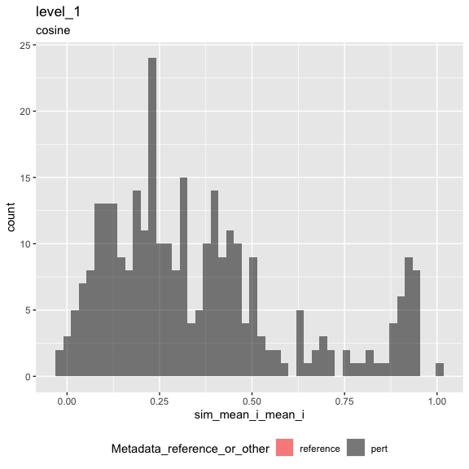

Inspect metrics
================

-   [1 Setup](#setup)
-   [2 Load metrics](#load-metrics)
-   [3 Inspect metrics](#inspect-metrics)
    -   [3.1 Functions](#functions)
    -   [3.2 Process metrics](#process-metrics)
        -   [3.2.1 Level 1](#level-1)
    -   [3.3 Plot metrics](#plot-metrics)
        -   [3.3.1 Level 1](#level-1-1)

# 1 Setup

``` r
library(magrittr)
library(tidyverse)
library(glue)
library(arrow)
library(matric)
library(logger)
source("utils.R")
```

``` r
knitr::opts_chunk$set(fig.height = 8, fig.width = 8, rows.print = 20)
```

``` r
cat(yaml::as.yaml(params))
```

    ## input_metrics_file_prefix: results/43ef7f7c/metrics

# 2 Load metrics

``` r
metric_set_names <- c("level_1")

metric_sets <-
  map(metric_set_names, function(metric_set) {
    parquet_file <-
      with(params, glue("{input_metrics_file_prefix}_{metric_set}.parquet"))

    log_info("Reading {parquet_file} ...")

    arrow::read_parquet(glue(parquet_file))
  })

names(metric_sets) <- paste(metric_set_names, "metrics", sep = "_")

all_same_cols_rep <- attr(metric_sets[[1]], "all_same_cols_rep")
```

# 3 Inspect metrics

## 3.1 Functions

``` r
color_map <- c(
  "reference" = "red",
  "pert" = "black"
)

plot_metric <-
  function(metrics,
           metric_name,
           plot_title,
           plot_subtitle) {

    metric_sym <- sym(metric_name)

    p <-
      metrics %>%
      mutate(point_order = as.numeric(factor(
        Metadata_reference_or_other,
        levels = c("reference", "pert"),
        ordered = TRUE
      ))) %>%
      arrange(desc(point_order)) %>%
      ggplot(aes(!!metric_sym,
        fill = Metadata_reference_or_other
      )) +
      geom_histogram(
        position = "identity",
        alpha = 0.5,
        bins = 50
      ) +
      scale_fill_manual(values = color_map) +
      ggtitle(plot_title, subtitle = plot_subtitle) +
      theme(legend.position = "bottom")

    list(fig1 = p)
  }
```

``` r
knitr::opts_chunk$set(fig.height = 6, fig.width = 6, rows.print = 20)
```

## 3.2 Process metrics

### 3.2.1 Level 1

``` r
level_1_metrics <-
  metric_sets[["level_1_metrics"]]
```

``` r
cat(yaml::as.yaml(attr(level_1_metrics, "params")))
```

    ## prepare_data:
    ##   input_profile_files:
    ##   - tag: ''
    ##     filename: /Users/shsingh/work/projects/2019_07_11_JUMP-CP/workspace/software/pilot-cpjump1-data/collated/2020_11_04_CPJUMP1/2020_11_04_CPJUMP1_U2OS_48_Compound_Standard_normalized_feature_select_negcon.parquet
    ##   output_profile_file: results/43ef7f7c/profiles.parquet
    ##   data_path: /Users/shsingh/work/projects/2019_07_11_JUMP-CP/workspace/software/pilot-cpjump1-data/collated/2020_11_04_CPJUMP1
    ##   reference_set:
    ##     Metadata_negcon_or_other: negcon
    ##   random_seed: 42
    ##   subsample_fraction: 1
    ##   subsample_pert_strata: ~
    ##   subsample_reference_strata: ~
    ##   shuffle: no
    ##   shuffle_bad_groups_threshold: ~
    ##   shuffle_group: ~
    ##   shuffle_strata: ~
    ##   shuffle_exclude: ~
    ##   aggregate_by: ~
    ## calculate_index:
    ##   input_profile_file: results/43ef7f7c/profiles.parquet
    ##   output_index_file: results/43ef7f7c/index.parquet
    ##   output_collatedindex_file: results/43ef7f7c/collatedindex.parquet
    ##   sim_params:
    ##     reference:
    ##       Metadata_reference_or_other: reference
    ##     all_same_cols_ref:
    ##     - Metadata_cell_line
    ##     - Metadata_timepoint
    ##     - Metadata_experiment_type
    ##     - Metadata_experiment_condition
    ##     - Metadata_Plate
    ##     all_same_cols_rep:
    ##     - Metadata_cell_line
    ##     - Metadata_timepoint
    ##     - Metadata_experiment_type
    ##     - Metadata_experiment_condition
    ##     - Metadata_target
    ##     - Metadata_broad_sample
    ##     - Metadata_control_type
    ##     - Metadata_reference_or_other
    ##     all_same_cols_rep_ref: ~
    ##     any_different_cols_non_rep: ~
    ##     all_same_cols_non_rep: ~
    ##     all_different_cols_non_rep: ~
    ##     all_same_cols_group: ~
    ##     any_different_cols_group: ~
    ##     annotation_cols:
    ##     - Metadata_cell_line
    ##     - Metadata_timepoint
    ##     - Metadata_experiment_type
    ##     - Metadata_experiment_condition
    ##     - Metadata_target
    ##     - Metadata_broad_sample
    ##     - Metadata_control_type
    ##     - Metadata_reference_or_other
    ## calculate_metrics:
    ##   input_profile_file: results/43ef7f7c/profiles.parquet
    ##   input_collatedindex_file: results/43ef7f7c/collatedindex.parquet
    ##   output_collatedsim_file: results/43ef7f7c/collatedsim.parquet
    ##   output_metrics_file_prefix: results/43ef7f7c/metrics
    ##   similarity_method: cosine
    ##   parallel_workers: 8

## 3.3 Plot metrics

### 3.3.1 Level 1

``` r
result <-
  plot_metric(
    level_1_metrics,
    "sim_mean_i_mean_i",
    "level_1",
    attr(level_1_metrics, "metric_metadata")$method
  )
result$fig1
```

<!-- -->

``` r
result <-
  plot_metric(
    level_1_metrics,
    "sim_scaled_mean_ref_i_mean_i",
    "level_1",
    attr(level_1_metrics, "metric_metadata")$method
  )
result$fig1
```

<!-- -->

``` r
level_1_metrics %>%
  arrange(across(everything())) %>%
  head()
```

<div class="kable-table">

| Metadata\_cell\_line | Metadata\_timepoint | Metadata\_experiment\_type | Metadata\_experiment\_condition | Metadata\_target | Metadata\_broad\_sample | Metadata\_control\_type | Metadata\_reference\_or\_other | sim\_scaled\_mean\_ref\_i\_mean\_i | sim\_scaled\_mean\_ref\_i\_median\_i | sim\_scaled\_median\_ref\_i\_mean\_i | sim\_scaled\_median\_ref\_i\_median\_i | sim\_ranked\_relrank\_mean\_ref\_i\_mean\_i | sim\_ranked\_relrank\_mean\_ref\_i\_median\_i | sim\_ranked\_relrank\_median\_ref\_i\_mean\_i | sim\_ranked\_relrank\_median\_ref\_i\_median\_i | sim\_mean\_i\_mean\_i | sim\_mean\_i\_median\_i | sim\_median\_i\_mean\_i | sim\_median\_i\_median\_i | sim\_mean\_stat\_ref\_i\_mean\_i | sim\_mean\_stat\_ref\_i\_median\_i | sim\_sd\_stat\_ref\_i\_mean\_i | sim\_sd\_stat\_ref\_i\_median\_i | sim\_stat\_signal\_n\_ref\_i\_mean\_i | sim\_stat\_signal\_n\_ref\_i\_median\_i | sim\_stat\_background\_n\_ref\_i\_mean\_i | sim\_stat\_background\_n\_ref\_i\_median\_i | sim\_retrieval\_average\_precision\_ref\_i\_mean\_i | sim\_retrieval\_average\_precision\_ref\_i\_median\_i | sim\_retrieval\_r\_precision\_ref\_i\_mean\_i | sim\_retrieval\_r\_precision\_ref\_i\_median\_i |
|:---------------------|:--------------------|:---------------------------|:--------------------------------|:-----------------|:------------------------|:------------------------|:-------------------------------|-----------------------------------:|-------------------------------------:|-------------------------------------:|---------------------------------------:|--------------------------------------------:|----------------------------------------------:|----------------------------------------------:|------------------------------------------------:|----------------------:|------------------------:|------------------------:|--------------------------:|---------------------------------:|-----------------------------------:|-------------------------------:|---------------------------------:|--------------------------------------:|----------------------------------------:|------------------------------------------:|--------------------------------------------:|----------------------------------------------------:|------------------------------------------------------:|----------------------------------------------:|------------------------------------------------:|
| U2OS                 | 48                  | Compound                   | Standard                        | ABL1             | BRD-K59831625-001-03-9  | NA                      | pert                           |                          5.9201311 |                            6.0037305 |                            5.8984264 |                              5.9648045 |                                   0.0156250 |                                     0.0156250 |                                     0.0156250 |                                       0.0156250 |             0.8956206 |               0.8929055 |               0.8926783 |                 0.8934769 |                        0.0183663 |                          0.0159729 |                      0.1494614 |                        0.1478708 |                                     3 |                                       3 |                                        64 |                                          64 |                                           1.0000000 |                                             1.0000000 |                                     1.0000000 |                                       1.0000000 |
| U2OS                 | 48                  | Compound                   | Standard                        | ABL1             | BRD-K87632963-001-03-0  | NA                      | pert                           |                          0.8741042 |                            1.2745949 |                            1.2253288 |                              1.7188401 |                                   0.2200521 |                                     0.1953125 |                                     0.1250000 |                                       0.0859375 |             0.1795694 |               0.2271438 |               0.2324350 |                 0.2854464 |                        0.0747892 |                          0.0496875 |                      0.2009291 |                        0.1585299 |                                     3 |                                       3 |                                        64 |                                          64 |                                           0.3481720 |                                             0.3571429 |                                     0.3333333 |                                       0.3333333 |
| U2OS                 | 48                  | Compound                   | Standard                        | ADA              | BRD-K66788707-001-14-3  | NA                      | pert                           |                          5.4088661 |                            5.3553888 |                            5.4423107 |                              5.3776505 |                                   0.0156250 |                                     0.0156250 |                                     0.0156250 |                                       0.0156250 |             0.8186864 |               0.8217368 |               0.8236872 |                 0.8291644 |                        0.0087410 |                          0.0069209 |                      0.1541036 |                        0.1518496 |                                     3 |                                       3 |                                        64 |                                          64 |                                           1.0000000 |                                             1.0000000 |                                     1.0000000 |                                       1.0000000 |
| U2OS                 | 48                  | Compound                   | Standard                        | ADA              | BRD-K91543828-001-02-0  | NA                      | pert                           |                          1.6101132 |                            2.1821740 |                            2.2764463 |                              2.9307230 |                                   0.1614583 |                                     0.1380208 |                                     0.0859375 |                                       0.0390625 |             0.3486825 |               0.4522069 |               0.4771869 |                 0.6211466 |                        0.0542909 |                          0.0160121 |                      0.2473146 |                        0.2213472 |                                     3 |                                       3 |                                        64 |                                          64 |                                           0.5099425 |                                             0.6077176 |                                     0.4166667 |                                       0.5000000 |
| U2OS                 | 48                  | Compound                   | Standard                        | ADH1C            | BRD-K55567017-001-12-3  | NA                      | pert                           |                          1.0760981 |                            0.8799534 |                            1.1022571 |                              0.9322840 |                                   0.1979167 |                                     0.2265625 |                                     0.1406250 |                                       0.1484375 |             0.2228940 |               0.2084651 |               0.2308279 |                 0.2333592 |                        0.0138281 |                          0.0027270 |                      0.2241117 |                        0.2046160 |                                     3 |                                       3 |                                        64 |                                          64 |                                           0.3076011 |                                             0.1825998 |                                     0.2500000 |                                       0.1666667 |
| U2OS                 | 48                  | Compound                   | Standard                        | ADH1C            | BRD-K56810756-003-07-7  | NA                      | pert                           |                          1.1106274 |                            1.0618561 |                            0.9368075 |                              0.7703879 |                                   0.1627604 |                                     0.1484375 |                                     0.1718750 |                                       0.1640625 |             0.2554586 |               0.2622748 |               0.2171882 |                 0.1944572 |                        0.0273825 |                          0.0195260 |                      0.2009595 |                        0.1973994 |                                     3 |                                       3 |                                        64 |                                          64 |                                           0.2264220 |                                             0.2386243 |                                     0.1666667 |                                       0.1666667 |

</div>

``` r
level_1_metrics %>%
  select(
    sim_retrieval_average_precision_ref_i_mean_i,
    sim_retrieval_r_precision_ref_i_mean_i,
    sim_ranked_relrank_mean_ref_i_mean_i,
    sim_scaled_mean_ref_i_mean_i
  ) %>%
  rename_with(~ str_remove_all(., "sim_|_ref_i_mean_i"), matches("sim_")) %>%
  GGally::ggpairs(progress = FALSE)
```

<!-- -->
