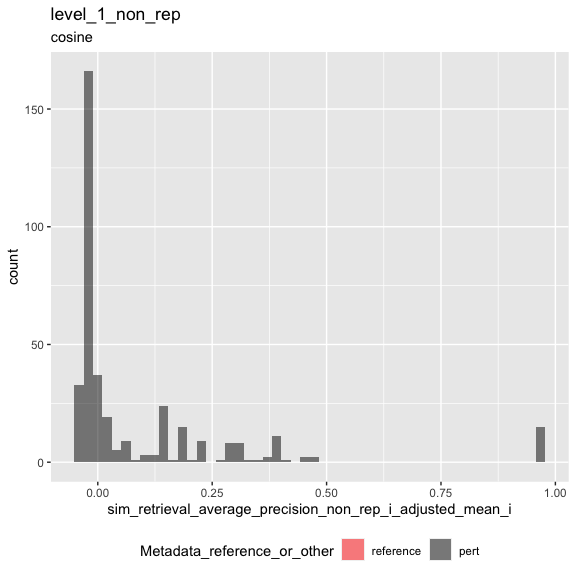
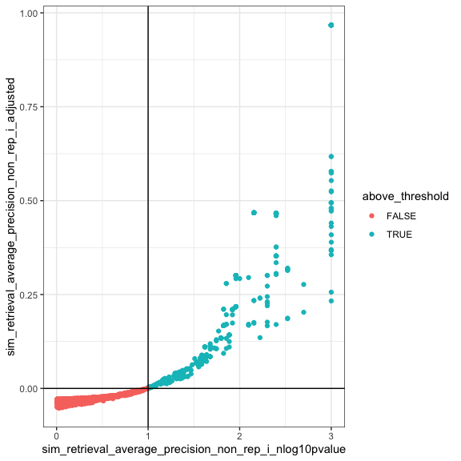
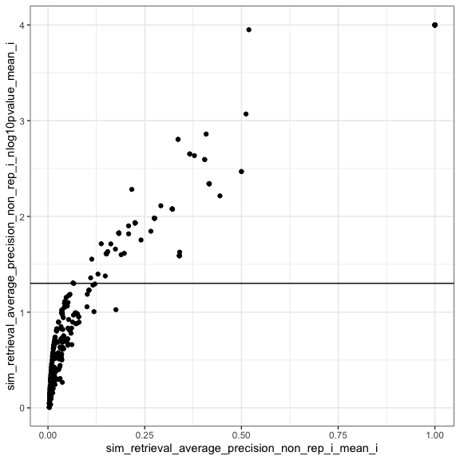
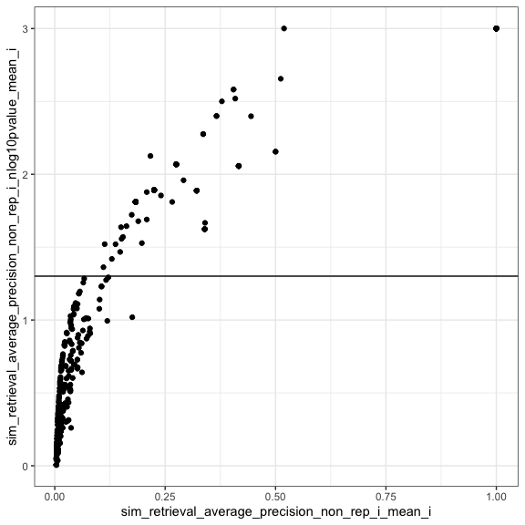
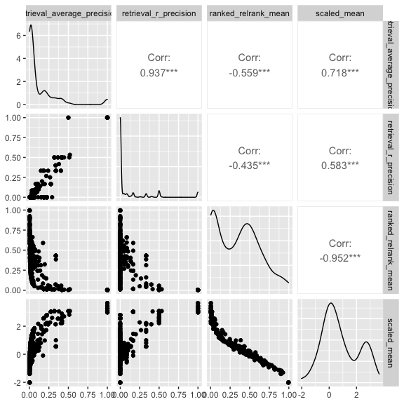

Inspect metrics
================

- <a href="#setup" id="toc-setup">1 Setup</a>
- <a href="#load-metrics" id="toc-load-metrics">2 Load metrics</a>
- <a href="#inspect-metrics" id="toc-inspect-metrics">3 Inspect
  metrics</a>
  - <a href="#functions" id="toc-functions">3.1 Functions</a>
  - <a href="#process-metrics" id="toc-process-metrics">3.2 Process
    metrics</a>
    - <a href="#level-1_0" id="toc-level-1_0">3.2.1 Level 1_0</a>
    - <a href="#level-1" id="toc-level-1">3.2.2 Level 1</a>
  - <a href="#compute-null-thresholds" id="toc-compute-null-thresholds">3.3
    Compute null thresholds</a>
  - <a href="#compute-p-values-and-adjust-metrics"
    id="toc-compute-p-values-and-adjust-metrics">3.4 Compute p-values and
    adjust metrics</a>
    - <a href="#level-1_0-1" id="toc-level-1_0-1">3.4.1 Level 1_0</a>
  - <a href="#aggregate-metrics" id="toc-aggregate-metrics">3.5 Aggregate
    metrics</a>
    - <a href="#level-1-1" id="toc-level-1-1">3.5.1 Level 1</a>
  - <a href="#plot-metrics" id="toc-plot-metrics">3.6 Plot metrics</a>
    - <a href="#level-1-2" id="toc-level-1-2">3.6.1 Level 1</a>

# 1 Setup

``` r
library(magrittr)
library(tidyverse)
library(glue)
library(arrow)
library(matric)
library(logger)
source("utils.R")
```

``` r
set.seed(params$random_seed)
```

``` r
knitr::opts_chunk$set(fig.height = 8, fig.width = 8, rows.print = 20)
```

``` r
cat(yaml::as.yaml(params))
```

    ## input_metrics_file_prefix: results/4413769c/metrics
    ## background_type: non_rep
    ## random_seed: 42

``` r
type <- params$background_type
```

# 2 Load metrics

``` r
metric_set_names <- c(glue("level_1_0_{type}"), glue("level_1_{type}"))

metric_sets <-
  map(metric_set_names, function(metric_set) {
    parquet_file <-
      with(params, glue("{input_metrics_file_prefix}_{metric_set}.parquet"))

    log_info("Reading {parquet_file} ...")

    arrow::read_parquet(glue(parquet_file))
  })

names(metric_sets) <- paste(metric_set_names, "metrics", sep = "_")

all_same_cols_rep <- attr(metric_sets[[1]], "all_same_cols_rep")
```

# 3 Inspect metrics

## 3.1 Functions

``` r
color_map <- c(
  "reference" = "red",
  "pert" = "black"
)

plot_metric <-
  function(metrics,
           metric_name,
           plot_title,
           plot_subtitle) {

    metric_sym <- sym(metric_name)

    p <-
      metrics %>%
      mutate(point_order = as.numeric(factor(
        Metadata_reference_or_other,
        levels = c("reference", "pert"),
        ordered = TRUE
      ))) %>%
      arrange(desc(point_order)) %>%
      ggplot(aes(!!metric_sym,
        fill = Metadata_reference_or_other
      )) +
      geom_histogram(
        position = "identity",
        alpha = 0.5,
        bins = 50
      ) +
      scale_fill_manual(values = color_map) +
      ggtitle(plot_title, subtitle = plot_subtitle) +
      theme(legend.position = "bottom")

    list(fig1 = p)
  }
```

``` r
#' Estimate statitics of the distribution of information retrieval metrics under the null hypothesis 
#'
#' @param m Number of positive examples (= number of replicates - 1)
#' @param n Number of negative examples (= number of controls, or number of non-replicates)
#' @param nn Number of simulations (default = 10000)
#'
#' @return statistics 
#'
retrieval_baseline <- function(m, n, nn = 10000, percentile = 0.90) {

  # average precision
  
  y_rank <- 1 - (seq(m + n) / (m + n))
  
  average_precision_null_samples <-
    map_dbl(seq(nn), function(i) {
      x <- as.factor(sample(c(rep(FALSE, n), rep(TRUE, m))))
      
      yardstick::average_precision_vec(x, y_rank, event_level = "second")
      
    })
  
  average_precision_stat <- quantile(average_precision_null_samples, c(percentile), names = FALSE)
  
  # R-precision

  k <- m
  
  r_precision_stat <-
    qhyper(p = percentile,
           m = m,
           n = n,
           k = k) / k
  
  data.frame(
    m = m, 
    n = n,
    sim_stat_average_precision_null = average_precision_stat,
    sim_stat_r_precision_null = r_precision_stat,
    sim_stat_average_precision_null_samples = average_precision_null_samples
  ) %>%
    nest(sim_stat_average_precision_null_samples = c(sim_stat_average_precision_null_samples))
  
}
retrieval_baseline(1, 1, 10)
```

|   m |   n | sim_stat_average_precision_null | sim_stat_r\_precision_null | sim_stat_average_precision_null_samples          |
|----:|----:|--------------------------------:|---------------------------:|:-------------------------------------------------|
|   1 |   1 |                               1 |                          1 | 0.5, 0.5, 1.0, 1.0, 0.5, 0.5, 0.5, 0.5, 1.0, 1.0 |

``` r
knitr::opts_chunk$set(fig.height = 6, fig.width = 6, rows.print = 20)
```

## 3.2 Process metrics

### 3.2.1 Level 1_0

``` r
level_1_0_metrics <-
  metric_sets[[glue("level_1_0_{type}_metrics")]]
```

``` r
cat(yaml::as.yaml(attr(level_1_0_metrics, "params")))
```

    ## prepare_data:
    ##   input_profile_files:
    ##   - tag: BR00116991
    ##     filename: /Users/shsingh/work/projects/2019_07_11_JUMP-CP/workspace/software/2021_Chandrasekaran_submitted/profiles/2020_11_04_CPJUMP1/BR00116991/BR00116991_normalized_feature_select_negcon_batch.csv.gz
    ##   - tag: BR00116992
    ##     filename: /Users/shsingh/work/projects/2019_07_11_JUMP-CP/workspace/software/2021_Chandrasekaran_submitted/profiles/2020_11_04_CPJUMP1/BR00116992/BR00116992_normalized_feature_select_negcon_batch.csv.gz
    ##   - tag: BR00116993
    ##     filename: /Users/shsingh/work/projects/2019_07_11_JUMP-CP/workspace/software/2021_Chandrasekaran_submitted/profiles/2020_11_04_CPJUMP1/BR00116993/BR00116993_normalized_feature_select_negcon_batch.csv.gz
    ##   - tag: BR00116994
    ##     filename: /Users/shsingh/work/projects/2019_07_11_JUMP-CP/workspace/software/2021_Chandrasekaran_submitted/profiles/2020_11_04_CPJUMP1/BR00116994/BR00116994_normalized_feature_select_negcon_batch.csv.gz
    ##   output_profile_file: results/4413769c/profiles.parquet
    ##   data_path: /Users/shsingh/work/projects/2019_07_11_JUMP-CP/workspace/software/2021_Chandrasekaran_submitted/profiles/2020_11_04_CPJUMP1
    ##   reference_set:
    ##     Metadata_control_type: negcon
    ##   random_seed: 42
    ##   external_metadata:
    ##     file: /Users/shsingh/work/projects/2019_07_11_JUMP-CP/workspace/software/2021_Chandrasekaran_submitted/benchmark/input/JUMP-Target-1_compound_metadata_additional_annotations.tsv
    ##     include_cols:
    ##     - Metadata_broad_sample
    ##     - Metadata_target_list
    ##     join_cols:
    ##       Metadata_broad_sample: Metadata_broad_sample
    ##   subsample_fraction: 1
    ##   subsample_pert_strata: ~
    ##   subsample_reference_strata: ~
    ##   shuffle: no
    ##   shuffle_bad_groups_threshold: ~
    ##   shuffle_group: ~
    ##   shuffle_strata: ~
    ##   shuffle_exclude: ~
    ##   aggregate_by:
    ##   - Metadata_broad_sample
    ##   - Metadata_control_type
    ##   - Metadata_Well
    ##   filter_by:
    ##     input_metrics_file_prefix: results/892889a3/metrics
    ##     metric_set: level_1_ref_null_adjusted
    ##     metric: sim_retrieval_average_precision_ref_i_adjusted_mean_i
    ##     threshold: 0
    ##   add_dummy_metadata_column: yes
    ##   split_rows_on_column: Metadata_target_list
    ## calculate_index:
    ##   input_profile_file: results/4413769c/profiles.parquet
    ##   output_index_file: results/4413769c/index.parquet
    ##   output_collatedindex_file: results/4413769c/collatedindex.parquet
    ##   sim_params:
    ##     reference:
    ##       Metadata_reference_or_other: reference
    ##     all_same_cols_ref: ~
    ##     all_same_cols_rep:
    ##     - Metadata_target_list_split
    ##     - Metadata_reference_or_other
    ##     all_same_cols_rep_ref: ~
    ##     any_different_cols_non_rep: Metadata_broad_sample
    ##     all_same_cols_non_rep: Metadata_dummy
    ##     all_different_cols_non_rep: Metadata_broad_sample
    ##     all_same_cols_group: ~
    ##     any_different_cols_group: ~
    ##     annotation_cols:
    ##     - Metadata_target_list_split
    ##     - Metadata_reference_or_other
    ## calculate_metrics:
    ##   input_profile_file: results/4413769c/profiles.parquet
    ##   input_collatedindex_file: results/4413769c/collatedindex.parquet
    ##   output_collatedsim_file: results/4413769c/collatedsim.parquet
    ##   output_metrics_file_prefix: results/4413769c/metrics
    ##   similarity_method: cosine
    ##   parallel_workers: 8

### 3.2.2 Level 1

``` r
level_1_metrics <-
  metric_sets[[glue("level_1_{type}_metrics")]]
```

``` r
cat(yaml::as.yaml(attr(level_1_metrics, "params")))
```

    ## prepare_data:
    ##   input_profile_files:
    ##   - tag: BR00116991
    ##     filename: /Users/shsingh/work/projects/2019_07_11_JUMP-CP/workspace/software/2021_Chandrasekaran_submitted/profiles/2020_11_04_CPJUMP1/BR00116991/BR00116991_normalized_feature_select_negcon_batch.csv.gz
    ##   - tag: BR00116992
    ##     filename: /Users/shsingh/work/projects/2019_07_11_JUMP-CP/workspace/software/2021_Chandrasekaran_submitted/profiles/2020_11_04_CPJUMP1/BR00116992/BR00116992_normalized_feature_select_negcon_batch.csv.gz
    ##   - tag: BR00116993
    ##     filename: /Users/shsingh/work/projects/2019_07_11_JUMP-CP/workspace/software/2021_Chandrasekaran_submitted/profiles/2020_11_04_CPJUMP1/BR00116993/BR00116993_normalized_feature_select_negcon_batch.csv.gz
    ##   - tag: BR00116994
    ##     filename: /Users/shsingh/work/projects/2019_07_11_JUMP-CP/workspace/software/2021_Chandrasekaran_submitted/profiles/2020_11_04_CPJUMP1/BR00116994/BR00116994_normalized_feature_select_negcon_batch.csv.gz
    ##   output_profile_file: results/4413769c/profiles.parquet
    ##   data_path: /Users/shsingh/work/projects/2019_07_11_JUMP-CP/workspace/software/2021_Chandrasekaran_submitted/profiles/2020_11_04_CPJUMP1
    ##   reference_set:
    ##     Metadata_control_type: negcon
    ##   random_seed: 42
    ##   external_metadata:
    ##     file: /Users/shsingh/work/projects/2019_07_11_JUMP-CP/workspace/software/2021_Chandrasekaran_submitted/benchmark/input/JUMP-Target-1_compound_metadata_additional_annotations.tsv
    ##     include_cols:
    ##     - Metadata_broad_sample
    ##     - Metadata_target_list
    ##     join_cols:
    ##       Metadata_broad_sample: Metadata_broad_sample
    ##   subsample_fraction: 1
    ##   subsample_pert_strata: ~
    ##   subsample_reference_strata: ~
    ##   shuffle: no
    ##   shuffle_bad_groups_threshold: ~
    ##   shuffle_group: ~
    ##   shuffle_strata: ~
    ##   shuffle_exclude: ~
    ##   aggregate_by:
    ##   - Metadata_broad_sample
    ##   - Metadata_control_type
    ##   - Metadata_Well
    ##   filter_by:
    ##     input_metrics_file_prefix: results/892889a3/metrics
    ##     metric_set: level_1_ref_null_adjusted
    ##     metric: sim_retrieval_average_precision_ref_i_adjusted_mean_i
    ##     threshold: 0
    ##   add_dummy_metadata_column: yes
    ##   split_rows_on_column: Metadata_target_list
    ## calculate_index:
    ##   input_profile_file: results/4413769c/profiles.parquet
    ##   output_index_file: results/4413769c/index.parquet
    ##   output_collatedindex_file: results/4413769c/collatedindex.parquet
    ##   sim_params:
    ##     reference:
    ##       Metadata_reference_or_other: reference
    ##     all_same_cols_ref: ~
    ##     all_same_cols_rep:
    ##     - Metadata_target_list_split
    ##     - Metadata_reference_or_other
    ##     all_same_cols_rep_ref: ~
    ##     any_different_cols_non_rep: Metadata_broad_sample
    ##     all_same_cols_non_rep: Metadata_dummy
    ##     all_different_cols_non_rep: Metadata_broad_sample
    ##     all_same_cols_group: ~
    ##     any_different_cols_group: ~
    ##     annotation_cols:
    ##     - Metadata_target_list_split
    ##     - Metadata_reference_or_other
    ## calculate_metrics:
    ##   input_profile_file: results/4413769c/profiles.parquet
    ##   input_collatedindex_file: results/4413769c/collatedindex.parquet
    ##   output_collatedsim_file: results/4413769c/collatedsim.parquet
    ##   output_metrics_file_prefix: results/4413769c/metrics
    ##   similarity_method: cosine
    ##   parallel_workers: 8

## 3.3 Compute null thresholds

``` r
level_1_0_metrics %>%
  distinct(across(all_of(c(
    glue("sim_stat_signal_n_{type}_i"),
    glue("sim_stat_background_n_{type}_i")
  ))))
```

| sim_stat_signal_n\_non_rep_i | sim_stat_background_n\_non_rep_i |
|-----------------------------:|---------------------------------:|
|                            1 |                              287 |
|                            2 |                              287 |
|                            3 |                              287 |
|                            4 |                              287 |
|                            9 |                              287 |
|                            6 |                              287 |
|                            5 |                              287 |
|                            8 |                              287 |
|                            1 |                              286 |
|                            4 |                              286 |
|                            3 |                              286 |
|                            5 |                              286 |
|                            7 |                              287 |
|                            2 |                              286 |
|                            8 |                              286 |
|                            6 |                              286 |

``` r
pow <- 1.3
points <- level_1_0_metrics[[glue("sim_stat_background_n_{type}_i")]]
max_value <- max(points)
break_point <- ceiling(seq(1, ceiling((max_value)^(1/pow)), 1)**(pow))
points_mapped <- points %>% map_dbl(function(i) break_point[min(which(break_point > i))])

level_1_0_metrics <-
  level_1_0_metrics %>%
  mutate(sim_stat_background_n_mapped = points_mapped)
```

``` r
level_1_0_metrics %>%
  distinct(across(all_of(c(
    glue("sim_stat_signal_n_{type}_i"),
    "sim_stat_background_n_mapped"
    #glue("sim_stat_background_n_{type}_i")
  ))))
```

| sim_stat_signal_n\_non_rep_i | sim_stat_background_n\_mapped |
|-----------------------------:|------------------------------:|
|                            1 |                           289 |
|                            2 |                           289 |
|                            3 |                           289 |
|                            4 |                           289 |
|                            9 |                           289 |
|                            6 |                           289 |
|                            5 |                           289 |
|                            8 |                           289 |
|                            7 |                           289 |

``` r
future::plan(future::multisession, workers = 14)
```

``` r
null_thresholds <-
  level_1_0_metrics %>%
  distinct(across(all_of(c(
    glue("sim_stat_signal_n_{type}_i"),
    "sim_stat_background_n_mapped"
    #glue("sim_stat_background_n_{type}_i")
  )))) %>%
  rename(m = 1, n = 2) %>%
  furrr::future_pmap_dfr(function(m, n)
  {
    log_info("Compute retrieval random baseline for m = {m}, n = {n}")
    retrieval_baseline(m = m, n = n, nn = 1000)
  },
  .options = furrr::furrr_options(seed = params$random_seed))

null_thresholds %>%
  arrange(m, n)
```

|   m |   n | sim_stat_average_precision_null | sim_stat_r\_precision_null | sim_stat_average_precision_null_samples                                                                                                                                                                                                                                                                                                                                                                                                                                                                                                                                                                                                                                                                                                                                                                                                                                                                                                                                                                                                                                                                                                                                                                                                                                                                                                                                                                                                                                                                                                                                                                                                                                                                                                                                                                                                                                                                                                                                                                                                                                                                                                                                                                                                                                                                                                                                                                                                                                                                                                                                                                                                                                                                                                                                                                                                                                                                                                                                                                                                                                                                                                                                                                                                                                                                                                                                                                                                                                                                                                                                                                                                                                                                                                                                                                                                                                                                                                                                                                                                                                                                                                                                                                                                                                                                                                                                                                                                                                                                                                                                                                                                                                                                                                                                                                                                                                                                                                                                                                                                                                                                                                                                                                                                                                                                                                                                                                                                                                                                                                                                                                                                                                                                                                                                                                                                                                                                                                                                                                                                                                                                                                                                                                                                                                                                                                                                                                                                                                                                                                                                                                                                                                                                                                                                                                                                                                                                                                                                                                                                                                                                                                                                                                                                                                                                                                                                                                                                                                                                                                                                                                                                                                                                                                                                                                                                                                                                                                                                                                                                                                                                                                                                                                                                                                                                                                                                                                                                                                                                                                                                                                                                                                                                                                                                                                                                                                                                                                                                                                                                                                                                                                                                                                                                                                                                                                                                                                                                                                                                                                                                                                                                                                                                                                                                                                                                                                                                                                                                                                                                                                                                                                                                                                                                                                                                                                                                                                                                                                                                                                                                                                                                                                                                                                                                                                                                                                                                                                                                                                                                                                                                                                                                                                                                                                                                                                                                                                                                                                                                                                                                                                                                                                                                                                                                                                                                                                                                                                                                                                                                                                                                                                                                                                                                                                                                                                                                                                                                                                                                                                                                                                                                                                                                                                                                                                                                                                                                                                                                                                                                                                                                                                                                                                                                                                                                                                                                                                                                                                                                                                |
|----:|----:|--------------------------------:|---------------------------:|:---------------------------------------------------------------------------------------------------------------------------------------------------------------------------------------------------------------------------------------------------------------------------------------------------------------------------------------------------------------------------------------------------------------------------------------------------------------------------------------------------------------------------------------------------------------------------------------------------------------------------------------------------------------------------------------------------------------------------------------------------------------------------------------------------------------------------------------------------------------------------------------------------------------------------------------------------------------------------------------------------------------------------------------------------------------------------------------------------------------------------------------------------------------------------------------------------------------------------------------------------------------------------------------------------------------------------------------------------------------------------------------------------------------------------------------------------------------------------------------------------------------------------------------------------------------------------------------------------------------------------------------------------------------------------------------------------------------------------------------------------------------------------------------------------------------------------------------------------------------------------------------------------------------------------------------------------------------------------------------------------------------------------------------------------------------------------------------------------------------------------------------------------------------------------------------------------------------------------------------------------------------------------------------------------------------------------------------------------------------------------------------------------------------------------------------------------------------------------------------------------------------------------------------------------------------------------------------------------------------------------------------------------------------------------------------------------------------------------------------------------------------------------------------------------------------------------------------------------------------------------------------------------------------------------------------------------------------------------------------------------------------------------------------------------------------------------------------------------------------------------------------------------------------------------------------------------------------------------------------------------------------------------------------------------------------------------------------------------------------------------------------------------------------------------------------------------------------------------------------------------------------------------------------------------------------------------------------------------------------------------------------------------------------------------------------------------------------------------------------------------------------------------------------------------------------------------------------------------------------------------------------------------------------------------------------------------------------------------------------------------------------------------------------------------------------------------------------------------------------------------------------------------------------------------------------------------------------------------------------------------------------------------------------------------------------------------------------------------------------------------------------------------------------------------------------------------------------------------------------------------------------------------------------------------------------------------------------------------------------------------------------------------------------------------------------------------------------------------------------------------------------------------------------------------------------------------------------------------------------------------------------------------------------------------------------------------------------------------------------------------------------------------------------------------------------------------------------------------------------------------------------------------------------------------------------------------------------------------------------------------------------------------------------------------------------------------------------------------------------------------------------------------------------------------------------------------------------------------------------------------------------------------------------------------------------------------------------------------------------------------------------------------------------------------------------------------------------------------------------------------------------------------------------------------------------------------------------------------------------------------------------------------------------------------------------------------------------------------------------------------------------------------------------------------------------------------------------------------------------------------------------------------------------------------------------------------------------------------------------------------------------------------------------------------------------------------------------------------------------------------------------------------------------------------------------------------------------------------------------------------------------------------------------------------------------------------------------------------------------------------------------------------------------------------------------------------------------------------------------------------------------------------------------------------------------------------------------------------------------------------------------------------------------------------------------------------------------------------------------------------------------------------------------------------------------------------------------------------------------------------------------------------------------------------------------------------------------------------------------------------------------------------------------------------------------------------------------------------------------------------------------------------------------------------------------------------------------------------------------------------------------------------------------------------------------------------------------------------------------------------------------------------------------------------------------------------------------------------------------------------------------------------------------------------------------------------------------------------------------------------------------------------------------------------------------------------------------------------------------------------------------------------------------------------------------------------------------------------------------------------------------------------------------------------------------------------------------------------------------------------------------------------------------------------------------------------------------------------------------------------------------------------------------------------------------------------------------------------------------------------------------------------------------------------------------------------------------------------------------------------------------------------------------------------------------------------------------------------------------------------------------------------------------------------------------------------------------------------------------------------------------------------------------------------------------------------------------------------------------------------------------------------------------------------------------------------------------------------------------------------------------------------------------------------------------------------------------------------------------------------------------------------------------------------------------------------------------------------------------------------------------------------------------------------------------------------------------------------------------------------------------------------------------------------------------------------------------------------------------------------------------------------------------------------------------------------------------------------------------------------------------------------------------------------------------------------------------------------------------------------------------------------------------------------------------------------------------------------------------------------------------------------------------------------------------------------------------------------------------------------------------------------------------------------------------------------------------------------------------------------------------------------------------------------------------------------------------------------------------------------------------------------------------------------------------------------------------------------------------------------------------------------------------------------------------------------------------------------------------------------------------------------------------------------------------------------------------------------------------------------------------------------------------------------------------------------------------------------------------------------------------------------------------------------------------------------------------------------------------------------------------------------------------------------------------------------------------------------------------------------------------------------------------------------------------------------------------------------------------------------------------------------------------------------------------------------------------------------------------------------------------------------------------------------------------------------------------------------------------------------------------------------------------------------------------------------------------------------------------------------------------------------------------------------------------------------------------------------------------------------------------------------------------------------------------------------------------------------------------------------------------------------------------------------------------------------------------------------------------------------------------------------------------------------------------------------------------------------------------------------------------------------------------------------------------------------------------------------------------------------------------------------------------------------------------------------------------------------------------------------------------------------------------------------------------------------------------------------------------------------------------------------------------------------------------------------------------------------------------------------------------------------------------------------------------------------------------------------------------------------------------------------------------------------------------------------------------------------------------------------------------------------------------------------------------------------------------------------------------------------------------------------------------------------------------------------------------------------------------------------------------------------------------------------------------------------------------------------------------------------------------------------------------------------------------------------------------------------------------------------------------------------------------------------------------------------------------------------------------------------------------------------------------|
|   1 | 289 |                       0.0323656 |                  0.0000000 | 0.003584229, 0.009259259, 0.008333333, 0.004098361, 0.006369427, 0.005988024, 0.005235602, 0.008695652, 0.004651163, 0.007246377, 0.011764706, 0.003496503, 0.003676471, 0.006849315, 0.004950495, 0.005952381, 0.003448276, 0.005464481, 0.004761905, 0.200000000, 0.004854369, 0.008547009, 0.004464286, 0.014705882, 0.017241379, 0.003759398, 0.004464286, 0.003773585, 0.006451613, 0.004807692, 0.006756757, 0.008000000, 0.004854369, 0.006802721, 0.009090909, 0.003571429, 0.006060606, 0.012820513, 0.015151515, 0.008928571, 0.007812500, 0.005208333, 0.047619048, 0.010101010, 0.005376344, 0.003802281, 0.005847953, 0.019230769, 0.003663004, 0.008620690, 0.009523810, 0.062500000, 0.125000000, 0.004608295, 0.005681818, 0.041666667, 0.008264463, 0.010752688, 0.003546099, 0.006578947, 0.008196721, 0.003861004, 0.055555556, 0.008474576, 0.009259259, 0.008474576, 0.004761905, 0.004310345, 0.014084507, 0.004201681, 0.009433962, 0.003787879, 0.008474576, 0.009523810, 0.005847953, 0.035714286, 0.010989011, 0.004950495, 0.027027027, 0.004405286, 0.003636364, 0.004149378, 0.009708738, 0.016393443, 0.003584229, 0.003968254, 0.021739130, 0.004926108, 0.006097561, 0.023809524, 0.008333333, 0.003546099, 0.010526316, 0.003921569, 0.016393443, 0.027777778, 0.003802281, 0.005681818, 0.071428571, 0.250000000, 0.003891051, 0.003937008, 0.015384615, 0.004081633, 0.004366812, 0.013513514, 0.008130081, 0.010204082, 0.005434783, 0.005263158, 0.006493506, 0.004032258, 0.030303030, 0.062500000, 0.003533569, 0.018867925, 0.004424779, 0.005494505, 0.004672897, 0.003984064, 0.008064516, 0.004048583, 0.009259259, 0.003717472, 0.007751938, 0.013888889, 0.003533569, 0.007812500, 0.004651163, 0.008403361, 0.020408163, 0.003802281, 0.007751938, 0.003546099, 0.090909091, 0.021276596, 0.007518797, 0.003558719, 0.011235955, 0.003875969, 0.004761905, 0.012820513, 0.007518797, 0.083333333, 0.007575758, 0.011627907, 0.035714286, 0.005952381, 0.004366812, 0.004000000, 0.010000000, 0.008130081, 0.004651163, 0.003731343, 0.003875969, 0.004739336, 0.006493506, 0.004807692, 0.004524887, 0.005555556, 0.004273504, 0.016393443, 0.006944444, 0.013888889, 0.166666667, 0.009090909, 0.006369427, 0.014492754, 0.008695652, 0.008620690, 0.010989011, 0.005952381, 0.004048583, 0.034482759, 0.004273504, 0.005780347, 0.011627907, 0.003484321, 0.500000000, 0.004464286, 0.007751938, 0.058823529, 0.004219409, 0.005988024, 0.006622517, 0.047619048, 0.004219409, 0.003875969, 0.027027027, 0.003787879, 0.004761905, 0.015873016, 0.004807692, 0.005917160, 0.003496503, 0.007042254, 0.005025126, 0.005347594, 0.009259259, 0.004065041, 0.016129032, 0.003571429, 0.009615385, 0.007407407, 0.006329114, 0.025641026, 0.006410256, 0.003597122, 0.003952569, 0.004424779, 0.010526316, 0.016666667, 0.005882353, 0.005291005, 0.006849315, 0.004464286, 0.005494505, 0.013698630, 0.058823529, 0.012820513, 1.000000000, 0.062500000, 0.016666667, 0.030303030, 0.025641026, 0.004878049, 0.004854369, 0.012345679, 0.034482759, 0.003521127, 0.011363636, 0.013513514, 0.005681818, 0.008130081, 0.011494253, 0.004347826, 0.003610108, 0.019607843, 0.003861004, 0.004132231, 0.007575758, 0.007194245, 0.006535948, 0.004901961, 0.003703704, 0.027777778, 0.003816794, 0.007936508, 0.004048583, 0.013698630, 0.062500000, 0.011494253, 0.004048583, 0.005208333, 0.020000000, 0.004016064, 0.004975124, 0.029411765, 0.076923077, 0.004098361, 0.009090909, 0.003558719, 0.013333333, 1.000000000, 0.003802281, 0.005714286, 0.006410256, 0.012195122, 0.005813953, 0.008695652, 0.003676471, 0.003508772, 0.011904762, 0.004651163, 0.010101010, 0.004149378, 0.035714286, 0.008064516, 0.004201681, 0.100000000, 0.005988024, 0.012658228, 0.020408163, 0.007462687, 0.003690037, 0.003610108, 0.004048583, 0.250000000, 0.007633588, 0.032258065, 0.013513514, 0.050000000, 0.004504505, 0.004424779, 0.004694836, 0.004464286, 0.006097561, 0.013157895, 0.006535948, 0.020833333, 0.038461538, 0.005494505, 0.020833333, 0.003597122, 0.003891051, 0.003703704, 0.004901961, 1.000000000, 0.007407407, 0.030303030, 0.005025126, 0.005347594, 0.006493506, 0.020833333, 0.040000000, 0.010752688, 0.004739336, 0.005347594, 0.032258065, 0.017241379, 0.004901961, 0.007246377, 0.011904762, 0.004310345, 0.006493506, 0.013698630, 0.004608295, 0.013698630, 0.003546099, 0.003717472, 0.004784689, 0.022727273, 0.006024096, 0.008620690, 0.047619048, 0.013513514, 0.007692308, 0.047619048, 0.016393443, 0.003472222, 0.006896552, 0.005714286, 0.024390244, 0.016949153, 0.142857143, 0.005076142, 0.003968254, 0.005952381, 0.003597122, 0.010309278, 0.023255814, 0.006172840, 0.006622517, 0.142857143, 0.043478261, 0.007042254, 0.014285714, 0.038461538, 0.005952381, 0.003703704, 0.058823529, 0.008547009, 0.009523810, 0.050000000, 0.019230769, 0.005434783, 0.005649718, 0.007194245, 0.013513514, 0.003448276, 0.003968254, 0.003717472, 0.003906250, 0.004201681, 0.006172840, 0.006849315, 0.004524887, 0.005988024, 0.037037037, 0.006097561, 0.003472222, 0.005649718, 0.008333333, 0.004761905, 0.005681818, 0.003759398, 0.004237288, 0.025000000, 0.004424779, 0.005780347, 0.010989011, 0.009090909, 0.045454545, 0.004291845, 0.005208333, 0.005076142, 0.011363636, 0.008474576, 0.004504505, 0.006289308, 0.005649718, 0.003546099, 0.062500000, 0.006944444, 0.010638298, 0.083333333, 0.003496503, 0.003861004, 0.021739130, 0.003984064, 0.004219409, 0.003984064, 0.004545455, 0.005235602, 0.004291845, 0.010000000, 0.020000000, 0.010752688, 0.005681818, 0.011627907, 0.006756757, 0.004081633, 0.066666667, 0.010526316, 0.009523810, 0.009345794, 0.005025126, 0.007352941, 0.040000000, 0.008264463, 0.004081633, 0.004545455, 0.015873016, 0.071428571, 0.004000000, 0.021739130, 0.004329004, 0.010204082, 0.166666667, 0.003546099, 0.003952569, 0.016949153, 0.009433962, 0.005555556, 0.003816794, 0.013888889, 0.004184100, 0.050000000, 0.003472222, 0.003649635, 0.005464481, 0.008064516, 0.007936508, 0.005208333, 0.011494253, 0.003597122, 0.009259259, 0.005128205, 0.005208333, 0.062500000, 0.008333333, 0.006666667, 0.005714286, 0.004366812, 0.008695652, 0.003773585, 0.003846154, 0.006410256, 0.023809524, 0.005494505, 0.012658228, 0.009803922, 0.005524862, 0.006289308, 0.033333333, 0.004273504, 0.004405286, 0.004484305, 0.008695652, 0.023255814, 0.006250000, 0.050000000, 0.009090909, 0.004032258, 0.010989011, 0.003676471, 0.008403361, 0.004366812, 0.090909091, 0.005102041, 0.071428571, 0.005154639, 0.006369427, 0.004739336, 0.009900990, 0.005464481, 0.007633588, 0.004048583, 0.100000000, 0.050000000, 0.006535948, 0.005128205, 0.003533569, 0.004424779, 0.025000000, 0.009433962, 0.004784689, 0.010869565, 0.004255319, 0.023809524, 0.005464481, 0.004201681, 0.010526316, 0.006896552, 0.003558719, 0.005434783, 0.005813953, 0.021739130, 0.012500000, 0.008695652, 0.017857143, 0.006993007, 0.005847953, 0.166666667, 0.011627907, 0.034482759, 0.006060606, 0.009523810, 0.012658228, 0.004901961, 0.166666667, 0.004545455, 0.010752688, 0.012987013, 0.003731343, 0.005780347, 0.027027027, 0.005524862, 0.009615385, 0.007575758, 0.003717472, 0.010000000, 0.004115226, 0.010309278, 0.004464286, 0.004291845, 0.012658228, 0.007936508, 0.008474576, 0.021739130, 0.004366812, 0.013333333, 0.003690037, 0.004081633, 0.066666667, 0.010752688, 0.005376344, 0.010752688, 0.004016064, 0.005000000, 0.005813953, 0.005882353, 0.003663004, 0.007246377, 0.006211180, 0.009009009, 0.010752688, 0.004291845, 0.004310345, 0.005649718, 0.005025126, 0.003921569, 1.000000000, 0.006666667, 0.010638298, 0.007936508, 0.015625000, 0.006172840, 0.006896552, 0.028571429, 0.006802721, 0.006024096, 0.004115226, 0.004524887, 0.250000000, 0.007092199, 0.005524862, 0.007092199, 0.007092199, 0.005617978, 0.004237288, 0.003623188, 0.006711409, 0.017543860, 0.005524862, 0.028571429, 0.005434783, 0.038461538, 0.020408163, 0.021276596, 0.003921569, 0.020000000, 0.006097561, 0.004716981, 0.006369427, 0.005434783, 0.005780347, 0.003861004, 0.005747126, 0.071428571, 0.014084507, 0.500000000, 0.006289308, 0.166666667, 0.003533569, 0.009009009, 0.006756757, 0.125000000, 0.004132231, 0.003846154, 0.004132231, 0.010309278, 0.003636364, 0.011363636, 0.006369427, 0.005813953, 0.003676471, 0.005025126, 0.006622517, 0.008130081, 0.005181347, 0.003623188, 0.004629630, 0.019230769, 0.004854369, 0.015873016, 0.008333333, 0.008771930, 0.010309278, 0.003831418, 0.017857143, 0.010526316, 0.006993007, 0.005291005, 0.005263158, 0.025641026, 0.007874016, 0.009090909, 0.005376344, 0.012345679, 0.007246377, 0.010000000, 0.004149378, 0.006578947, 0.006097561, 0.013698630, 0.004651163, 0.004065041, 0.007874016, 0.006535948, 0.004385965, 0.004329004, 0.006535948, 0.014705882, 0.006024096, 0.066666667, 0.025000000, 0.004950495, 0.004237288, 0.031250000, 0.004878049, 0.006756757, 0.007692308, 0.003649635, 0.004016064, 0.004694836, 0.005263158, 0.004032258, 0.006849315, 0.016666667, 0.043478261, 0.003508772, 0.005434783, 0.010309278, 0.017241379, 0.003533569, 0.011494253, 0.009174312, 0.005524862, 0.003831418, 0.004201681, 0.003717472, 0.004807692, 0.008771930, 0.006993007, 1.000000000, 0.004566210, 0.090909091, 0.011627907, 0.005555556, 0.003448276, 0.030303030, 0.005952381, 0.004132231, 0.006289308, 0.009803922, 0.066666667, 0.004651163, 0.007518797, 0.006535948, 0.007692308, 0.017241379, 0.019230769, 0.005405405, 0.003787879, 0.023255814, 0.011363636, 0.500000000, 0.125000000, 0.004716981, 0.005747126, 0.005714286, 0.013698630, 0.009174312, 0.006172840, 0.005102041, 0.006711409, 0.004347826, 0.004184100, 0.004672897, 0.006944444, 0.005405405, 0.014492754, 0.008000000, 0.003472222, 0.025641026, 0.166666667, 0.006329114, 0.008130081, 0.003731343, 0.003584229, 0.005434783, 0.008130081, 0.003759398, 0.009803922, 0.007812500, 0.005102041, 0.017543860, 0.006060606, 0.003984064, 0.006993007, 0.003496503, 0.033333333, 0.003546099, 0.016666667, 0.083333333, 0.005917160, 0.083333333, 0.013333333, 0.008771930, 0.009090909, 0.007575758, 0.004132231, 0.090909091, 0.006622517, 0.003636364, 0.012987013, 0.010526316, 0.021739130, 0.023809524, 0.008130081, 0.004098361, 0.003533569, 0.011111111, 0.006578947, 0.062500000, 0.012500000, 0.011904762, 0.007575758, 0.011111111, 0.007751938, 0.027777778, 0.010989011, 0.066666667, 0.005586592, 0.014705882, 0.014925373, 0.005681818, 0.020000000, 0.031250000, 0.005181347, 0.015384615, 0.005494505, 0.003636364, 0.008403361, 0.006097561, 0.008064516, 0.008474576, 0.008771930, 0.008474576, 0.005747126, 0.007142857, 0.066666667, 0.007812500, 0.005649718, 0.004484305, 0.007812500, 0.004784689, 0.006060606, 0.005025126, 0.004504505, 0.013698630, 0.010752688, 0.004975124, 0.040000000, 0.004273504, 0.006134969, 0.012820513, 0.006451613, 0.003787879, 0.015625000, 0.142857143, 0.016949153, 0.011363636, 0.009009009, 0.029411765, 0.018181818, 0.007352941, 0.005714286, 0.003861004, 0.008547009, 0.007462687, 0.013888889, 0.011363636, 0.003597122, 0.006944444, 0.010101010, 0.005405405, 0.008547009, 0.005813953, 0.004716981, 0.100000000, 0.006097561, 0.008771930, 0.006711409, 0.005586592, 0.005747126, 0.007246377, 0.009345794, 0.003802281, 0.009523810, 0.010752688, 0.029411765, 0.011904762, 0.020833333, 0.004255319, 0.023255814, 0.076923077, 0.005050505, 0.004545455, 0.009174312, 0.005128205, 0.006369427, 0.003496503, 0.016393443, 0.004098361, 0.166666667, 0.004291845, 0.004065041, 0.020000000, 0.005988024, 0.006493506, 0.014084507, 0.004201681, 0.083333333, 0.003891051, 0.006802721, 0.003676471, 0.090909091, 0.005524862, 0.005319149, 0.013333333, 0.009615385, 0.004854369, 0.012820513, 0.003921569, 0.005780347, 0.008264463, 0.004385965, 0.031250000, 0.011494253, 0.006756757, 0.003921569, 0.004219409, 0.027777778, 0.008547009, 0.018518519, 0.006451613, 0.006711409, 0.005714286, 0.008474576, 0.004784689, 0.006134969, 0.032258065, 0.004149378, 0.006451613, 0.004739336, 0.006756757, 0.005464481, 0.010204082, 0.006211180, 0.004830918, 0.003448276, 0.016129032, 0.004926108, 0.003472222, 0.076923077, 0.005681818, 0.007812500, 0.004739336, 0.004608295, 0.012820513, 0.016949153, 0.005128205, 0.004065041, 0.004651163, 0.011627907, 0.004098361, 0.003472222, 0.010752688, 0.004484305, 0.004424779, 0.003802281, 0.004201681, 0.076923077, 0.003984064, 0.003484321, 0.007246377, 0.013698630, 0.004694836, 0.008620690, 0.004545455, 0.006802721, 0.006250000, 0.005319149, 0.014925373, 0.011627907, 0.003546099, 0.005813953, 0.008620690, 0.076923077, 0.008000000, 0.005780347, 0.027777778, 0.008849558, 0.010101010, 0.003610108, 0.010526316, 0.004761905, 0.004484305, 0.011111111, 0.007575758, 0.052631579, 0.500000000, 0.003623188, 0.006060606, 0.007092199, 0.003802281, 0.004255319, 0.004975124, 0.066666667, 0.024390244, 0.012820513, 0.003533569, 1.000000000, 0.250000000, 0.166666667, 0.003952569, 0.016949153, 0.019607843, 0.003546099, 0.007575758, 0.004830918, 0.003759398, 0.013157895, 0.011627907, 0.040000000, 0.027777778, 0.012987013, 0.011235955, 0.009090909, 0.004901961, 0.026315789, 0.010989011, 0.019607843, 0.004132231, 0.005494505, 0.017543860, 0.004032258, 0.043478261 |
|   2 | 289 |                       0.0400996 |                  0.0000000 | 0.256211180, 0.025603865, 0.005897010, 0.013664925, 0.030024510, 0.032574153, 0.020218003, 0.022681704, 0.007870285, 0.010033445, 0.005733874, 0.022153129, 0.008901961, 0.035661584, 0.005678256, 0.026500639, 0.007506127, 0.006029560, 0.009099384, 0.006544991, 0.091666667, 0.013482545, 0.025808458, 0.006274281, 0.007237741, 0.009705114, 0.007338751, 0.017767296, 0.007947935, 0.009336460, 0.013636364, 0.034710208, 0.006448474, 0.057037037, 0.022574124, 0.048054920, 0.015259009, 0.014880952, 0.008169525, 0.104273504, 0.013308798, 0.129184100, 0.008321298, 0.014109698, 0.128816794, 0.010398289, 0.017118308, 0.006476078, 0.007048872, 0.014818460, 0.007932020, 0.031739130, 0.009207334, 0.010790598, 0.027444254, 0.018357488, 0.007325214, 0.017937580, 0.050877193, 0.006823074, 0.024868706, 0.010976466, 0.038798920, 0.011363636, 0.012757105, 0.026547619, 0.054854981, 0.039829512, 0.016741071, 0.025657895, 0.129048583, 0.013765582, 0.007435047, 0.008600130, 0.008150126, 0.008492248, 0.009952302, 0.008247738, 0.007095865, 0.006174435, 0.012694146, 0.040099558, 0.018835019, 0.007476739, 0.006480331, 0.032695375, 0.049571603, 0.170527671, 0.022296132, 0.021420038, 0.006268986, 0.016756757, 0.010602618, 0.007982855, 0.012320789, 0.011873171, 0.006238498, 0.005985089, 0.006662463, 0.013376537, 0.005841160, 0.008799172, 0.007075788, 0.006481853, 0.006229732, 0.022455526, 0.010794206, 0.015844757, 0.007282742, 0.022514620, 0.013305322, 0.009856959, 0.008366411, 0.015984428, 0.006318681, 0.007913282, 0.010000000, 0.011666667, 0.008186314, 0.008075933, 0.104651163, 0.016959064, 0.089393939, 0.007792861, 0.012617326, 0.007359841, 0.009342413, 0.016388762, 0.014405113, 0.015163185, 0.042572464, 0.015595516, 0.008519051, 0.009948807, 0.007078773, 0.014575306, 0.020779221, 0.019799270, 0.032407407, 0.006210406, 0.014257327, 0.023333333, 0.005642426, 0.017155425, 0.036240786, 0.025344180, 0.016809629, 0.005772006, 0.008498735, 0.005853036, 0.019290123, 0.013951311, 0.007589895, 0.008926108, 0.026415691, 0.007030867, 0.054232804, 0.018393393, 0.012676257, 0.010195779, 0.057291667, 0.009066569, 0.011357786, 0.008762479, 0.060526316, 0.035628019, 0.009540428, 0.253597122, 0.015021930, 0.025014132, 0.006972560, 0.007215664, 0.007041559, 0.035901163, 0.024691358, 0.024479167, 0.017126270, 0.013125739, 0.017095266, 0.008361262, 0.010655286, 0.027171717, 0.011289609, 0.007469342, 0.011965812, 0.008154122, 0.015351122, 0.012198465, 0.010775862, 0.007979177, 0.016606989, 0.020799513, 0.005941097, 0.010047847, 0.037239583, 0.012621500, 0.010300207, 0.016944444, 0.010565111, 0.018393497, 0.014265622, 0.005430165, 0.006699346, 0.011644696, 0.066205534, 0.512658228, 0.059089124, 0.006281211, 0.012396145, 0.013945278, 0.006407467, 0.023611111, 0.010715685, 0.061627907, 0.007985334, 0.039682540, 0.008980630, 0.010761238, 0.014237356, 0.020798898, 0.015310893, 0.006682842, 0.010539537, 0.005305226, 0.145454545, 0.088377724, 0.008300321, 0.012467293, 0.010850767, 0.015338828, 0.257692308, 0.012509535, 0.014724576, 0.010637134, 0.009285714, 0.035098522, 0.053929122, 0.006084170, 0.005576313, 0.095454545, 0.009285469, 0.006657703, 0.043896321, 0.005845411, 0.009689922, 0.012118396, 0.030414747, 0.007078652, 0.012719298, 0.006672236, 0.039314516, 0.009878049, 0.007750967, 0.010409907, 0.007557385, 0.005855986, 0.014198274, 0.005936696, 0.009221486, 0.005356673, 0.006113460, 0.011866797, 0.018131868, 0.034523810, 0.007516929, 0.011301199, 0.065591398, 0.010815838, 0.011145511, 0.019294991, 0.034936627, 0.006826361, 0.006208373, 0.032212885, 0.008489691, 0.055555556, 0.017621487, 0.009004174, 0.030701754, 0.018874284, 0.011294104, 0.006419427, 0.011964286, 0.007653358, 0.021135029, 0.014021118, 0.039285714, 0.025156413, 0.012168464, 0.019330734, 0.026583035, 0.007050805, 0.029869067, 0.006261832, 0.005570893, 0.032342657, 0.058130081, 0.008263627, 0.011256864, 0.027529762, 0.008692366, 0.054424779, 0.015017361, 0.006812293, 0.005552072, 0.056250000, 0.009070961, 0.010100074, 0.010105799, 0.018102073, 0.005282218, 0.012097765, 0.009657010, 0.007416268, 0.006877657, 0.009445629, 0.006718147, 0.006337768, 0.010445314, 0.007435047, 0.012501953, 0.011640798, 0.014294135, 0.006963284, 0.008539891, 0.030861244, 0.112745098, 0.034869976, 0.007128978, 0.008179724, 0.007268190, 0.007307611, 0.010401685, 0.036363636, 0.006886898, 0.011002576, 0.008087337, 0.008869572, 0.170343137, 0.008939306, 0.006168667, 0.011113141, 0.087899543, 0.013131313, 0.008516032, 0.009325833, 0.006973140, 0.021395881, 0.084761905, 0.009842879, 0.038340336, 0.007649573, 0.038496377, 0.008818959, 0.016410256, 0.020917062, 0.021520147, 0.007510277, 0.008333851, 0.010150987, 0.019037356, 0.005563233, 0.010066453, 0.009109312, 0.008453184, 0.014357430, 0.006304703, 0.005828771, 0.017899584, 0.008067633, 0.022989889, 0.014314768, 0.006290959, 0.030134680, 0.006833954, 0.006139651, 0.007816302, 0.007550378, 0.036917563, 0.023458811, 0.012757105, 0.006684000, 0.008425798, 0.019669828, 0.013879066, 0.007582721, 0.011669842, 0.016098485, 0.046723953, 0.013004414, 0.008602190, 0.022667254, 0.010107680, 0.018907563, 0.026375405, 0.012789380, 0.005306841, 0.006155974, 0.012014721, 0.020555767, 0.013085871, 0.020669698, 0.006857143, 0.009875213, 0.011870377, 0.031505532, 0.056369427, 0.007678929, 0.010591133, 0.007334618, 0.006132756, 0.018434343, 0.008877628, 0.016527253, 0.011262441, 0.042020257, 0.015696649, 0.008807692, 0.029631255, 0.020676692, 0.006922184, 0.006110223, 0.008844257, 0.011983348, 0.041269841, 0.010427807, 0.019569288, 0.009139249, 0.011435382, 0.006474494, 0.056172840, 0.029849358, 0.006364192, 0.010138889, 0.035885167, 0.008503862, 0.010575139, 0.008109323, 0.005758489, 0.019204032, 0.011827559, 0.018258212, 0.010447354, 0.171171171, 0.005975216, 0.009966856, 0.010634716, 0.006158117, 0.011847047, 0.031818182, 0.010708971, 0.011657090, 0.018694861, 0.010578044, 0.012142857, 0.007590924, 0.048958333, 0.017861340, 0.005542846, 0.010471491, 0.015979119, 0.009090200, 0.005795558, 0.008637447, 0.006530946, 0.009025127, 0.008186071, 0.028376990, 0.022735192, 0.032217149, 0.019954004, 0.014217315, 0.007586643, 0.005880598, 0.053937008, 0.007029757, 0.020233295, 0.014600767, 0.030988687, 0.012374582, 0.011769759, 0.008491541, 0.027543860, 0.014796732, 0.017214499, 0.009579296, 0.043904518, 0.022819245, 0.029761905, 0.013379846, 0.008503647, 0.007665648, 0.008619414, 0.020656371, 0.015796020, 0.008878049, 0.006789998, 0.007487687, 0.019548872, 0.009489117, 0.006581143, 0.017652945, 0.010545011, 0.010451681, 0.044444444, 0.006743458, 0.006217472, 0.103906250, 0.255102041, 0.005712460, 0.020958851, 0.014173299, 0.253745318, 0.008316044, 0.508695652, 0.032392894, 0.010282651, 0.005768521, 0.010530983, 0.010849167, 0.256849315, 0.007346226, 0.026203416, 0.034746503, 0.009135943, 0.009249787, 0.006042943, 0.007525084, 0.018623737, 0.007629505, 0.007456383, 0.006225241, 0.054383117, 0.011300505, 0.042083712, 0.007260101, 0.025570548, 0.009822475, 0.005884001, 0.005232786, 0.011309003, 0.011614781, 0.107462687, 0.018068384, 0.010464108, 0.045358090, 0.007333876, 0.005911505, 0.006513184, 0.016557198, 0.008119658, 0.047690763, 0.007622394, 0.006463955, 0.009411076, 0.021861472, 0.006238468, 0.013307842, 0.009649123, 0.008578431, 0.010643016, 0.019066287, 0.008894136, 0.005962042, 0.013736521, 0.007735962, 0.016551636, 0.013704319, 0.007767254, 0.024172009, 0.008047364, 0.005881974, 0.009181287, 0.012042694, 0.006321639, 0.009351407, 0.014978761, 0.008819816, 0.014742525, 0.012173796, 0.011019201, 0.022857143, 0.029812293, 0.009231412, 0.340909091, 0.006046158, 0.006705900, 0.006885897, 0.013923353, 0.011779379, 0.010761958, 0.008371458, 0.045483461, 0.052339901, 0.023809524, 0.013193361, 0.076584507, 0.007803157, 0.011668944, 0.017525126, 0.008410703, 0.029438682, 0.014801938, 0.007005275, 0.006390712, 0.005591182, 0.015179206, 0.007312263, 0.028472222, 0.014926108, 0.054098361, 0.192982456, 0.028654971, 0.030578898, 0.006232881, 0.040640394, 0.025208333, 0.008738739, 0.035858295, 0.007294430, 0.011733587, 0.036956522, 0.010189705, 0.035087719, 0.013183891, 0.008890469, 0.006615643, 0.009636463, 0.031653747, 0.047930283, 0.011309524, 0.013888889, 0.005891483, 0.008626861, 0.013461538, 0.025804171, 0.137500000, 0.009347826, 0.016619901, 0.011009485, 0.011451592, 0.009349646, 0.007878151, 0.031655035, 0.051282051, 0.022444299, 0.010710195, 0.015156637, 0.011210488, 0.025415601, 0.041774892, 0.030566711, 0.033370412, 0.005277276, 0.051587302, 0.093859649, 0.025278219, 0.035857717, 0.014147287, 0.143518519, 0.023018648, 0.075000000, 0.014166667, 0.019812610, 0.008099286, 0.008368069, 0.132633588, 0.030734323, 0.014603175, 0.019204032, 0.019294294, 0.005868397, 0.040000000, 0.016760168, 0.013346728, 0.014203130, 0.007325214, 0.022989889, 0.049000645, 0.012216224, 0.017521238, 0.008036046, 0.010963049, 0.007445043, 0.008448349, 0.036024527, 0.012190603, 0.006084904, 0.008246314, 0.014128798, 0.015826331, 0.011282517, 0.007775463, 0.015512266, 0.008581472, 0.066548583, 0.007022405, 0.051956815, 0.007239583, 0.012032770, 0.008009153, 0.021354616, 0.010843499, 0.013875969, 0.008075933, 0.010355421, 0.037050805, 0.017279822, 0.013341913, 0.022987013, 0.006083226, 0.010858051, 0.007655827, 0.016190719, 0.008279915, 0.008492914, 0.007402753, 0.016826598, 0.010238825, 0.011396011, 0.012699565, 0.012500000, 0.038983051, 0.029263220, 0.005409047, 0.009859496, 0.007066132, 0.008349368, 0.007464607, 0.022086466, 0.022252274, 0.011482607, 0.011307101, 0.109649123, 0.005864567, 0.013259571, 0.012840099, 0.013074770, 0.019623234, 0.048461538, 0.021848014, 0.005771215, 0.013535760, 0.009051338, 0.009195451, 0.007361069, 0.006972560, 0.006071352, 0.009995318, 0.039285714, 0.018689196, 0.012900641, 0.016086435, 0.032563025, 0.011512765, 0.008524418, 0.040099558, 0.016339869, 0.009786351, 0.006349206, 0.009412634, 0.010747126, 0.006573276, 0.007218735, 0.009587814, 0.020090090, 0.009561258, 0.013220417, 0.007676471, 0.011448864, 0.010924370, 0.005722651, 0.021326014, 0.010176070, 0.173708920, 0.017692750, 0.021474359, 0.015979119, 0.009467041, 0.008603220, 0.010796221, 0.016382869, 0.007826850, 0.013697017, 0.006303153, 0.011308840, 0.009164714, 0.007768595, 0.013265020, 0.011425047, 0.010821797, 0.009862536, 0.049300254, 0.025429167, 0.011816979, 0.012908894, 0.009461806, 0.007707365, 0.011951356, 0.006704738, 0.007741511, 0.015749601, 0.007337360, 0.014442779, 0.016954023, 0.008368748, 0.019615385, 0.130649718, 0.021708683, 0.007458126, 0.006810880, 0.015954520, 0.009411076, 0.015018315, 0.010230713, 0.012097765, 0.082664526, 0.019560358, 0.033493397, 0.011665846, 0.007377517, 0.008310345, 0.008767052, 0.007825756, 0.011212121, 0.023143797, 0.007246195, 0.011250000, 0.013198758, 0.017812106, 0.017948718, 0.013764881, 0.006538614, 0.006333631, 0.009755440, 0.012873655, 0.006772197, 0.014860140, 0.019213091, 0.021632471, 0.016034644, 0.126923077, 0.173289183, 0.256410256, 0.041666667, 0.097222222, 0.021289962, 0.037365591, 0.010241077, 0.014388182, 0.013913043, 0.011067102, 0.011011905, 0.008444444, 0.010779221, 0.011010284, 0.009318655, 0.005574348, 0.008571841, 0.006230697, 0.069607843, 0.020126640, 0.005583976, 0.014049098, 0.011522212, 0.011976477, 0.007323959, 0.007230145, 0.029291845, 0.019589240, 0.009845387, 0.013858195, 0.006288792, 0.008912793, 0.010802469, 0.019140083, 0.006664473, 0.007716461, 0.010101010, 0.022007452, 0.005639069, 0.006545617, 0.030760234, 0.009124162, 0.024739336, 0.006278154, 0.009715750, 0.046191554, 0.010121766, 0.008341192, 0.013359086, 0.022738446, 0.006419458, 0.013067227, 0.007740448, 0.029824561, 0.005608529, 0.017757937, 0.007285999, 0.018181818, 0.016924779, 0.015857331, 0.018140590, 0.005865974, 0.011337005, 0.020904383, 0.030213539, 0.037087912, 0.006871036, 0.008231483, 0.008107493, 0.007331756, 0.010250683, 0.044217687, 0.513513514, 0.006179072, 0.015518707, 0.012511740, 0.028663893, 0.016171329, 0.015085082, 0.016454082, 0.007605820, 0.010307132, 0.008101249, 0.006428104, 0.015458059, 0.026666667, 0.009101655, 0.026570048, 0.019675132, 0.010298987, 0.008916160, 0.012575758, 0.033008658, 0.018077475, 0.006309208, 0.017458920, 0.015763547, 0.020126874, 0.009012510, 0.009712400, 0.007561544, 0.007627353, 0.104694836, 0.005878674, 0.008831110, 0.038867925, 0.011416710, 0.016226514, 0.006940041, 0.008482462, 0.008213485, 0.021514884, 0.022052087, 0.008470327, 0.005202368, 0.016888226, 0.015044743, 0.009560445, 0.027462687, 0.017026040, 0.019656377, 0.009633112, 0.007649214, 0.009114481, 0.113333333, 0.006479313, 0.009632035, 0.009509106, 0.021430158, 0.008164557, 0.009413663, 0.008609135, 0.005504536, 0.006860984, 0.009980237, 0.022616918, 0.024412116, 0.046276596, 0.010826311, 0.008844676, 0.047643443, 0.036969697, 0.017455981, 0.006670778, 0.012899543, 0.046950241, 0.027495232, 0.009242215, 0.008021901, 0.021295089, 0.014349376, 0.009567014, 0.029009009, 0.038647343, 0.012193362, 0.046726001, 0.006718147, 0.067032967 |
|   3 | 289 |                       0.0491907 |                  0.0000000 | 0.011083728, 0.018221962, 0.131678963, 0.015336806, 0.013697880, 0.027667728, 0.016889910, 0.021446634, 0.016444748, 0.046771206, 0.026701421, 0.015092740, 0.342469076, 0.018475660, 0.089817005, 0.023731289, 0.025858515, 0.017533911, 0.009490227, 0.011287073, 0.021567086, 0.118665149, 0.347210541, 0.012017170, 0.007895478, 0.079558917, 0.011567968, 0.008312261, 0.098929494, 0.027981570, 0.010331795, 0.009479378, 0.020035645, 0.011347715, 0.014691385, 0.040091565, 0.020071301, 0.019356352, 0.011562593, 0.011748971, 0.026108342, 0.019440273, 0.018630263, 0.011498860, 0.042995001, 0.027760803, 0.009008378, 0.007550247, 0.040696438, 0.101695906, 0.029115280, 0.014173165, 0.011679002, 0.011177438, 0.024690928, 0.012357026, 0.008034788, 0.018920156, 0.013597659, 0.016076038, 0.013237617, 0.031615879, 0.023901099, 0.015902261, 0.195679012, 0.025646316, 0.014353950, 0.015604364, 0.019373468, 0.073465423, 0.018097260, 0.018623737, 0.013353959, 0.351077461, 0.029496653, 0.105422648, 0.017295495, 0.174820806, 0.017655803, 0.015055388, 0.011217117, 0.031680223, 0.007480886, 0.026570048, 0.013067574, 0.045050227, 0.013860608, 0.019216587, 0.014469250, 0.012895212, 0.023716175, 0.008511057, 0.014108193, 0.009404934, 0.031651330, 0.097406425, 0.012783116, 0.010078989, 0.009570762, 0.013854793, 0.007765325, 0.008470429, 0.030047545, 0.028220732, 0.009921981, 0.014960934, 0.020740173, 0.032577791, 0.010102301, 0.008816689, 0.024545019, 0.013624090, 0.050788970, 0.016305025, 0.009547874, 0.174768519, 0.020182169, 0.016776333, 0.019559200, 0.009660841, 0.010663906, 0.008578243, 0.012268620, 0.033987585, 0.018719015, 0.020088487, 0.032734478, 0.012703637, 0.011660725, 0.013935621, 0.032739791, 0.014234695, 0.037150350, 0.081789755, 0.015777105, 0.080528284, 0.007410310, 0.065894070, 0.010340656, 0.008335574, 0.010311861, 0.033657551, 0.009580124, 0.014412312, 0.007815188, 0.010533253, 0.009987636, 0.012085758, 0.020755102, 0.031030739, 0.048156460, 0.017258587, 0.008112249, 0.009754908, 0.082546674, 0.030994152, 0.013449191, 0.010606175, 0.011247569, 0.022019615, 0.008272711, 0.012719302, 0.054967128, 0.015269877, 0.028110261, 0.008769728, 0.012453067, 0.034731432, 0.007797569, 0.100680720, 0.176700029, 0.027205496, 0.012138546, 0.012886358, 0.023868216, 0.014533493, 0.011076800, 0.012933143, 0.012866937, 0.054816689, 0.008929959, 0.016844749, 0.120667611, 0.076941784, 0.016802688, 0.017334016, 0.028893329, 0.047037037, 0.014057928, 0.025015822, 0.100744417, 0.014652778, 0.010693718, 0.011090631, 0.008670416, 0.048816070, 0.013226898, 0.012156633, 0.013167235, 0.010596821, 0.011649793, 0.014759484, 0.010718487, 0.024850966, 0.013052258, 0.077426740, 0.029226813, 0.028307547, 0.008550656, 0.011999473, 0.012521853, 0.025340830, 0.008920953, 0.010383972, 0.024954378, 0.009950086, 0.010553416, 0.014185188, 0.029027341, 0.017072938, 0.030753631, 0.030327667, 0.011064253, 0.010022228, 0.024333792, 0.009993040, 0.025443072, 0.014888538, 0.028059715, 0.010878866, 0.017920547, 0.016236165, 0.010191971, 0.023256373, 0.015687138, 0.009999380, 0.024581700, 0.173971686, 0.016207639, 0.010402708, 0.009127163, 0.011037589, 0.015246952, 0.016856489, 0.011438327, 0.020878962, 0.015636988, 0.007924204, 0.018081592, 0.012170760, 0.013874515, 0.010235135, 0.026808016, 0.011165937, 0.026222380, 0.009313998, 0.040628202, 0.009271581, 0.020573797, 0.058930655, 0.009357873, 0.012660137, 0.021164021, 0.019391111, 0.040490490, 0.011134936, 0.095792419, 0.010573916, 0.017357388, 0.014642667, 0.017402042, 0.008329732, 0.021940127, 0.025240027, 0.008898594, 0.025371461, 0.015737926, 0.026053305, 0.009924916, 0.018546748, 0.022868099, 0.009410994, 0.018363061, 0.008787477, 0.014633718, 0.010371617, 0.025276498, 0.009064754, 0.012392056, 0.010646535, 0.011200913, 0.089743590, 0.008404875, 0.013436875, 0.012325431, 0.018374217, 0.013873476, 0.013998928, 0.018170040, 0.013869608, 0.018793607, 0.009836460, 0.008599737, 0.028824894, 0.016724725, 0.016155270, 0.185852312, 0.022266169, 0.063761208, 0.046122995, 0.012789067, 0.017731866, 0.007858231, 0.012127660, 0.027122098, 0.012764508, 0.051840369, 0.010016320, 0.014868626, 0.037035813, 0.016222461, 0.047066866, 0.040335841, 0.011436656, 0.010207259, 0.010098389, 0.010333572, 0.058883648, 0.013941935, 0.075264550, 0.012004236, 0.008627545, 0.018805847, 0.017071005, 0.015430277, 0.009024751, 0.047404811, 0.018372758, 0.093064524, 0.010881281, 0.015613188, 0.107847179, 0.011400679, 0.008654493, 0.009306400, 0.037419974, 0.018900180, 0.009046297, 0.023303697, 0.075991132, 0.010333709, 0.013509815, 0.011970377, 0.029189858, 0.019229089, 0.011688322, 0.014543321, 0.015221718, 0.014455058, 0.010004681, 0.012584491, 0.027521506, 0.017707880, 0.008467104, 0.014892526, 0.026589568, 0.038455958, 0.031534674, 0.013615105, 0.026479525, 0.018765002, 0.011842696, 0.023543270, 0.007895796, 0.009355371, 0.032547995, 0.019651695, 0.028166337, 0.029009553, 0.011451063, 0.010520641, 0.011858495, 0.017336029, 0.015078843, 0.342836615, 0.009266241, 0.016358230, 0.013647643, 0.011068148, 0.011016511, 0.077814631, 0.012120286, 0.014783384, 0.007353741, 0.015189088, 0.008081893, 0.010845636, 0.011616077, 0.009235271, 0.017309419, 0.007750080, 0.011107481, 0.016547990, 0.007651104, 0.009345034, 0.014068849, 0.011535940, 0.013157681, 0.009136317, 0.036341867, 0.018574784, 0.022076156, 0.011206451, 0.029912938, 0.010473894, 0.118987650, 0.020013324, 0.019732745, 0.063797049, 0.009717461, 0.008250053, 0.024205263, 0.014032815, 0.018603512, 0.011464230, 0.008435841, 0.019465330, 0.025336021, 0.009574558, 0.015313629, 0.035923528, 0.011059510, 0.009450653, 0.042411985, 0.010602209, 0.019052963, 0.011984810, 0.017708333, 0.014777026, 0.359899749, 0.105494505, 0.008119622, 0.023359729, 0.013944623, 0.010923601, 0.032347021, 0.012166504, 0.016898014, 0.007237141, 0.027279125, 0.014404055, 0.021329798, 0.011765430, 0.008097653, 0.018799058, 0.011189392, 0.008143034, 0.019842464, 0.014782042, 0.018726054, 0.010326968, 0.015729146, 0.044390078, 0.023939368, 0.027758353, 0.019512164, 0.014188613, 0.011164539, 0.063123895, 0.009031104, 0.015694796, 0.049624708, 0.010832265, 0.021373071, 0.029419297, 0.011017383, 0.016852567, 0.022126961, 0.009078026, 0.020189510, 0.009554530, 0.019070134, 0.015791869, 0.024990358, 0.010562273, 0.345625798, 0.014106754, 0.046795418, 0.009096254, 0.027345183, 0.013315217, 0.023502285, 0.017653442, 0.028951639, 0.090765027, 0.008536828, 0.018878834, 0.025133827, 0.031714259, 0.008319236, 0.028638817, 0.023076923, 0.048989489, 0.016826359, 0.015493476, 0.009024930, 0.076871658, 0.020040072, 0.014257792, 0.008786736, 0.015130264, 0.012721565, 0.013300017, 0.010115990, 0.034770857, 0.009335399, 0.024786506, 0.009180002, 0.015924806, 0.025314233, 0.093564765, 0.016888729, 0.019195325, 0.013874839, 0.011972503, 0.016216224, 0.049469570, 0.022886340, 0.011430470, 0.009141438, 0.021185836, 0.023283596, 0.014461691, 0.014861569, 0.091653000, 0.012265997, 0.045742754, 0.033339045, 0.016361398, 0.010144350, 0.012657380, 0.014843731, 0.036115611, 0.050930687, 0.015562572, 0.025987154, 0.010728472, 0.026068799, 0.014733210, 0.020098814, 0.009431043, 0.019698223, 0.014855367, 0.008436225, 0.018024132, 0.052341067, 0.018353387, 0.027446190, 0.025226570, 0.062322267, 0.012785804, 0.024030744, 0.021180106, 0.018032716, 0.028095229, 0.012103453, 0.013838178, 0.021554263, 0.021724031, 0.021894410, 0.015739263, 0.056634049, 0.017800398, 0.027882581, 0.179961215, 0.008515831, 0.026294748, 0.015391904, 0.019064832, 0.011106710, 0.019543619, 0.009866778, 0.041021101, 0.024908425, 0.008299214, 0.012661589, 0.009614524, 0.012953541, 0.033745990, 0.007476971, 0.014508657, 0.129685497, 0.014962866, 0.020198670, 0.014426877, 0.010242691, 0.019982363, 0.069177692, 0.028811257, 0.020462796, 0.011334574, 0.082150452, 0.025770985, 0.011836698, 0.013553037, 0.097927754, 0.023235827, 0.021136121, 0.018845732, 0.008887883, 0.009056116, 0.014450183, 0.025350299, 0.008717472, 0.011350149, 0.011775477, 0.009885945, 0.027809602, 0.068418172, 0.022253537, 0.022672922, 0.015102884, 0.018157203, 0.341461026, 0.056710526, 0.008957273, 0.021826814, 0.016551432, 0.014403801, 0.030181819, 0.010112725, 0.024095294, 0.012579690, 0.010537293, 0.022609944, 0.045462146, 0.026513065, 0.010133743, 0.009584880, 0.009740401, 0.013115950, 0.010159465, 0.015447374, 0.009835349, 0.008785956, 0.015188663, 0.010453926, 0.007583361, 0.028083528, 0.010024158, 0.019076729, 0.010938332, 0.016022487, 0.019777100, 0.021276849, 0.049159664, 0.007726637, 0.098322703, 0.019908607, 0.008135466, 0.020379354, 0.012602221, 0.007563262, 0.015129228, 0.025033018, 0.034606263, 0.072858861, 0.092186120, 0.038116776, 0.012272075, 0.022620452, 0.015150838, 0.011703054, 0.012472702, 0.010226732, 0.051638689, 0.010089920, 0.012066541, 0.011861189, 0.016444107, 0.015392491, 0.074946581, 0.009283087, 0.012790864, 0.009975223, 0.038881758, 0.011147162, 0.012452948, 0.022243296, 0.025683866, 0.013764456, 0.011146088, 0.033699671, 0.012106607, 0.010483339, 0.008674663, 0.010275418, 0.037469124, 0.009406881, 0.008720272, 0.009744736, 0.015508713, 0.010520606, 0.016390694, 0.007632773, 0.016666667, 0.015222561, 0.014462170, 0.027990880, 0.021342953, 0.013249646, 0.012526876, 0.015438579, 0.011397199, 0.044002695, 0.036709402, 0.008388398, 0.012605201, 0.014846592, 0.007190810, 0.012375040, 0.010379468, 0.013844790, 0.069648693, 0.043880537, 0.016878411, 0.034789271, 0.023741433, 0.018132780, 0.015359236, 0.017432336, 0.014879427, 0.022732954, 0.027871940, 0.042496283, 0.009955715, 0.042420635, 0.034825883, 0.014809354, 0.016924776, 0.014609466, 0.009721131, 0.013797919, 0.019800681, 0.044602075, 0.009332250, 0.011796129, 0.008541066, 0.012078652, 0.034022932, 0.012570504, 0.010545684, 0.012244072, 0.013509356, 0.012571762, 0.030039329, 0.030376750, 0.022636996, 0.016438221, 0.070833333, 0.011569563, 0.011841515, 0.120486656, 0.011388655, 0.009095066, 0.009461724, 0.024150621, 0.027133586, 0.055100423, 0.022802769, 0.019010303, 0.013377854, 0.020035159, 0.020705895, 0.023303823, 0.009766524, 0.061269154, 0.008982878, 0.010692583, 0.013769756, 0.013171644, 0.012767082, 0.023234825, 0.016966148, 0.044656333, 0.014956161, 0.073679959, 0.056509517, 0.028816334, 0.012205763, 0.051706867, 0.010255873, 0.349115438, 0.033107089, 0.008583814, 0.020378582, 0.010054059, 0.012877303, 0.022350748, 0.007605459, 0.016823352, 0.008680520, 0.022873350, 0.019497602, 0.013779129, 0.026912769, 0.030737516, 0.020126874, 0.012544803, 0.010861036, 0.013737398, 0.022332537, 0.111309524, 0.021171607, 0.011339442, 0.008940457, 0.051512098, 0.008276891, 0.013824484, 0.016810261, 0.014991876, 0.016451919, 0.011079205, 0.012759778, 0.021666702, 0.130827887, 0.020773942, 0.013549261, 0.027001978, 0.009206249, 0.023554315, 0.057982945, 0.007821693, 0.010762815, 0.009602130, 0.038450474, 0.008789814, 0.024447622, 0.027259902, 0.009807122, 0.080638688, 0.052526132, 0.041722962, 0.043447535, 0.010600905, 0.025211901, 0.022838315, 0.024986042, 0.009153455, 0.013022058, 0.061625022, 0.020829875, 0.023316299, 0.007987741, 0.044442018, 0.042220990, 0.021036274, 0.010766689, 0.026843825, 0.014217429, 0.018107718, 0.025410963, 0.013929521, 0.011408469, 0.012730905, 0.027735529, 0.019788643, 0.068612934, 0.339484321, 0.011261324, 0.022287964, 0.013929589, 0.025933076, 0.024544656, 0.036911033, 0.007782676, 0.010988492, 0.009242601, 0.016375747, 0.013087693, 0.008845094, 0.016309627, 0.009908528, 0.018555927, 0.008638071, 0.075695262, 0.013400974, 0.010378161, 0.022133411, 0.019336446, 0.013588797, 0.007564074, 0.020284381, 0.023086750, 0.011719768, 0.024588583, 0.010162263, 0.015646681, 0.012299740, 0.011630768, 0.007192733, 0.011850667, 0.008362355, 0.008575719, 0.019819987, 0.026612161, 0.035064227, 0.024521775, 0.340500895, 0.118356210, 0.027484207, 0.018674737, 0.019478703, 0.010587191, 0.009559154, 0.018211902, 0.378496503, 0.021835833, 0.019015349, 0.012234346, 0.008389641, 0.017470692, 0.013622817, 0.016348666, 0.009491876, 0.022549020, 0.012665252, 0.010116728, 0.021431357, 0.008630052, 0.016788151, 0.035651576, 0.026616241, 0.014924382, 0.016760829, 0.012052768, 0.018137308, 0.033710305, 0.017399339, 0.012005576, 0.013264584, 0.019693123, 0.023909115, 0.009436955, 0.012903714, 0.013530085, 0.017689955, 0.009978435, 0.029834019, 0.132807018, 0.029404533, 0.009103819, 0.022041024, 0.008706745, 0.021422559, 0.012363694, 0.008667994, 0.028901185, 0.010066212, 0.027712841, 0.101207729, 0.013185463, 0.066349206, 0.022577018, 0.009488895, 0.013181767, 0.010380871, 0.035284704, 0.012120902, 0.026442734, 0.096741970, 0.010924505, 0.008896166, 0.022771927, 0.011916376, 0.009955234, 0.009135505, 0.029506066, 0.023720557, 0.060149573, 0.015224739, 0.011976667, 0.018296241, 0.016158414, 0.340730098, 0.012109507, 0.030329378, 0.015635594, 0.007916716, 0.010941240, 0.012841390, 0.380847953, 0.019951477, 0.026671748, 0.008199416, 0.016705783, 0.009070685, 0.016923372, 0.013155114, 0.016034644 |
|   4 | 289 |                       0.0506076 |                  0.0000000 | 0.035870142, 0.012307831, 0.023786962, 0.039009018, 0.045592375, 0.029220779, 0.013993893, 0.021942338, 0.021922349, 0.057350385, 0.046665020, 0.041416596, 0.014684834, 0.014125970, 0.025038705, 0.016364872, 0.012595204, 0.033822515, 0.032157602, 0.015889758, 0.012815407, 0.014998907, 0.010847358, 0.038707022, 0.014850734, 0.013871611, 0.021198930, 0.029569365, 0.022356147, 0.060198477, 0.018984464, 0.039039016, 0.024886621, 0.020816219, 0.012910963, 0.033593478, 0.014189527, 0.012829519, 0.018211645, 0.010722042, 0.016967090, 0.020420394, 0.016391079, 0.011200016, 0.048014541, 0.043265420, 0.012139663, 0.012304660, 0.016410908, 0.021620802, 0.076058560, 0.022117082, 0.013913936, 0.031474157, 0.009912442, 0.011188916, 0.027563582, 0.152526132, 0.044521442, 0.017633753, 0.013440612, 0.018328409, 0.027797488, 0.022648591, 0.018036800, 0.015400729, 0.011710846, 0.014239468, 0.036777502, 0.068785723, 0.014783394, 0.018190640, 0.013189368, 0.026089048, 0.016286572, 0.066337732, 0.036839410, 0.094087070, 0.028587154, 0.018007603, 0.013484879, 0.035492181, 0.034548121, 0.017741713, 0.010852352, 0.058589599, 0.020921344, 0.018354127, 0.031438944, 0.011940887, 0.011171644, 0.018046848, 0.045738307, 0.028212922, 0.013604626, 0.019931325, 0.013396211, 0.012518753, 0.014036325, 0.018592859, 0.011083307, 0.036120471, 0.014398213, 0.017147018, 0.023689756, 0.093460333, 0.012459038, 0.013615470, 0.016811940, 0.038643273, 0.013704287, 0.035711125, 0.029344150, 0.021744985, 0.034790756, 0.022286308, 0.013310632, 0.035440573, 0.041082707, 0.013313997, 0.036562298, 0.011781783, 0.016626944, 0.143102117, 0.021427420, 0.023706699, 0.016079888, 0.028078748, 0.015955353, 0.016180443, 0.012743397, 0.078265421, 0.012383312, 0.031232602, 0.026065252, 0.014908599, 0.017190212, 0.030442890, 0.029900847, 0.018283112, 0.015207962, 0.016094605, 0.017110165, 0.060711951, 0.016335683, 0.076055993, 0.014546809, 0.031395717, 0.011887193, 0.011584983, 0.051596320, 0.014923893, 0.022023203, 0.091584043, 0.019043018, 0.016818637, 0.014599917, 0.017406482, 0.017329610, 0.020352908, 0.017102109, 0.015145295, 0.011026770, 0.099717570, 0.025364051, 0.012439992, 0.131801471, 0.058941905, 0.021866245, 0.014848620, 0.015506982, 0.014499905, 0.021609602, 0.023996836, 0.011327406, 0.013711934, 0.010766589, 0.009749314, 0.014563604, 0.029871403, 0.011492252, 0.011945044, 0.042101618, 0.029639351, 0.017057492, 0.010502302, 0.012966298, 0.019256531, 0.020431301, 0.031541440, 0.044942393, 0.012609820, 0.025881205, 0.022100772, 0.015738351, 0.020068337, 0.013016148, 0.019672106, 0.099072250, 0.067128588, 0.259902653, 0.011742136, 0.026448874, 0.056039262, 0.016064818, 0.019642273, 0.012819938, 0.014151189, 0.011647688, 0.017334687, 0.038001617, 0.013437788, 0.056667255, 0.022503101, 0.013569769, 0.019964583, 0.015642378, 0.012908452, 0.014153135, 0.012869263, 0.015955228, 0.021425942, 0.022978196, 0.014920243, 0.010918895, 0.028692408, 0.020557876, 0.064044146, 0.015997772, 0.020856650, 0.010841526, 0.012327015, 0.034789084, 0.019218679, 0.019977429, 0.012913337, 0.031678483, 0.024124297, 0.014934598, 0.024144629, 0.025443010, 0.016920583, 0.020173197, 0.024420536, 0.024832089, 0.063828199, 0.049722684, 0.021386121, 0.019626930, 0.023062128, 0.025321670, 0.010683377, 0.011266518, 0.012994819, 0.014220501, 0.042943905, 0.040037767, 0.021179494, 0.030127116, 0.023002703, 0.045436508, 0.014396220, 0.018396295, 0.022092180, 0.023536838, 0.024871593, 0.011705124, 0.014001652, 0.027480141, 0.086658530, 0.045483753, 0.014349000, 0.314188218, 0.033586397, 0.075336701, 0.010519172, 0.017569993, 0.013511497, 0.017250066, 0.055552075, 0.031390008, 0.038171857, 0.013439370, 0.019312338, 0.023629029, 0.018723772, 0.014733635, 0.040592491, 0.010000262, 0.031105665, 0.022094956, 0.009947460, 0.032153157, 0.025857663, 0.020522003, 0.014483279, 0.071125425, 0.022613161, 0.025325160, 0.020247787, 0.062299714, 0.042783903, 0.016845192, 0.011761973, 0.019719513, 0.023418284, 0.012470739, 0.010371059, 0.016152334, 0.032678236, 0.015982292, 0.014791987, 0.030113179, 0.021415935, 0.039644997, 0.014580671, 0.261803390, 0.062645443, 0.011863603, 0.012259756, 0.018517054, 0.016369350, 0.019078627, 0.022089943, 0.037198504, 0.066010280, 0.011263302, 0.018427016, 0.012059483, 0.092479675, 0.025209115, 0.019090075, 0.012323883, 0.032564919, 0.073980076, 0.012784643, 0.016054679, 0.014335071, 0.259679888, 0.015400931, 0.031017236, 0.014486950, 0.075307398, 0.017817232, 0.015438121, 0.015303401, 0.020197707, 0.013643091, 0.010877727, 0.019874411, 0.017867621, 0.066589039, 0.026713274, 0.019635360, 0.038418669, 0.021806797, 0.020885213, 0.018904014, 0.013023108, 0.018468299, 0.025280833, 0.012193265, 0.028868007, 0.028722551, 0.016435149, 0.038412953, 0.020879911, 0.014885372, 0.052487107, 0.024980272, 0.014175466, 0.017201057, 0.017003783, 0.061228675, 0.015484557, 0.027259363, 0.021894279, 0.015386840, 0.023455129, 0.142550119, 0.019580265, 0.023166302, 0.022267445, 0.012823226, 0.028324552, 0.015920019, 0.138963497, 0.027416982, 0.034805940, 0.014616431, 0.011051848, 0.014233940, 0.020945654, 0.029628881, 0.030992506, 0.027679665, 0.014234839, 0.019133862, 0.027385732, 0.102514625, 0.011579513, 0.012575724, 0.013164585, 0.012644454, 0.262541822, 0.032644712, 0.014163282, 0.270067803, 0.095852957, 0.021819339, 0.021983170, 0.022175075, 0.019458532, 0.036113318, 0.020694963, 0.013352384, 0.050497707, 0.019105843, 0.029163566, 0.013010531, 0.011205832, 0.010439879, 0.017909503, 0.027892741, 0.018302370, 0.011347193, 0.015642662, 0.026590128, 0.022190006, 0.011693272, 0.016409036, 0.022995094, 0.013405312, 0.015662105, 0.014184821, 0.013410507, 0.010700030, 0.020916350, 0.017532696, 0.049802959, 0.032560962, 0.013619019, 0.022506360, 0.014686600, 0.016265989, 0.024438392, 0.012012510, 0.272326650, 0.030123226, 0.016127602, 0.049018452, 0.030615130, 0.020617732, 0.028176692, 0.014476464, 0.024593146, 0.015188733, 0.014434495, 0.033511567, 0.025410397, 0.011858099, 0.038224796, 0.017648205, 0.056825677, 0.026983865, 0.019917052, 0.023603853, 0.016541787, 0.061644728, 0.014734562, 0.020442235, 0.022741162, 0.014128095, 0.014021764, 0.014592158, 0.014302435, 0.014778932, 0.020661888, 0.012426079, 0.016710790, 0.038798790, 0.018031693, 0.263375298, 0.020150186, 0.031951779, 0.023889525, 0.017373097, 0.024818303, 0.014919725, 0.030499493, 0.028093897, 0.073095268, 0.024014834, 0.022513808, 0.014801505, 0.017749271, 0.027804097, 0.026241354, 0.020842200, 0.020215534, 0.015744626, 0.014167049, 0.012956899, 0.023829068, 0.038500155, 0.017825977, 0.011798059, 0.023248612, 0.012224951, 0.012960944, 0.028369026, 0.021899511, 0.014322777, 0.012590391, 0.012399947, 0.020872097, 0.015609056, 0.075059324, 0.097427460, 0.009851019, 0.023351099, 0.016661620, 0.035499123, 0.039178050, 0.027336596, 0.015991926, 0.044030005, 0.016542735, 0.009784301, 0.024163292, 0.014212959, 0.018680590, 0.018593853, 0.016946927, 0.013687077, 0.020100723, 0.022818817, 0.020459182, 0.010409831, 0.018092644, 0.010347297, 0.012578740, 0.015669022, 0.013296562, 0.034435467, 0.030799766, 0.024224041, 0.028317679, 0.026509740, 0.012261594, 0.011570311, 0.028799570, 0.023614351, 0.022668285, 0.033381248, 0.068150943, 0.038051877, 0.016914575, 0.013169002, 0.018346981, 0.018655772, 0.025160871, 0.009121263, 0.011169790, 0.136922753, 0.010825620, 0.016935232, 0.018608741, 0.027333608, 0.010533132, 0.022676817, 0.057159344, 0.030216770, 0.018754428, 0.023775620, 0.296354721, 0.015126108, 0.013468216, 0.016246083, 0.012435078, 0.069876109, 0.015318771, 0.045031894, 0.014784393, 0.017252494, 0.015815876, 0.014377192, 0.015278396, 0.011615754, 0.026676822, 0.010841625, 0.027907780, 0.016285089, 0.022499497, 0.062687003, 0.011602301, 0.023785996, 0.012947048, 0.019479108, 0.033669930, 0.019875218, 0.017338356, 0.016977867, 0.011670834, 0.014474550, 0.042336236, 0.019840461, 0.018057236, 0.035534457, 0.027766399, 0.011782837, 0.011520442, 0.059289110, 0.034355474, 0.015881874, 0.015088360, 0.013097103, 0.011322618, 0.015552262, 0.031063321, 0.014500834, 0.023563100, 0.016094409, 0.027270888, 0.013855627, 0.013366688, 0.042121337, 0.035607746, 0.029172816, 0.019818927, 0.026421803, 0.015499606, 0.015715337, 0.029149776, 0.015853572, 0.013674373, 0.061053922, 0.025191392, 0.021352177, 0.060161693, 0.022633968, 0.014074503, 0.026412166, 0.037154354, 0.014874162, 0.030596202, 0.060076178, 0.015439820, 0.061048951, 0.018840121, 0.017031388, 0.014037169, 0.030191202, 0.019868499, 0.016645136, 0.015479453, 0.015816112, 0.040555094, 0.013085215, 0.125421788, 0.020823569, 0.023176940, 0.033278895, 0.014579616, 0.025094040, 0.018209336, 0.028078078, 0.012329855, 0.012769068, 0.018027708, 0.032208257, 0.016338756, 0.267797053, 0.017665592, 0.012013444, 0.075655392, 0.011526756, 0.010052374, 0.018015702, 0.064616715, 0.013079107, 0.010987811, 0.016597208, 0.024855345, 0.032725404, 0.023522676, 0.021351480, 0.039150022, 0.054914530, 0.031923370, 0.304616065, 0.009580214, 0.012343300, 0.099968469, 0.010922806, 0.015497104, 0.015364141, 0.015495431, 0.021088781, 0.015158820, 0.011216076, 0.018478664, 0.022840432, 0.013905008, 0.043019006, 0.011961321, 0.013350945, 0.025326236, 0.041259817, 0.015241761, 0.022442066, 0.029279506, 0.040340381, 0.018104820, 0.013114615, 0.010236903, 0.020021907, 0.048921839, 0.014192044, 0.012343810, 0.023852547, 0.023971839, 0.011673387, 0.022118234, 0.036717474, 0.012059807, 0.012315603, 0.029317537, 0.015489653, 0.047219962, 0.020758677, 0.015077269, 0.009370629, 0.014781567, 0.011139092, 0.021752802, 0.018570821, 0.013357601, 0.058906397, 0.042486552, 0.024751205, 0.034947262, 0.081692401, 0.012871683, 0.010960866, 0.020157013, 0.029355417, 0.015802653, 0.044929894, 0.016308075, 0.013093325, 0.061613825, 0.012634410, 0.012406799, 0.164667062, 0.016382666, 0.028039579, 0.017307022, 0.026147448, 0.110763565, 0.019748799, 0.013246534, 0.026898756, 0.044460853, 0.011268306, 0.020045842, 0.018740835, 0.012873742, 0.010900084, 0.014181932, 0.039652465, 0.024819255, 0.012143176, 0.010760538, 0.049850293, 0.262482018, 0.014680076, 0.013020231, 0.019746883, 0.014702648, 0.023341796, 0.013697314, 0.022231374, 0.015459364, 0.015845184, 0.017579636, 0.031281843, 0.089118256, 0.029786121, 0.016058280, 0.011678892, 0.033257674, 0.057771078, 0.014293389, 0.013621079, 0.014064126, 0.016651388, 0.017325856, 0.018948424, 0.023021064, 0.014095105, 0.014555269, 0.042327788, 0.013984473, 0.021527249, 0.022539971, 0.011525667, 0.014368074, 0.015517109, 0.054652265, 0.140814734, 0.025113063, 0.013962644, 0.012332170, 0.021392003, 0.017854051, 0.011439278, 0.048102538, 0.011247343, 0.028512556, 0.014684109, 0.031506399, 0.044780399, 0.013110753, 0.030523940, 0.016893579, 0.013361880, 0.010929897, 0.018761995, 0.015388061, 0.014317165, 0.016302499, 0.017084273, 0.093467643, 0.047976815, 0.023032857, 0.015642853, 0.093037686, 0.018512047, 0.014201733, 0.021436725, 0.014849827, 0.018372894, 0.072606788, 0.014334972, 0.025626431, 0.063105201, 0.011787664, 0.011455876, 0.014971960, 0.019759702, 0.015641834, 0.015675360, 0.019463213, 0.271243397, 0.017504918, 0.009710309, 0.025235248, 0.018800569, 0.016687623, 0.020385802, 0.015429469, 0.016840345, 0.016384652, 0.037574030, 0.012625989, 0.030192266, 0.054424336, 0.023917035, 0.014151348, 0.017132737, 0.012036968, 0.096623436, 0.036615971, 0.035204637, 0.096973182, 0.020559727, 0.019664217, 0.022718894, 0.024181620, 0.020266844, 0.016568100, 0.017038900, 0.017872638, 0.012358374, 0.092787042, 0.015563043, 0.018614650, 0.066579558, 0.031859261, 0.012222735, 0.021548583, 0.039685957, 0.015031873, 0.022469927, 0.012821100, 0.285139803, 0.032023113, 0.012674501, 0.031187490, 0.035799436, 0.021443014, 0.015387027, 0.012581713, 0.036561608, 0.014759808, 0.010834629, 0.099276016, 0.016671773, 0.017268350, 0.018786757, 0.027222509, 0.011132871, 0.009909952, 0.017674320, 0.028438258, 0.015713840, 0.105015483, 0.046590456, 0.191318091, 0.025390525, 0.030726331, 0.012500484, 0.030292074, 0.011653480, 0.022636880, 0.019493203, 0.047713571, 0.031673137, 0.015432748, 0.010532852, 0.016212601, 0.040663725, 0.021241883, 0.012023214, 0.023706208, 0.021494675, 0.011475192, 0.025911749, 0.032503863, 0.013711157, 0.015116531, 0.014674724, 0.012174201, 0.015922505, 0.019786706, 0.012248677, 0.010876563, 0.012149139, 0.020503055, 0.013955482, 0.048310893, 0.013250867, 0.017241055, 0.044168475, 0.012165853, 0.015734069, 0.018115114, 0.023248196, 0.013322022, 0.028598619, 0.014771780, 0.012641140, 0.014465748, 0.015618132, 0.041727909, 0.021755870, 0.045857591, 0.047239426, 0.010047905, 0.014899654, 0.035134391, 0.011884086, 0.018132112, 0.015822200, 0.047582862, 0.026038037, 0.027537772, 0.018454771, 0.038551758, 0.028133672, 0.012738857, 0.015691217, 0.067200056, 0.022638034, 0.014967035, 0.064913949, 0.013452158, 0.316380719, 0.013292669, 0.014143260, 0.015789717, 0.010447577, 0.385669362, 0.021948657, 0.020450118, 0.016971937, 0.013114488, 0.017235422, 0.015013091 |
|   5 | 289 |                       0.0596504 |                  0.0000000 | 0.01167061, 0.01680840, 0.01840862, 0.02034328, 0.02130929, 0.02270083, 0.01678087, 0.01385067, 0.07942861, 0.02714408, 0.02928116, 0.02257741, 0.04666794, 0.02539481, 0.03146910, 0.02439188, 0.05852365, 0.04993747, 0.09072388, 0.01390923, 0.02514171, 0.01961815, 0.01205587, 0.03963283, 0.01174973, 0.01293673, 0.02253127, 0.02637114, 0.03609819, 0.06488304, 0.01858137, 0.05285270, 0.02600179, 0.02805616, 0.02614603, 0.01420736, 0.02464023, 0.01992531, 0.01266551, 0.01850577, 0.02576808, 0.03189792, 0.01941727, 0.02487021, 0.03384411, 0.01963541, 0.07038100, 0.02187336, 0.01687383, 0.02283432, 0.01914985, 0.01690200, 0.02321515, 0.01974718, 0.02434617, 0.03552808, 0.07129506, 0.06512369, 0.03343717, 0.01444946, 0.01791384, 0.01601354, 0.02138017, 0.01580221, 0.03183262, 0.01676943, 0.01530423, 0.03395619, 0.02003725, 0.01321003, 0.01539150, 0.01314411, 0.06720632, 0.01793706, 0.02295055, 0.02578409, 0.01802296, 0.03820339, 0.01976331, 0.04135758, 0.02063857, 0.02863559, 0.01604479, 0.03758717, 0.01723528, 0.01889711, 0.03388874, 0.01412722, 0.02088301, 0.01704229, 0.01696269, 0.03998601, 0.01931849, 0.03263980, 0.01854959, 0.03041996, 0.06241559, 0.03404194, 0.03487265, 0.07278793, 0.03336688, 0.03197229, 0.01317068, 0.01817865, 0.03408549, 0.02225674, 0.06002239, 0.01137150, 0.01744149, 0.01734107, 0.03973154, 0.01693327, 0.03392812, 0.02361024, 0.08409321, 0.05301210, 0.03108949, 0.02502287, 0.03759020, 0.02899199, 0.01856358, 0.04942119, 0.01872123, 0.01820540, 0.06198305, 0.02763217, 0.02186873, 0.02851299, 0.01782075, 0.01213229, 0.01250888, 0.01969534, 0.02888690, 0.01981698, 0.01464940, 0.01963751, 0.02388731, 0.06140910, 0.02609485, 0.07536208, 0.04145759, 0.02051444, 0.22262464, 0.12917843, 0.01856907, 0.01346981, 0.01652905, 0.08111824, 0.02448724, 0.08838004, 0.02017543, 0.02577149, 0.01214001, 0.01620091, 0.02809947, 0.03493183, 0.08908915, 0.03181784, 0.09093578, 0.02658449, 0.02419103, 0.06591522, 0.04098774, 0.01868167, 0.02688855, 0.02920987, 0.02082418, 0.03967244, 0.23112533, 0.02494342, 0.03543638, 0.03764141, 0.01361595, 0.05982982, 0.03899023, 0.03492818, 0.02041155, 0.03127988, 0.02408230, 0.01808545, 0.02971098, 0.02473746, 0.04012712, 0.03764035, 0.03696505, 0.02750453, 0.02169321, 0.02158849, 0.03804698, 0.01596765, 0.02543696, 0.14797549, 0.07103896, 0.12918449, 0.02220451, 0.01817684, 0.02798208, 0.02063490, 0.01815217, 0.04295514, 0.01753224, 0.01897785, 0.15576764, 0.03242959, 0.02798476, 0.02489324, 0.01622212, 0.02449110, 0.04356904, 0.01722967, 0.01676514, 0.01539650, 0.01893540, 0.01476277, 0.02117141, 0.05869511, 0.01315188, 0.02279519, 0.02671531, 0.03976416, 0.01621650, 0.02640463, 0.02263501, 0.02475421, 0.02414344, 0.01664745, 0.02778948, 0.05652233, 0.03620202, 0.01930769, 0.26421089, 0.02178497, 0.01763036, 0.02155223, 0.01428181, 0.03430966, 0.02658088, 0.05830888, 0.01500719, 0.01733840, 0.01309304, 0.01735693, 0.02801618, 0.02195592, 0.01627499, 0.04574346, 0.01332988, 0.05963049, 0.02109000, 0.05632773, 0.01900031, 0.04598930, 0.03009898, 0.01674636, 0.04418681, 0.03201961, 0.02532363, 0.03476270, 0.02492659, 0.01613638, 0.02159350, 0.01705640, 0.06732778, 0.01241627, 0.02285708, 0.02290718, 0.02816435, 0.01403431, 0.13996695, 0.01979441, 0.02840670, 0.02055841, 0.01723804, 0.02599598, 0.01604933, 0.02444655, 0.01165831, 0.03985250, 0.02704250, 0.01355837, 0.02794663, 0.03459458, 0.02026536, 0.02122650, 0.01732082, 0.03372673, 0.02493573, 0.02185883, 0.04415707, 0.02483564, 0.02781763, 0.01847180, 0.02763767, 0.01689632, 0.03039535, 0.01665393, 0.01649935, 0.01578549, 0.02886312, 0.02072362, 0.05797406, 0.01413618, 0.11547191, 0.02336219, 0.02816139, 0.03277166, 0.05243042, 0.01560765, 0.01830820, 0.01277062, 0.01750334, 0.02096723, 0.03230897, 0.01378746, 0.02036648, 0.01260403, 0.07544233, 0.01783054, 0.06736559, 0.01405117, 0.03251150, 0.02072007, 0.02718851, 0.03650675, 0.01649325, 0.03121289, 0.03458137, 0.02198484, 0.03111921, 0.01560504, 0.03102461, 0.01908986, 0.02287057, 0.01489958, 0.04770137, 0.01594103, 0.03309911, 0.01331314, 0.02678951, 0.01497485, 0.02714067, 0.01474448, 0.02820099, 0.02026070, 0.01585193, 0.02199613, 0.02006276, 0.02172736, 0.02779858, 0.05926433, 0.01826443, 0.01618525, 0.03341241, 0.03293822, 0.01335539, 0.06480465, 0.01569801, 0.02140849, 0.02785816, 0.01344746, 0.09944751, 0.01316741, 0.02841652, 0.02317564, 0.06377063, 0.01593424, 0.01563422, 0.03167658, 0.01528073, 0.07393506, 0.05315342, 0.02368906, 0.02416704, 0.02626350, 0.04711136, 0.02123050, 0.01523568, 0.05151678, 0.02192366, 0.01868669, 0.01639215, 0.02553404, 0.02842781, 0.02502551, 0.03310810, 0.04289047, 0.01718083, 0.01944113, 0.02030676, 0.02163210, 0.06384911, 0.03966622, 0.05757334, 0.07157779, 0.02102452, 0.02591872, 0.02281584, 0.08096105, 0.02030688, 0.03859045, 0.05948905, 0.02097216, 0.05618165, 0.03126725, 0.23615114, 0.02212414, 0.03115408, 0.02013535, 0.01581514, 0.03278122, 0.02021848, 0.04986978, 0.03598357, 0.02252186, 0.10172494, 0.05693368, 0.02151288, 0.03596394, 0.02042880, 0.21397651, 0.02430936, 0.04450030, 0.01754345, 0.02765641, 0.02381009, 0.02312511, 0.02778596, 0.02005855, 0.03441824, 0.02006963, 0.02680388, 0.02218065, 0.03084703, 0.04577995, 0.02864902, 0.02746250, 0.03708612, 0.04469257, 0.01255997, 0.04639344, 0.01535699, 0.06797644, 0.05529136, 0.03295030, 0.03588170, 0.01703001, 0.02078717, 0.13280578, 0.02694430, 0.01897419, 0.01964725, 0.02133202, 0.02438953, 0.01721918, 0.01453260, 0.03777527, 0.03290703, 0.05878033, 0.01653786, 0.23547695, 0.02759676, 0.02504719, 0.07552651, 0.02674069, 0.01372575, 0.02895723, 0.05101194, 0.01518986, 0.01270402, 0.01661487, 0.03304949, 0.05520928, 0.03747672, 0.01967119, 0.01986111, 0.01784823, 0.06643171, 0.02231055, 0.02925016, 0.02060960, 0.02693947, 0.05052330, 0.03973824, 0.01507040, 0.02661000, 0.01777320, 0.02375807, 0.05224181, 0.03047362, 0.01718493, 0.02041045, 0.03012866, 0.02758002, 0.01479475, 0.13371150, 0.04437837, 0.04541745, 0.11429662, 0.08336755, 0.02930203, 0.01942237, 0.01741841, 0.01610056, 0.02388301, 0.03957917, 0.07105710, 0.01741450, 0.03117070, 0.01584462, 0.08551626, 0.01694626, 0.01561589, 0.01975661, 0.13350648, 0.01981722, 0.02755910, 0.02581706, 0.01772438, 0.01447788, 0.01306289, 0.02757986, 0.06750731, 0.01727005, 0.01336716, 0.01460381, 0.01787457, 0.03531308, 0.01428992, 0.01971701, 0.08924847, 0.01876930, 0.01597869, 0.03392438, 0.01488075, 0.06701908, 0.11621521, 0.02454608, 0.02523609, 0.05268084, 0.01937948, 0.02401928, 0.02081952, 0.02140798, 0.01543465, 0.01825464, 0.01977102, 0.01783296, 0.02065497, 0.08642148, 0.23987060, 0.01813124, 0.01793601, 0.02450701, 0.01330537, 0.02771803, 0.01936624, 0.01691766, 0.01971030, 0.02859076, 0.01762995, 0.01685976, 0.04902852, 0.01963088, 0.03226594, 0.02124938, 0.03266252, 0.01324779, 0.04229426, 0.02284955, 0.02347716, 0.01922866, 0.01405398, 0.01201955, 0.01392317, 0.03455228, 0.04675850, 0.11824224, 0.01666373, 0.09250684, 0.01930719, 0.04569574, 0.01206863, 0.04865591, 0.06620305, 0.01695033, 0.04064048, 0.01507060, 0.02988522, 0.02445101, 0.01557330, 0.02476829, 0.04237553, 0.01706909, 0.03235079, 0.03579435, 0.02250187, 0.04968796, 0.03567752, 0.01736681, 0.01553547, 0.12327874, 0.05265275, 0.01597812, 0.02935969, 0.02834068, 0.01500455, 0.02851520, 0.01807452, 0.01987085, 0.02103703, 0.15871400, 0.08134162, 0.05194851, 0.01302817, 0.03638045, 0.01788461, 0.01456947, 0.01510646, 0.02764805, 0.01630763, 0.01883818, 0.07165288, 0.01911051, 0.02061899, 0.01357605, 0.05475379, 0.03958437, 0.01708607, 0.01920355, 0.04093316, 0.02145548, 0.01216734, 0.02388402, 0.01729002, 0.02471344, 0.02725588, 0.01631801, 0.01745920, 0.02544421, 0.03032423, 0.03386446, 0.03284909, 0.02620320, 0.01798277, 0.02561546, 0.01999299, 0.01610991, 0.02315578, 0.04472687, 0.02181110, 0.02754381, 0.07901287, 0.04299135, 0.04733972, 0.01778258, 0.05178261, 0.14500000, 0.02553538, 0.03437913, 0.03098973, 0.05067224, 0.04680411, 0.01761058, 0.01576967, 0.01894809, 0.01535814, 0.01555063, 0.02324361, 0.01746508, 0.06894386, 0.02503595, 0.03549945, 0.03402410, 0.01408653, 0.01540161, 0.02496174, 0.06065436, 0.01960656, 0.01261754, 0.02597705, 0.02712002, 0.02120335, 0.01948746, 0.01678098, 0.02569397, 0.02945605, 0.02637611, 0.01757795, 0.06459428, 0.01946466, 0.03231194, 0.24943662, 0.01934952, 0.01383629, 0.01812307, 0.02475751, 0.04323954, 0.01555011, 0.02197338, 0.01711498, 0.02105963, 0.03273381, 0.01873153, 0.02531508, 0.02031188, 0.03152688, 0.02116246, 0.02149913, 0.01377533, 0.05386835, 0.01990555, 0.01871053, 0.21660326, 0.02345861, 0.02384736, 0.01513178, 0.01623753, 0.04838845, 0.05564066, 0.02498626, 0.01827942, 0.02551692, 0.01821897, 0.01425573, 0.01438019, 0.21652354, 0.01406157, 0.02627476, 0.02554694, 0.01976276, 0.04670760, 0.01623470, 0.04423539, 0.02794355, 0.01468498, 0.06085954, 0.01871291, 0.02215648, 0.03926676, 0.01805580, 0.01388134, 0.05045654, 0.01581582, 0.03449906, 0.01608338, 0.01218333, 0.02311839, 0.04772957, 0.01673386, 0.02282565, 0.04157522, 0.02006744, 0.02803180, 0.02509140, 0.03553103, 0.01751592, 0.02242584, 0.03821419, 0.02078411, 0.01180899, 0.03013005, 0.02357223, 0.01938475, 0.02247745, 0.09072894, 0.01580158, 0.05805702, 0.03254405, 0.02659366, 0.02759144, 0.01495636, 0.06548331, 0.02220729, 0.03145597, 0.02806944, 0.02094506, 0.01496235, 0.02314238, 0.01603490, 0.01810898, 0.02063714, 0.01948210, 0.03218349, 0.09640945, 0.04775950, 0.02546706, 0.04325724, 0.01662467, 0.01946972, 0.03016371, 0.01857768, 0.03108144, 0.04980676, 0.01678200, 0.01638752, 0.01561993, 0.03738095, 0.01378328, 0.01446134, 0.07471516, 0.01918019, 0.04095492, 0.03329480, 0.04516565, 0.02169093, 0.02055021, 0.09471667, 0.01407076, 0.13140839, 0.02854720, 0.01692381, 0.01263819, 0.01634135, 0.04144389, 0.01556920, 0.01594065, 0.02501765, 0.02939399, 0.01299275, 0.01725496, 0.04805495, 0.01430125, 0.02039620, 0.05607567, 0.02539121, 0.01587512, 0.22569807, 0.01370860, 0.03257790, 0.01628409, 0.02875594, 0.01634666, 0.01720433, 0.01538520, 0.01198169, 0.03102700, 0.01540687, 0.04994839, 0.01553884, 0.01347872, 0.07593250, 0.01407375, 0.01518177, 0.01423787, 0.01743888, 0.02452254, 0.06728165, 0.01955309, 0.04943747, 0.02019499, 0.06154096, 0.03666769, 0.02735365, 0.01758207, 0.01492752, 0.03061892, 0.02076463, 0.01593440, 0.01990290, 0.06390814, 0.24362101, 0.01484730, 0.06927254, 0.01628206, 0.05060170, 0.01312238, 0.02152201, 0.02225760, 0.02680133, 0.01335976, 0.02331828, 0.01758703, 0.03565712, 0.02208185, 0.01656057, 0.02674727, 0.07141026, 0.03193229, 0.01693386, 0.13268764, 0.02636877, 0.01901862, 0.02212931, 0.05006641, 0.01628473, 0.03514311, 0.01583871, 0.01495400, 0.02228772, 0.03922759, 0.01637423, 0.01483390, 0.03027616, 0.02422566, 0.02257267, 0.03543574, 0.01578495, 0.04190716, 0.01513762, 0.01932117, 0.01747314, 0.05518972, 0.03209818, 0.01707712, 0.01571139, 0.02365353, 0.01593417, 0.01972242, 0.02003044, 0.01688402, 0.01780798, 0.01572936, 0.01556706, 0.01249276, 0.02166321, 0.01205772, 0.01987618, 0.01857242, 0.02450451, 0.05495017, 0.04863210, 0.02776163, 0.01821259, 0.02598995, 0.02417367, 0.02953286, 0.06104878, 0.01498568, 0.01716486, 0.01862198, 0.01332789, 0.02508857, 0.01325755, 0.02449686, 0.08442901, 0.02217866, 0.02416352, 0.01514259, 0.04728572, 0.01479972, 0.02201203, 0.02711733, 0.03295167, 0.08464772, 0.02382038, 0.08018095, 0.01723765, 0.02176828, 0.02741373, 0.01612402, 0.11591083, 0.01338352, 0.01671200, 0.03032651, 0.02425087, 0.01533541, 0.03612077, 0.02244665, 0.02176126, 0.04426482, 0.01183939, 0.01726388, 0.02194365, 0.04811016, 0.03537858, 0.03473080, 0.01897406, 0.02318748, 0.04612606, 0.02015934, 0.01499035, 0.01747811, 0.02330014, 0.01245292, 0.02935134, 0.02206178, 0.06849928, 0.02783312, 0.01816337, 0.02303370, 0.03683167, 0.01855812, 0.03666855, 0.01724882, 0.01876745, 0.01502919, 0.02233194, 0.02314424, 0.02689271, 0.01873463, 0.01506816, 0.02576623, 0.03323938, 0.08239072, 0.02293237, 0.03117890, 0.06520584, 0.13746736, 0.01801649, 0.02109589                                                                                                                                                                                                                                                                                                                                                                                                                                                                                                                                                                                                                                                                                                                                                                                                                                                                                                                                                                                                                                         |
|   6 | 289 |                       0.0647162 |                  0.1666667 | 0.07030455, 0.01476770, 0.02222488, 0.04793083, 0.01821249, 0.06455710, 0.03065488, 0.01732380, 0.05499668, 0.03176800, 0.03480695, 0.02092630, 0.02939000, 0.02932577, 0.02447783, 0.02414817, 0.01830420, 0.01973873, 0.02589093, 0.01998957, 0.02567833, 0.01945631, 0.03361081, 0.01649704, 0.01921623, 0.03488755, 0.02109738, 0.08925741, 0.01914744, 0.10057624, 0.08067360, 0.03382152, 0.02288140, 0.01959511, 0.01796001, 0.03111613, 0.05981956, 0.03594886, 0.01908491, 0.02803724, 0.02526725, 0.03672579, 0.03438283, 0.01740666, 0.04287642, 0.03038339, 0.05002275, 0.02629143, 0.01397204, 0.04521182, 0.10527402, 0.10288491, 0.02365966, 0.02963075, 0.03016394, 0.01396038, 0.02592149, 0.02596256, 0.02632856, 0.02923809, 0.03344013, 0.02869407, 0.01736799, 0.02451627, 0.01835967, 0.08053945, 0.01926018, 0.06808641, 0.02340126, 0.01994117, 0.06870684, 0.03054004, 0.03433592, 0.02368437, 0.02043870, 0.03141354, 0.02136488, 0.01939459, 0.01883006, 0.05453886, 0.01828818, 0.01636643, 0.22983336, 0.05016562, 0.18557752, 0.01743245, 0.02182064, 0.01761580, 0.02447842, 0.01575472, 0.01739282, 0.06461225, 0.03205782, 0.02242758, 0.01994678, 0.02483826, 0.02046076, 0.02016723, 0.04151937, 0.02843899, 0.01827635, 0.02300228, 0.01648820, 0.01879035, 0.07791653, 0.02458844, 0.02196612, 0.01835329, 0.02813544, 0.02919901, 0.01680668, 0.02183868, 0.04307755, 0.18206479, 0.08186368, 0.02343575, 0.02931904, 0.02748335, 0.01585530, 0.03478591, 0.10209032, 0.03195876, 0.01724614, 0.04179245, 0.02955241, 0.03821306, 0.03695522, 0.01665196, 0.02562426, 0.01724197, 0.01933665, 0.03039552, 0.03938330, 0.03136731, 0.02139661, 0.05465092, 0.02619105, 0.04834154, 0.04170746, 0.02556317, 0.05727947, 0.01892031, 0.01725295, 0.01897276, 0.02667084, 0.01944671, 0.03926036, 0.04510575, 0.02415579, 0.03556851, 0.08943741, 0.03237150, 0.01904226, 0.02427769, 0.02423684, 0.03015584, 0.04163402, 0.02671218, 0.02064714, 0.01780691, 0.02036543, 0.02257534, 0.03297861, 0.01878624, 0.05180056, 0.03443075, 0.05545178, 0.03363207, 0.02070068, 0.11208745, 0.03616393, 0.03927127, 0.01655990, 0.04599525, 0.07867785, 0.02053956, 0.03724176, 0.03732449, 0.07172232, 0.10840936, 0.01682046, 0.02666910, 0.26384429, 0.01614701, 0.02874600, 0.18772363, 0.03363164, 0.16007138, 0.02544198, 0.01864188, 0.10107168, 0.01418604, 0.02696750, 0.07086973, 0.02769127, 0.02921503, 0.01783184, 0.01934588, 0.02718404, 0.01963035, 0.03141736, 0.02358958, 0.03006235, 0.01542216, 0.07527479, 0.04662132, 0.01935051, 0.01927244, 0.01724517, 0.04243352, 0.07616971, 0.04001585, 0.02721471, 0.02175813, 0.03832508, 0.01530334, 0.05940827, 0.10833891, 0.02596152, 0.01952290, 0.01940140, 0.02550560, 0.01855838, 0.02435347, 0.01606904, 0.02315988, 0.02030268, 0.05638341, 0.03938263, 0.02253132, 0.02089318, 0.03198098, 0.02569149, 0.02183802, 0.01843341, 0.04847223, 0.03455425, 0.02591030, 0.01469465, 0.08420495, 0.04729550, 0.02041130, 0.02469073, 0.01624499, 0.03863635, 0.03226254, 0.01781052, 0.03254151, 0.04439608, 0.02340236, 0.02848682, 0.03755199, 0.03900673, 0.02270981, 0.06945179, 0.03082514, 0.03161401, 0.01917622, 0.02066260, 0.02789909, 0.02487802, 0.03772273, 0.02538855, 0.05714342, 0.06446517, 0.01393773, 0.02414455, 0.18871560, 0.02027703, 0.02700161, 0.02849277, 0.01487605, 0.03980275, 0.01417252, 0.02368011, 0.01946430, 0.05560060, 0.04872279, 0.01710257, 0.01506089, 0.01590884, 0.01871264, 0.01733783, 0.02016336, 0.02558611, 0.04307625, 0.03320988, 0.03562459, 0.03443487, 0.03590600, 0.01567149, 0.02055871, 0.05650459, 0.01911064, 0.02259194, 0.01547835, 0.01911492, 0.03702176, 0.04585093, 0.01588422, 0.03423106, 0.02014310, 0.03066733, 0.04494503, 0.03927880, 0.01574313, 0.01833881, 0.02108633, 0.02784044, 0.02154902, 0.01686166, 0.02338263, 0.02659037, 0.01973360, 0.04332262, 0.05494996, 0.01747065, 0.02520652, 0.20892402, 0.02004335, 0.01799299, 0.04862301, 0.02021030, 0.02553508, 0.01922148, 0.03247782, 0.02425498, 0.01427287, 0.02476321, 0.02207040, 0.02875462, 0.05610558, 0.03110158, 0.10967397, 0.03881457, 0.01817999, 0.02312611, 0.02807853, 0.01903028, 0.03190048, 0.02438315, 0.04169147, 0.08854998, 0.03209165, 0.02713335, 0.02714233, 0.05127298, 0.06319424, 0.02650144, 0.02096047, 0.02760635, 0.07325654, 0.03612265, 0.36091497, 0.01827129, 0.02401227, 0.01685395, 0.01969982, 0.03644873, 0.03410484, 0.01833843, 0.01757417, 0.02110000, 0.02389044, 0.01947928, 0.04246377, 0.03037290, 0.02466684, 0.03613513, 0.04024679, 0.03892566, 0.03429814, 0.01833599, 0.11848608, 0.01633133, 0.02527280, 0.01961786, 0.02859332, 0.02048176, 0.02571119, 0.07525170, 0.02009305, 0.16997749, 0.10460202, 0.01828228, 0.02783112, 0.05010071, 0.01814229, 0.03947829, 0.02363831, 0.02536782, 0.04776862, 0.01779142, 0.02942093, 0.02674287, 0.05194974, 0.02661935, 0.13673078, 0.02715635, 0.02821771, 0.09164396, 0.04442890, 0.02999109, 0.06944065, 0.02828890, 0.04637092, 0.03589988, 0.01799611, 0.02045350, 0.02356024, 0.01701764, 0.01624878, 0.02016900, 0.06892308, 0.03357285, 0.02731403, 0.01638673, 0.03000253, 0.03148794, 0.02619502, 0.01714947, 0.01738585, 0.02064619, 0.03939361, 0.19005785, 0.01516191, 0.01643160, 0.01920430, 0.02375609, 0.12629340, 0.01932555, 0.03777308, 0.03769228, 0.03422115, 0.03436228, 0.03778954, 0.01973893, 0.03917112, 0.04547338, 0.02327561, 0.05203540, 0.02327960, 0.03610989, 0.03825178, 0.02871704, 0.05222243, 0.03170418, 0.04784774, 0.11440953, 0.06113827, 0.03346963, 0.07163564, 0.01537049, 0.18012908, 0.05015761, 0.11284378, 0.02645582, 0.02922702, 0.02877966, 0.02515525, 0.02392002, 0.03929133, 0.01808043, 0.03064411, 0.02020322, 0.02198011, 0.01836137, 0.03281505, 0.02075608, 0.03623598, 0.02396021, 0.01484382, 0.03027783, 0.03942691, 0.01541780, 0.02316746, 0.03285352, 0.02090531, 0.01894052, 0.03806531, 0.02542147, 0.04857834, 0.04069393, 0.02210737, 0.02826123, 0.02412597, 0.04618623, 0.03035330, 0.02474241, 0.03370646, 0.06605530, 0.02275638, 0.02241684, 0.02230491, 0.10070920, 0.05335694, 0.04225103, 0.04223093, 0.02941010, 0.03705730, 0.02953821, 0.02842996, 0.02805377, 0.03537727, 0.04066328, 0.02184177, 0.03405042, 0.03064750, 0.03100604, 0.01942227, 0.04277355, 0.03261293, 0.05557653, 0.07174641, 0.04588351, 0.07929665, 0.01514020, 0.04611699, 0.03322445, 0.01412488, 0.01804981, 0.03331474, 0.03129161, 0.03563556, 0.02465111, 0.02311700, 0.03158279, 0.07324204, 0.03886710, 0.03421677, 0.02658065, 0.14521874, 0.02617310, 0.01612610, 0.04262729, 0.02443484, 0.02571812, 0.05659087, 0.03497153, 0.04365283, 0.02352551, 0.03315060, 0.01439390, 0.02282871, 0.03189797, 0.02256288, 0.01933556, 0.03525799, 0.05071041, 0.02917138, 0.01556239, 0.02705973, 0.02802151, 0.01923989, 0.04055291, 0.01733901, 0.03624761, 0.05082212, 0.02605889, 0.02034982, 0.01683261, 0.03645010, 0.02219325, 0.03001583, 0.01858826, 0.03214456, 0.01812720, 0.03046855, 0.02882816, 0.02617436, 0.04567818, 0.04071382, 0.01695440, 0.02783112, 0.07398117, 0.02166870, 0.02041067, 0.02280247, 0.05549786, 0.02126837, 0.04542211, 0.02900309, 0.09814850, 0.03246519, 0.01663552, 0.03605650, 0.12663079, 0.02436632, 0.03594754, 0.02706325, 0.02376247, 0.02447259, 0.03078154, 0.02474505, 0.07086145, 0.02691588, 0.03869028, 0.01770598, 0.03197179, 0.02644757, 0.03179084, 0.04078018, 0.02355365, 0.02720484, 0.01788016, 0.03565753, 0.01751889, 0.01918274, 0.01863802, 0.21291614, 0.03445542, 0.06667709, 0.02381737, 0.01870131, 0.02322335, 0.03111374, 0.01695110, 0.05338789, 0.01579035, 0.02045453, 0.02494183, 0.02002720, 0.02110698, 0.05691829, 0.02155879, 0.03151787, 0.05359161, 0.03406806, 0.03934572, 0.03492861, 0.02812211, 0.05232883, 0.01791033, 0.03217951, 0.02040069, 0.01635683, 0.04903176, 0.02496412, 0.07249468, 0.02585494, 0.02727283, 0.05842976, 0.04097532, 0.06278729, 0.02501879, 0.01749525, 0.01593015, 0.05439952, 0.03211808, 0.02065518, 0.11303836, 0.02282375, 0.01723277, 0.03719728, 0.01842341, 0.20153267, 0.02043326, 0.03521992, 0.36022008, 0.02584779, 0.03383926, 0.02521081, 0.01416227, 0.02579374, 0.03473212, 0.02010350, 0.02116062, 0.03198074, 0.02854975, 0.18984228, 0.01323055, 0.03420640, 0.02840999, 0.06565160, 0.02254095, 0.01486147, 0.03805338, 0.03684254, 0.02942008, 0.02543681, 0.03494541, 0.05121476, 0.02789550, 0.01813778, 0.03861371, 0.02162557, 0.02385026, 0.02018970, 0.02261857, 0.02091007, 0.01847748, 0.03293055, 0.01811471, 0.02690941, 0.01740025, 0.03605212, 0.05347226, 0.02057101, 0.03002164, 0.02191552, 0.02154347, 0.01980411, 0.01739674, 0.05473786, 0.02299870, 0.01542652, 0.02047153, 0.04581338, 0.08306873, 0.18865092, 0.04081264, 0.05520673, 0.03148757, 0.03501277, 0.03540103, 0.01493590, 0.09725384, 0.01589511, 0.02200886, 0.19141658, 0.04951301, 0.02985810, 0.03306607, 0.03146384, 0.03516782, 0.02267806, 0.01986869, 0.02369300, 0.01697902, 0.03575199, 0.04780537, 0.02466349, 0.01841674, 0.02782666, 0.01428429, 0.01975713, 0.01821942, 0.05166306, 0.01616041, 0.02521714, 0.02177435, 0.04582572, 0.07492232, 0.02340669, 0.02853635, 0.01646874, 0.01748284, 0.04434062, 0.02971664, 0.02036532, 0.07912339, 0.02215490, 0.02126504, 0.03112641, 0.02691508, 0.01530065, 0.01917100, 0.02133225, 0.02209652, 0.03643027, 0.02081166, 0.04076466, 0.01904115, 0.04767791, 0.02540469, 0.14344706, 0.01406256, 0.04473389, 0.18862231, 0.02266071, 0.02468116, 0.03104324, 0.02712635, 0.02592435, 0.01848936, 0.02979469, 0.03429766, 0.03252326, 0.02411301, 0.02120531, 0.02195102, 0.02478211, 0.02958289, 0.03183183, 0.01625902, 0.03132719, 0.01927247, 0.01861710, 0.02546696, 0.17126838, 0.02305262, 0.01924614, 0.05844315, 0.02169962, 0.02710906, 0.01855130, 0.18297797, 0.01746771, 0.08381046, 0.01814411, 0.04997712, 0.03289998, 0.02704827, 0.03714081, 0.02472894, 0.01837709, 0.04237574, 0.01699628, 0.02528840, 0.02470770, 0.01893029, 0.01989305, 0.02207419, 0.01907615, 0.07518725, 0.01630760, 0.01752462, 0.03049210, 0.03000605, 0.02119322, 0.01956317, 0.01934413, 0.03716097, 0.03404090, 0.04104374, 0.02963188, 0.04422376, 0.03932156, 0.02671119, 0.08649280, 0.01972461, 0.05217549, 0.01640766, 0.02854708, 0.11412075, 0.01620342, 0.01612684, 0.04459483, 0.01707649, 0.02312205, 0.01946146, 0.02260806, 0.02924357, 0.03100138, 0.06742715, 0.25217113, 0.03265013, 0.01898070, 0.02790481, 0.02214034, 0.04002765, 0.03556420, 0.04250174, 0.02004563, 0.02624022, 0.03312210, 0.03149202, 0.01995400, 0.04113910, 0.02995826, 0.02385834, 0.03652120, 0.04368602, 0.07815917, 0.02088887, 0.02810404, 0.03334472, 0.04782431, 0.03931352, 0.02193228, 0.02939976, 0.03146707, 0.04091762, 0.01839433, 0.04137300, 0.06248571, 0.03372952, 0.03669004, 0.05061042, 0.06434987, 0.02305177, 0.03668093, 0.06297728, 0.01745689, 0.04569282, 0.01878640, 0.01662049, 0.01474911, 0.02245183, 0.19081782, 0.02218051, 0.08558297, 0.15094741, 0.03959341, 0.05688783, 0.01856945, 0.02508635, 0.04467428, 0.02446938, 0.02885527, 0.03818552, 0.02560379, 0.03833891, 0.06603086, 0.08130750, 0.02309084, 0.02529407, 0.09577949, 0.02878121, 0.04220195, 0.03731862, 0.07457422, 0.02364465, 0.02492109, 0.02800251, 0.06685459, 0.02133668, 0.10322425, 0.01617585, 0.02040066, 0.02309013, 0.02806903, 0.01872828, 0.02784726, 0.02871518, 0.01960107, 0.03167997, 0.06298984, 0.17884619, 0.02230578, 0.08761903, 0.06106495, 0.01551596, 0.04881880, 0.04271101, 0.03277461, 0.01624049, 0.02511749, 0.08798509, 0.02859664, 0.04537930, 0.01863757, 0.10992175, 0.02891221, 0.02807703, 0.05165924, 0.02920511, 0.04498981, 0.04069137, 0.03733453, 0.06082683, 0.01375430, 0.04329096, 0.02054984, 0.02599526, 0.01581590, 0.02386854, 0.02256370, 0.02041079, 0.01846792, 0.02032349, 0.02496715, 0.04237448, 0.06827637, 0.03897078, 0.03615176, 0.07458373, 0.02912664, 0.02245052, 0.01863197, 0.02531760, 0.02736769, 0.05793173, 0.02040717, 0.03807885, 0.02785029, 0.02271597, 0.03728111, 0.05369194, 0.04046312, 0.05776145, 0.01923209, 0.01759217, 0.03195728, 0.02571966, 0.02129026, 0.02220389, 0.01792975, 0.01991637, 0.02235296, 0.02671417, 0.02518417, 0.02071310, 0.03246640, 0.03293884, 0.04948993, 0.01652252, 0.03300980, 0.02469226, 0.01529142                                                                                                                                                                                                                                                                                                                                                                                                                                                                                                                                                                                                                                                                                                                                                                                                                                                                                                                                                                                                                                         |
|   7 | 289 |                       0.0721800 |                  0.1428571 | 0.02465122, 0.02386301, 0.04202806, 0.02631113, 0.03339963, 0.04364106, 0.03978302, 0.02926908, 0.01931339, 0.03856485, 0.02411839, 0.02838720, 0.02281836, 0.02569836, 0.03383888, 0.03025232, 0.06716904, 0.02397849, 0.02097328, 0.04700330, 0.02054240, 0.03141855, 0.03085163, 0.02163202, 0.01611584, 0.02575026, 0.10495518, 0.03583642, 0.02330558, 0.03251584, 0.02027100, 0.02682089, 0.02690595, 0.02605451, 0.03483382, 0.06737449, 0.02548529, 0.03180803, 0.02287895, 0.05492001, 0.02783159, 0.05482555, 0.03085207, 0.02150998, 0.02549260, 0.03545031, 0.02172452, 0.02958303, 0.02845657, 0.03131260, 0.02806580, 0.01943125, 0.03635461, 0.01962176, 0.19585990, 0.01562568, 0.04373843, 0.04295809, 0.03269647, 0.04755345, 0.01847459, 0.03809155, 0.04144281, 0.08040487, 0.01938897, 0.03923535, 0.10370067, 0.04778478, 0.02585007, 0.04063654, 0.03085199, 0.02076260, 0.03686829, 0.02160953, 0.06194598, 0.03282043, 0.05679396, 0.02705232, 0.03837255, 0.03714758, 0.02519130, 0.19903937, 0.08427067, 0.04726193, 0.03003349, 0.04778411, 0.04654052, 0.02982594, 0.04195482, 0.02406233, 0.04547281, 0.06083347, 0.02694871, 0.02386055, 0.09053196, 0.07826508, 0.03062501, 0.03313534, 0.02626253, 0.06269317, 0.05588577, 0.03659027, 0.09912445, 0.03742605, 0.02178313, 0.07609519, 0.09536243, 0.03645764, 0.02050210, 0.02381449, 0.02574789, 0.02521844, 0.01813294, 0.17253758, 0.02188639, 0.02731552, 0.01924170, 0.03211439, 0.01978090, 0.21065501, 0.05666007, 0.02020574, 0.04653049, 0.05504363, 0.02157189, 0.06388107, 0.02495958, 0.17849414, 0.06374138, 0.02232204, 0.01813295, 0.05405869, 0.05752980, 0.03638685, 0.03839935, 0.03050480, 0.02687238, 0.04984535, 0.03750836, 0.01949686, 0.03562677, 0.03433045, 0.02063751, 0.03646895, 0.02331475, 0.09448919, 0.02232248, 0.21798627, 0.03294248, 0.02264707, 0.01806941, 0.04256016, 0.02296257, 0.02016432, 0.02889647, 0.01972258, 0.04307237, 0.04684732, 0.02018794, 0.02268777, 0.05403179, 0.03478671, 0.07145505, 0.03647846, 0.03163611, 0.02514425, 0.02461157, 0.03776063, 0.02647052, 0.03848846, 0.03710562, 0.03340003, 0.05751959, 0.19906593, 0.02244726, 0.02182882, 0.02845868, 0.02853452, 0.02701995, 0.07171059, 0.02046845, 0.04280322, 0.06515507, 0.03919262, 0.02235647, 0.04866452, 0.02108183, 0.04076041, 0.02835299, 0.02730502, 0.02596556, 0.02402285, 0.02122322, 0.01943059, 0.07680708, 0.06299659, 0.02469716, 0.02641228, 0.01773286, 0.03347276, 0.05079466, 0.07231245, 0.09425554, 0.01769460, 0.02331312, 0.02349905, 0.02105616, 0.02298198, 0.02990383, 0.03854449, 0.06276740, 0.02280580, 0.02190650, 0.03809759, 0.01796478, 0.03250114, 0.03121803, 0.06551731, 0.02716504, 0.02548262, 0.02153927, 0.02406382, 0.02428952, 0.03319951, 0.04852103, 0.02046354, 0.03447629, 0.03843444, 0.08762366, 0.03721137, 0.02640200, 0.02125339, 0.04958584, 0.02851014, 0.14977237, 0.02388473, 0.05230003, 0.04797066, 0.05696265, 0.05719031, 0.01731650, 0.02519307, 0.16863822, 0.02227806, 0.03854281, 0.03795573, 0.04484535, 0.02364830, 0.05362906, 0.04039198, 0.06577789, 0.02047083, 0.02467722, 0.13276788, 0.02073932, 0.07811016, 0.04166354, 0.03200964, 0.06095709, 0.01849446, 0.03404691, 0.05373205, 0.04065533, 0.02864193, 0.01750978, 0.02001829, 0.05120952, 0.04367331, 0.03271613, 0.02637727, 0.03307432, 0.02223593, 0.04001349, 0.02244606, 0.02000016, 0.02694458, 0.01575869, 0.03623369, 0.03155210, 0.03182532, 0.03365985, 0.03066846, 0.07832506, 0.01896988, 0.02565644, 0.03456550, 0.02172427, 0.02865299, 0.02963847, 0.02662996, 0.17065641, 0.02971069, 0.05377838, 0.01952817, 0.03392556, 0.03729253, 0.17242099, 0.02609570, 0.03012943, 0.02335436, 0.02872967, 0.02663540, 0.04301871, 0.08606782, 0.02012989, 0.09453968, 0.09996365, 0.04302008, 0.17889431, 0.04964669, 0.04545463, 0.03386533, 0.03689732, 0.03368660, 0.02698278, 0.03051442, 0.02401742, 0.02343979, 0.03811194, 0.03596697, 0.05259595, 0.02926734, 0.03693306, 0.02086302, 0.02619971, 0.01825331, 0.03261195, 0.03385394, 0.03208301, 0.12075487, 0.03394818, 0.02419879, 0.07164046, 0.03188890, 0.07450465, 0.02430437, 0.11033166, 0.02061822, 0.04354937, 0.02196468, 0.06483107, 0.01800458, 0.02263884, 0.02035259, 0.03018685, 0.02501523, 0.02761642, 0.02189788, 0.02155151, 0.07330942, 0.02938369, 0.03275413, 0.02240926, 0.05356702, 0.03314620, 0.02612084, 0.04197969, 0.02152401, 0.12343689, 0.02199614, 0.04224132, 0.02077703, 0.04656899, 0.03979992, 0.04827521, 0.02446637, 0.16624825, 0.05676124, 0.16428889, 0.01717189, 0.02099857, 0.02487432, 0.01861063, 0.02981334, 0.02959373, 0.08577386, 0.03377219, 0.02617093, 0.03856539, 0.03164621, 0.06836091, 0.02291747, 0.02865834, 0.02817652, 0.02301133, 0.03931151, 0.02706283, 0.04097421, 0.02879094, 0.02228826, 0.03247028, 0.02519966, 0.03904689, 0.02966308, 0.03753065, 0.02255401, 0.11141898, 0.03084707, 0.03507264, 0.02040620, 0.03390556, 0.01894566, 0.17148809, 0.02124722, 0.06140118, 0.18396856, 0.02752975, 0.17162275, 0.03072767, 0.02894720, 0.03846888, 0.02889916, 0.02560973, 0.04575550, 0.03857922, 0.02565584, 0.03260514, 0.02850750, 0.02491202, 0.04569537, 0.02650522, 0.03717704, 0.02036054, 0.02231421, 0.03419951, 0.04910678, 0.03310115, 0.05767934, 0.02765190, 0.02246586, 0.02771415, 0.05578024, 0.04452004, 0.02732402, 0.03769806, 0.04722890, 0.02234180, 0.03723324, 0.09384773, 0.05347577, 0.02794117, 0.04567645, 0.02880924, 0.03972523, 0.04145861, 0.03361230, 0.16924292, 0.03896266, 0.07952981, 0.01842405, 0.02675706, 0.03516119, 0.13055822, 0.03955844, 0.02907770, 0.04086953, 0.05932492, 0.03082257, 0.02947545, 0.05553787, 0.03886996, 0.03703895, 0.02000789, 0.01718239, 0.02400932, 0.03862528, 0.01755182, 0.02416998, 0.02846920, 0.02561664, 0.03515817, 0.01639655, 0.03064068, 0.02073594, 0.02658997, 0.07429813, 0.02655067, 0.03025180, 0.02862615, 0.04163398, 0.02153705, 0.10653329, 0.02291276, 0.04749416, 0.02284892, 0.02428612, 0.10508601, 0.04146585, 0.02450845, 0.02666371, 0.02324190, 0.07673785, 0.04384908, 0.20517604, 0.02485404, 0.04695947, 0.05158725, 0.17301280, 0.03169168, 0.05114625, 0.06281296, 0.04330592, 0.02094685, 0.03664543, 0.01722109, 0.03330246, 0.01873746, 0.05138249, 0.04198066, 0.02697165, 0.02109415, 0.02065416, 0.15719649, 0.03783767, 0.01895788, 0.03089825, 0.03318834, 0.02291853, 0.08640319, 0.08191995, 0.03442874, 0.02863490, 0.02771790, 0.05258901, 0.03758226, 0.10849835, 0.02602572, 0.01851854, 0.02540555, 0.05945879, 0.02814750, 0.03216195, 0.06941018, 0.06180454, 0.02598249, 0.04400995, 0.02688395, 0.05892603, 0.17222821, 0.02423477, 0.03264882, 0.07713288, 0.02043980, 0.10066326, 0.02950342, 0.03160468, 0.02352961, 0.02249610, 0.04044724, 0.07366178, 0.03814623, 0.05709369, 0.02260554, 0.06287536, 0.07569253, 0.01879093, 0.05230207, 0.15959769, 0.04976170, 0.03405860, 0.02240999, 0.02539312, 0.05606192, 0.04047338, 0.02813571, 0.02522708, 0.03210422, 0.01800993, 0.20119797, 0.02199119, 0.02611801, 0.05240308, 0.01897074, 0.02533788, 0.04804508, 0.02974566, 0.02535183, 0.02458755, 0.02164396, 0.01654547, 0.02913563, 0.02673444, 0.05987259, 0.02147830, 0.05155214, 0.07082129, 0.04406061, 0.05188270, 0.02721801, 0.02118865, 0.02745726, 0.03710488, 0.02832360, 0.03381956, 0.05633973, 0.02555056, 0.04147895, 0.12086905, 0.02898119, 0.03549549, 0.01917596, 0.04946976, 0.02841740, 0.17687168, 0.03833812, 0.02343885, 0.02329988, 0.05704822, 0.02843955, 0.01977602, 0.05537553, 0.02800432, 0.02350825, 0.02599835, 0.02106285, 0.03281526, 0.03080053, 0.02181877, 0.04019715, 0.02927998, 0.03456121, 0.02025028, 0.04488967, 0.02635362, 0.04515774, 0.05412611, 0.04411275, 0.02422124, 0.03419890, 0.03139254, 0.06084036, 0.06179799, 0.04005954, 0.05061072, 0.03407203, 0.02586561, 0.03813735, 0.04884801, 0.09975594, 0.03152040, 0.02342243, 0.03186377, 0.02851630, 0.04333893, 0.02245196, 0.07216533, 0.02427327, 0.02956528, 0.01972808, 0.01828294, 0.07803701, 0.02486112, 0.02308643, 0.03430504, 0.03615987, 0.03617163, 0.04480944, 0.02126648, 0.02674746, 0.02642984, 0.02399810, 0.02258381, 0.02375603, 0.02303212, 0.04216780, 0.04693123, 0.02044615, 0.02275913, 0.02960048, 0.10277893, 0.02832911, 0.03618921, 0.01932976, 0.03037721, 0.08187361, 0.02034526, 0.02966704, 0.01850264, 0.02776040, 0.03526786, 0.02667126, 0.02987973, 0.02788799, 0.02948375, 0.03214399, 0.02591179, 0.02337639, 0.07976148, 0.02177117, 0.02929881, 0.02015323, 0.02921017, 0.02646816, 0.03484344, 0.09909420, 0.03061731, 0.03231995, 0.02469376, 0.04983350, 0.02268230, 0.02427430, 0.06216517, 0.02355684, 0.03206877, 0.01871171, 0.01902342, 0.04366462, 0.04092229, 0.02900387, 0.02672849, 0.02248663, 0.01731327, 0.06155156, 0.01883705, 0.02017462, 0.05295634, 0.03642368, 0.03491083, 0.02350819, 0.02723009, 0.02000816, 0.03967018, 0.02000239, 0.02911507, 0.07005178, 0.04629800, 0.02949939, 0.22030204, 0.04752504, 0.02485419, 0.03146425, 0.03529668, 0.04011148, 0.05682845, 0.01919313, 0.02720458, 0.02419827, 0.02506447, 0.04898655, 0.03184789, 0.02297993, 0.02609911, 0.02574353, 0.01800956, 0.02699499, 0.06562802, 0.02283006, 0.10578308, 0.03079453, 0.03013873, 0.02399774, 0.02763925, 0.02669932, 0.17304710, 0.01984955, 0.02855937, 0.03436211, 0.02265247, 0.02391013, 0.03720895, 0.03511240, 0.02947582, 0.01876243, 0.02045133, 0.07057339, 0.08349556, 0.02148178, 0.04793219, 0.01997533, 0.02502060, 0.02301536, 0.03797875, 0.02277786, 0.02539887, 0.03583254, 0.02282597, 0.03903950, 0.03240110, 0.03609961, 0.02268965, 0.02547439, 0.07955507, 0.04713288, 0.02833537, 0.02458599, 0.05989693, 0.02966171, 0.03002201, 0.02581854, 0.03055867, 0.02237127, 0.02349318, 0.03831194, 0.02694181, 0.02071950, 0.02654746, 0.01884778, 0.04174800, 0.03588215, 0.04540485, 0.05637607, 0.04505395, 0.02906630, 0.03412871, 0.05462282, 0.03543213, 0.09170664, 0.11225699, 0.03517425, 0.02306200, 0.02950840, 0.03470427, 0.02508079, 0.02279555, 0.02073362, 0.10007193, 0.05284539, 0.02784157, 0.03425059, 0.03135627, 0.03165919, 0.05233215, 0.02297472, 0.02494750, 0.02288715, 0.02164121, 0.02520819, 0.01885301, 0.02123709, 0.02075196, 0.04907567, 0.04905135, 0.03167950, 0.02521349, 0.02438687, 0.07361696, 0.01842896, 0.02892838, 0.03929017, 0.01817004, 0.07826080, 0.03064845, 0.03534356, 0.03596750, 0.06518735, 0.02362147, 0.02458537, 0.01993981, 0.03893394, 0.02249302, 0.03496865, 0.02792012, 0.03613845, 0.02107454, 0.01993652, 0.02163791, 0.03127327, 0.03183479, 0.03993984, 0.02368514, 0.02165975, 0.04722306, 0.16525985, 0.05993759, 0.01900706, 0.04131470, 0.02150624, 0.07414373, 0.02550987, 0.02301809, 0.03161831, 0.03433889, 0.02709262, 0.03568713, 0.09630281, 0.05027213, 0.02107506, 0.02981926, 0.02567932, 0.01929638, 0.01969030, 0.02994333, 0.02085609, 0.02998062, 0.02581246, 0.02297895, 0.04441444, 0.02575278, 0.03784416, 0.03552415, 0.13447992, 0.02103649, 0.09991251, 0.03733376, 0.02688632, 0.03326017, 0.04101692, 0.19417868, 0.02593372, 0.03067986, 0.03082689, 0.02061360, 0.02740894, 0.02432509, 0.09346839, 0.03379546, 0.02000040, 0.05544718, 0.03719266, 0.02453115, 0.02397821, 0.03250136, 0.03012357, 0.01711082, 0.02161340, 0.03563594, 0.03477219, 0.02422031, 0.04388054, 0.04463673, 0.02671465, 0.02909883, 0.02582723, 0.02622190, 0.03142271, 0.17706336, 0.02923698, 0.04024009, 0.02819754, 0.15937343, 0.01888396, 0.01984493, 0.03014505, 0.09532269, 0.01791682, 0.06978159, 0.03221822, 0.03187666, 0.03093095, 0.05454683, 0.01901017, 0.02536825, 0.06551157, 0.10302889, 0.02950778, 0.02448135, 0.04455049, 0.02184146, 0.03718259, 0.02552646, 0.03124638, 0.06664317, 0.02145876, 0.07296832, 0.02336011, 0.03507478, 0.02535987, 0.02352526, 0.08899903, 0.04246036, 0.02863316, 0.02582404, 0.02671658, 0.05504535, 0.03003940, 0.03354731, 0.02542285, 0.04872656, 0.01832092, 0.02277892, 0.02906669, 0.13203943, 0.03589561, 0.02094417, 0.02428200, 0.03212620, 0.05490995, 0.06582906, 0.03225988, 0.02610733, 0.04061949, 0.01974225, 0.04568740, 0.02677586, 0.02114826, 0.12349776, 0.03481882, 0.10871017, 0.03618907, 0.03135820, 0.03300223, 0.03234965, 0.03332829, 0.03768799, 0.03505932, 0.01874260, 0.02343993, 0.03476815, 0.07755063, 0.05131969                                                                                                                                                                                                                                                                                                                                                                                                                                                                                                                                                                                                                                                                                                                                                                                                                                                                                                                                                                                                                                         |
|   8 | 289 |                       0.0700862 |                  0.1250000 | 0.02554364, 0.03641762, 0.08692350, 0.02678734, 0.03207245, 0.03650580, 0.02626216, 0.03511621, 0.05899410, 0.03867914, 0.04734521, 0.03149833, 0.02259883, 0.01916016, 0.02759024, 0.04496055, 0.02060652, 0.08396015, 0.04123954, 0.02731640, 0.03445759, 0.04959472, 0.03265191, 0.05199367, 0.04990859, 0.03813719, 0.05220912, 0.03042515, 0.05502744, 0.02904542, 0.04608695, 0.06145177, 0.04765200, 0.05968673, 0.03276010, 0.04373861, 0.04271587, 0.02357366, 0.04117019, 0.03690372, 0.02994886, 0.08091178, 0.03873518, 0.02427713, 0.02020252, 0.06030251, 0.03702341, 0.02695769, 0.03920421, 0.02297770, 0.05796645, 0.04203772, 0.02313006, 0.03179016, 0.14650636, 0.01811171, 0.03100533, 0.05074828, 0.02175618, 0.05848456, 0.05062835, 0.11218818, 0.02861069, 0.02412543, 0.02950013, 0.04292873, 0.03885395, 0.04509564, 0.03012102, 0.01928569, 0.15415378, 0.02380354, 0.07199236, 0.03993460, 0.02141780, 0.04507689, 0.03978836, 0.04647320, 0.02651472, 0.06573438, 0.03360991, 0.02389400, 0.03902326, 0.03154950, 0.05265381, 0.15420706, 0.03270246, 0.01858930, 0.08870294, 0.03522929, 0.03527653, 0.02410170, 0.03075881, 0.02265245, 0.04189129, 0.19455932, 0.06809658, 0.11725754, 0.02701117, 0.02426672, 0.03950193, 0.01949348, 0.03406503, 0.04852311, 0.03484686, 0.05221012, 0.02719545, 0.09843795, 0.04162935, 0.02260400, 0.03633334, 0.04414696, 0.02666985, 0.02073533, 0.03831393, 0.05389218, 0.03610904, 0.02454130, 0.02344170, 0.03459294, 0.03357126, 0.02977838, 0.03270592, 0.04013399, 0.02697124, 0.03462875, 0.04524388, 0.03723111, 0.03533456, 0.02152905, 0.03812240, 0.05705297, 0.03307354, 0.02473555, 0.06804134, 0.07792159, 0.08305859, 0.03442136, 0.05681579, 0.02737482, 0.02931556, 0.02811107, 0.10248440, 0.07524813, 0.03915400, 0.02720199, 0.03366881, 0.03000505, 0.02773504, 0.03104705, 0.03771377, 0.24233083, 0.08127537, 0.02600652, 0.02816596, 0.03375466, 0.03050674, 0.05760613, 0.14720164, 0.02220063, 0.08140682, 0.05874210, 0.02415000, 0.02345474, 0.03322690, 0.04895526, 0.02457784, 0.02364947, 0.10838309, 0.05015517, 0.02885575, 0.01869635, 0.02725647, 0.02225829, 0.03571677, 0.02790295, 0.02567640, 0.15426937, 0.08190124, 0.10872693, 0.02979570, 0.05465785, 0.04338189, 0.03148178, 0.05313838, 0.04306788, 0.08633204, 0.03186576, 0.03939503, 0.04710541, 0.03482150, 0.10692919, 0.02865369, 0.02718085, 0.02599131, 0.03042330, 0.02573726, 0.04860017, 0.03851158, 0.02931765, 0.01964447, 0.02918073, 0.03543535, 0.02569999, 0.02964171, 0.04657818, 0.04064549, 0.03222470, 0.02479357, 0.02950382, 0.03269604, 0.02706074, 0.02702949, 0.03807391, 0.04549265, 0.04417517, 0.03893616, 0.03533202, 0.02239430, 0.02174961, 0.04146232, 0.02839207, 0.03215143, 0.03028239, 0.05139384, 0.02892367, 0.03517324, 0.02629793, 0.02163420, 0.04299669, 0.04926782, 0.02225233, 0.02682537, 0.03008203, 0.03910309, 0.04536718, 0.05661008, 0.02890929, 0.04113485, 0.03333098, 0.04679154, 0.03623887, 0.04388384, 0.03492856, 0.02505801, 0.02441499, 0.05054422, 0.03231986, 0.04512679, 0.03842565, 0.05317609, 0.03980882, 0.04883047, 0.07714289, 0.02184685, 0.03803513, 0.09329721, 0.02696106, 0.04168865, 0.03590043, 0.03966195, 0.03589836, 0.03409681, 0.04274422, 0.02005930, 0.03410381, 0.07359855, 0.04862281, 0.02146462, 0.04831961, 0.02206191, 0.02244331, 0.02169389, 0.03534357, 0.03936432, 0.08002324, 0.03575903, 0.20516622, 0.02614489, 0.02405689, 0.03568406, 0.05406588, 0.03303482, 0.02194813, 0.04902743, 0.02316101, 0.11223972, 0.03358450, 0.07145804, 0.02410421, 0.03621286, 0.03201971, 0.03365192, 0.13696067, 0.05903628, 0.04233556, 0.02375356, 0.02840579, 0.02442205, 0.02311336, 0.03244308, 0.05283331, 0.09561323, 0.01779911, 0.05659291, 0.02803389, 0.14339482, 0.03504804, 0.02791092, 0.03089562, 0.04960458, 0.01994990, 0.04540820, 0.03898564, 0.03704292, 0.10645258, 0.03338135, 0.03154013, 0.05163225, 0.03771695, 0.03055312, 0.05068968, 0.03934046, 0.02675415, 0.05158731, 0.04226093, 0.15229816, 0.01954505, 0.03101315, 0.02143548, 0.02795340, 0.03965526, 0.03914359, 0.04784504, 0.05877235, 0.06396092, 0.02842185, 0.03222507, 0.02841266, 0.03169977, 0.02340182, 0.02449429, 0.02251744, 0.02616143, 0.03286046, 0.02897187, 0.09958085, 0.07677182, 0.05023597, 0.03134593, 0.03715150, 0.02512926, 0.09887243, 0.02850996, 0.03221853, 0.02512403, 0.02569979, 0.02214505, 0.02155190, 0.02496053, 0.02710879, 0.04542983, 0.08348178, 0.03580122, 0.03064019, 0.03428936, 0.05224679, 0.02978992, 0.12181444, 0.03125747, 0.02112774, 0.05166022, 0.07006079, 0.02766977, 0.03509780, 0.03499335, 0.05550607, 0.04156735, 0.02449656, 0.19468595, 0.03252670, 0.05452827, 0.02119268, 0.06857795, 0.03006140, 0.08659347, 0.06104062, 0.03942146, 0.02674468, 0.03326208, 0.03707373, 0.03748456, 0.02688799, 0.03458864, 0.04729019, 0.03742401, 0.05859815, 0.03374203, 0.05480666, 0.04341301, 0.02994002, 0.03537818, 0.02566140, 0.02935426, 0.02841200, 0.02188174, 0.06925349, 0.03362864, 0.08318063, 0.04349398, 0.03428223, 0.07853422, 0.03963749, 0.02494625, 0.03054318, 0.09869276, 0.03798969, 0.02746291, 0.11423301, 0.04763806, 0.04796812, 0.01955989, 0.02844059, 0.13605106, 0.02195588, 0.02665688, 0.02537493, 0.02902924, 0.04072214, 0.02254353, 0.03680907, 0.05016524, 0.03468146, 0.04098594, 0.02034950, 0.02770180, 0.02942887, 0.06097541, 0.04387329, 0.03427122, 0.05145444, 0.03403350, 0.04208013, 0.03326111, 0.02255849, 0.03128862, 0.06662353, 0.03024700, 0.02496740, 0.02722670, 0.04419549, 0.02899590, 0.06447244, 0.02060680, 0.04297260, 0.11325597, 0.05477546, 0.02550124, 0.03713343, 0.03064815, 0.02257646, 0.02799709, 0.04347309, 0.03763356, 0.03227607, 0.02967983, 0.02442974, 0.04766473, 0.03152745, 0.03939650, 0.05573257, 0.17718572, 0.04091580, 0.03601142, 0.03531109, 0.02127159, 0.02476391, 0.03650955, 0.07267438, 0.03504282, 0.08815775, 0.05760714, 0.04387783, 0.14881075, 0.03993664, 0.02981525, 0.02382928, 0.03083164, 0.02334595, 0.02314873, 0.02564501, 0.04610013, 0.03870500, 0.03580180, 0.03910462, 0.04784503, 0.02974388, 0.02907227, 0.05158783, 0.02537560, 0.02878858, 0.02892464, 0.02204223, 0.04922801, 0.04075000, 0.16966489, 0.03809137, 0.03312648, 0.04092935, 0.04747713, 0.05302958, 0.03347407, 0.04980970, 0.01875204, 0.02944320, 0.05477106, 0.04640776, 0.02711023, 0.02833388, 0.02344972, 0.04992964, 0.02804755, 0.02362046, 0.02171551, 0.04262936, 0.04077498, 0.02575743, 0.13006788, 0.15487467, 0.14844363, 0.02068154, 0.02452551, 0.15905604, 0.03897711, 0.06081056, 0.02601339, 0.05348021, 0.03370439, 0.06311347, 0.03759389, 0.02291964, 0.03667495, 0.05447579, 0.02954191, 0.02595564, 0.02921190, 0.05234515, 0.02495662, 0.03621641, 0.03096122, 0.02857812, 0.03072128, 0.15129176, 0.03266913, 0.03476953, 0.02097107, 0.02281966, 0.06603383, 0.10534697, 0.02789776, 0.03860496, 0.03183774, 0.03652703, 0.02978596, 0.02866406, 0.02649307, 0.03352172, 0.09265553, 0.08684688, 0.03752905, 0.04113297, 0.06377330, 0.04914643, 0.04039036, 0.03068563, 0.08648667, 0.02332104, 0.04256520, 0.03416723, 0.03305143, 0.02341146, 0.03018919, 0.04490546, 0.04941033, 0.03413213, 0.04999666, 0.03734603, 0.04594360, 0.03371151, 0.04507233, 0.04033377, 0.04627326, 0.02623127, 0.02546178, 0.04990028, 0.05944799, 0.02195869, 0.01909900, 0.04355387, 0.02387579, 0.04058871, 0.06176856, 0.01951870, 0.03574562, 0.02902467, 0.02432016, 0.02752815, 0.04660028, 0.03252459, 0.05814701, 0.08848202, 0.02476423, 0.04245089, 0.03797339, 0.03210136, 0.02096170, 0.04888659, 0.03871682, 0.05247043, 0.06386112, 0.02077834, 0.02808223, 0.02267655, 0.03702919, 0.03726683, 0.03313560, 0.04770825, 0.02608160, 0.02005254, 0.02042728, 0.05629134, 0.03457196, 0.03167744, 0.02562774, 0.05799630, 0.02367927, 0.02265181, 0.10105806, 0.02899271, 0.01813151, 0.02502486, 0.02728969, 0.03674535, 0.03839999, 0.03844724, 0.06184255, 0.06952973, 0.02326954, 0.05514874, 0.03735395, 0.04216060, 0.02720220, 0.04422318, 0.02453661, 0.02779536, 0.01936655, 0.02475707, 0.02093837, 0.03345264, 0.06344817, 0.03750121, 0.04092936, 0.05038378, 0.04543002, 0.06768233, 0.02463428, 0.03297273, 0.02184595, 0.03016993, 0.04244073, 0.02380438, 0.02399448, 0.02557751, 0.06020378, 0.03194905, 0.02179890, 0.05768511, 0.03246137, 0.02245342, 0.02955132, 0.02832995, 0.06328227, 0.06433873, 0.03350038, 0.09270615, 0.15756682, 0.02607983, 0.03267755, 0.02301214, 0.03681864, 0.03866592, 0.02804995, 0.03685238, 0.05617427, 0.02301704, 0.04533155, 0.05286662, 0.02421491, 0.03343203, 0.03240745, 0.04113204, 0.03382406, 0.02134832, 0.04261580, 0.03820497, 0.03357169, 0.04867881, 0.02847175, 0.03189022, 0.02003505, 0.02573238, 0.02576262, 0.03647394, 0.02404743, 0.03573084, 0.02212790, 0.02584744, 0.02952643, 0.23840102, 0.05035519, 0.02630674, 0.25794669, 0.02065532, 0.02414525, 0.03619121, 0.16259170, 0.02264826, 0.04091601, 0.02240035, 0.04228845, 0.03753229, 0.02942999, 0.05122818, 0.03114360, 0.05142519, 0.02725954, 0.03405436, 0.04856302, 0.03052424, 0.02482184, 0.02872756, 0.03878018, 0.27920081, 0.02878884, 0.06996741, 0.02144622, 0.02795265, 0.08946209, 0.02796829, 0.02158457, 0.03966658, 0.02873446, 0.04604917, 0.03429235, 0.03094612, 0.05847486, 0.05994436, 0.14798482, 0.03025731, 0.03319921, 0.02687079, 0.03360664, 0.03024193, 0.04758648, 0.04249767, 0.02420528, 0.08905678, 0.04823965, 0.03040473, 0.17862934, 0.03677074, 0.03293819, 0.05079323, 0.07145509, 0.04084723, 0.03442822, 0.02492827, 0.02983228, 0.03629020, 0.03186643, 0.03975508, 0.04627344, 0.06204404, 0.04559732, 0.05324948, 0.02629328, 0.09192353, 0.04604082, 0.03122293, 0.02395243, 0.03130457, 0.05251534, 0.03073977, 0.01807693, 0.02754508, 0.03517930, 0.03391611, 0.03468939, 0.06614002, 0.03033998, 0.04057103, 0.02126606, 0.03422341, 0.13068813, 0.10172821, 0.02672850, 0.03274167, 0.04277464, 0.07031477, 0.04170620, 0.03633036, 0.03757075, 0.06178925, 0.02588696, 0.02849253, 0.02291166, 0.04872730, 0.03461101, 0.02422558, 0.03465903, 0.02531563, 0.03515727, 0.02363810, 0.02791948, 0.06480381, 0.01940399, 0.02184850, 0.03108752, 0.19477157, 0.02075279, 0.03588774, 0.03054508, 0.18293809, 0.03710936, 0.06029097, 0.03118950, 0.03691699, 0.02584118, 0.03079152, 0.10279209, 0.04396419, 0.04210826, 0.07201459, 0.03170575, 0.02370377, 0.03296553, 0.03181203, 0.05435865, 0.03544518, 0.02258189, 0.03902426, 0.05494707, 0.02209605, 0.05108903, 0.02435856, 0.02605967, 0.03968149, 0.03707342, 0.03500551, 0.02515182, 0.09785655, 0.04819792, 0.02426366, 0.03014221, 0.04560502, 0.05940418, 0.04611295, 0.04800512, 0.04389878, 0.20793308, 0.02721240, 0.03737834, 0.02327168, 0.03190018, 0.03755618, 0.04829806, 0.02672967, 0.02238510, 0.07091041, 0.03952055, 0.03269699, 0.03289887, 0.02868229, 0.06834900, 0.02852233, 0.04745415, 0.03207503, 0.02271002, 0.02573611, 0.02430873, 0.06348411, 0.04611431, 0.02817542, 0.02802978, 0.02778682, 0.02644912, 0.02865928, 0.03046538, 0.03860795, 0.03171085, 0.02493569, 0.04670182, 0.02057059, 0.03113800, 0.09190461, 0.07779519, 0.03638414, 0.03728958, 0.03353446, 0.03026383, 0.02306294, 0.02198774, 0.04976106, 0.02715532, 0.03146627, 0.03464901, 0.03621065, 0.03649807, 0.02912933, 0.04938014, 0.05056955, 0.02647693, 0.03063911, 0.15561668, 0.01932806, 0.03614350, 0.02493593, 0.02569375, 0.02377069, 0.03586782, 0.02262760, 0.10089558, 0.05862992, 0.03581159, 0.04294637, 0.03904425, 0.03463289, 0.07125838, 0.03581241, 0.02509166, 0.02955487, 0.04096348, 0.04823289, 0.02639787, 0.04419220, 0.04773332, 0.03109296, 0.18625141, 0.02763883, 0.03059500, 0.03448096, 0.02549637, 0.05713668, 0.02437887, 0.03429648, 0.01973377, 0.02821842, 0.04088278, 0.04236486, 0.04635345, 0.03081634, 0.03455708, 0.03096724, 0.07153223, 0.02562237, 0.02584878, 0.03401467, 0.02904420, 0.05643558, 0.03700123, 0.03379510, 0.02442693, 0.07690391, 0.08220829, 0.03907560, 0.03246326, 0.03368454, 0.02177532, 0.04406902, 0.04414776, 0.05050067, 0.02340123, 0.04551849, 0.02550206, 0.03784429, 0.04476379, 0.02272810, 0.03488964, 0.01986173, 0.02667684, 0.03418382, 0.02818753, 0.04047277, 0.09562630, 0.02208114, 0.05178420, 0.03413993, 0.03981265, 0.04612465, 0.08700839                                                                                                                                                                                                                                                                                                                                                                                                                                                                                                                                                                                                                                                                                                                                                                                                                                                                                                                                                                                                                                         |
|   9 | 289 |                       0.0778368 |                  0.1111111 | 0.02168580, 0.06552542, 0.10987992, 0.08878973, 0.03702333, 0.05704136, 0.08434060, 0.03350529, 0.02704862, 0.16358692, 0.04117029, 0.03072527, 0.02641940, 0.04512074, 0.06894626, 0.06338105, 0.04954719, 0.11698686, 0.02634572, 0.04909782, 0.04633104, 0.02841053, 0.07352351, 0.02360995, 0.03079859, 0.04971141, 0.04650242, 0.03904144, 0.04255907, 0.14150207, 0.04890167, 0.02510603, 0.06260764, 0.03503469, 0.04035704, 0.03797479, 0.15004269, 0.03605454, 0.02357843, 0.02587405, 0.03498350, 0.03296770, 0.03212128, 0.03479304, 0.03968374, 0.04088231, 0.04638511, 0.04546475, 0.06405023, 0.04047026, 0.03547867, 0.03785102, 0.04595255, 0.08886767, 0.12682998, 0.03235945, 0.02378558, 0.03649412, 0.06570717, 0.03293564, 0.06330521, 0.07469230, 0.02593649, 0.04972479, 0.02871472, 0.03029887, 0.03405611, 0.06840914, 0.04191869, 0.03112451, 0.05133514, 0.02782638, 0.08586892, 0.05118303, 0.02849247, 0.03084582, 0.04859276, 0.03351799, 0.03174839, 0.04584053, 0.08011743, 0.05122966, 0.03353405, 0.03285697, 0.07150303, 0.14291485, 0.05298864, 0.05726835, 0.02566269, 0.03833555, 0.03059218, 0.08536393, 0.02481858, 0.08993492, 0.02887589, 0.03811136, 0.03212076, 0.03527520, 0.04764427, 0.02905655, 0.02983928, 0.03444013, 0.02514820, 0.06034215, 0.02977477, 0.03517282, 0.03425020, 0.03732496, 0.04121939, 0.05071220, 0.02821476, 0.04918025, 0.03523362, 0.02948104, 0.04498002, 0.03652343, 0.03465886, 0.03827919, 0.06039908, 0.03899556, 0.03178809, 0.04284761, 0.02026275, 0.03385727, 0.03061398, 0.02897782, 0.02468382, 0.02898653, 0.03094247, 0.11253790, 0.04099886, 0.03178621, 0.02554836, 0.03760173, 0.06851761, 0.05719351, 0.03199669, 0.03814007, 0.02517432, 0.22303253, 0.03066419, 0.02346025, 0.14704768, 0.04038971, 0.02954791, 0.03059367, 0.03565570, 0.03425660, 0.04950926, 0.04080483, 0.07135807, 0.05444067, 0.02205989, 0.03680113, 0.09279331, 0.03160030, 0.02381173, 0.02922118, 0.05792043, 0.03531929, 0.05417966, 0.08937808, 0.03469365, 0.03840321, 0.03768327, 0.02193161, 0.02980142, 0.02477607, 0.06601566, 0.04318305, 0.02841825, 0.05193563, 0.06319123, 0.04084031, 0.02560961, 0.02641608, 0.03320063, 0.02934462, 0.09337649, 0.03125464, 0.05822793, 0.03496854, 0.05733662, 0.04154829, 0.08672924, 0.02338049, 0.03908784, 0.08460338, 0.04800917, 0.06401907, 0.04058732, 0.14073209, 0.02567769, 0.03356584, 0.08586870, 0.03141972, 0.03926174, 0.02886522, 0.03355793, 0.03247394, 0.04377523, 0.02852767, 0.03515788, 0.02413455, 0.04360159, 0.10449967, 0.05862288, 0.05042433, 0.03376022, 0.05481221, 0.04831476, 0.02640424, 0.04823589, 0.03971708, 0.07553870, 0.02466220, 0.03380109, 0.05463542, 0.17010844, 0.02920121, 0.04928134, 0.02782427, 0.10693628, 0.02618264, 0.02970945, 0.03339744, 0.07185082, 0.04675360, 0.03468935, 0.07461176, 0.03716764, 0.03003900, 0.05425394, 0.03312965, 0.03365013, 0.02497391, 0.06975456, 0.02556398, 0.05767678, 0.03831812, 0.06501659, 0.03608225, 0.04629257, 0.07075716, 0.05892143, 0.03616091, 0.02669597, 0.03365023, 0.03263439, 0.08089919, 0.09253226, 0.02859061, 0.02837963, 0.03509602, 0.03303576, 0.04927217, 0.03349119, 0.02570664, 0.02809071, 0.08214530, 0.04030952, 0.03948972, 0.04771554, 0.07208180, 0.03273626, 0.05202327, 0.07190531, 0.03221840, 0.03015534, 0.02307895, 0.03167278, 0.04428567, 0.02775374, 0.02732347, 0.04799266, 0.02481534, 0.04086029, 0.03936034, 0.02345902, 0.20983535, 0.02721915, 0.03451097, 0.04389133, 0.03263378, 0.02593467, 0.03475278, 0.05019878, 0.02579922, 0.02207878, 0.03460763, 0.13954550, 0.03346806, 0.04814505, 0.02631712, 0.03202474, 0.03052719, 0.14211272, 0.03413443, 0.03841398, 0.03957908, 0.03043689, 0.03610088, 0.05154207, 0.02435401, 0.04308066, 0.04629408, 0.02507740, 0.07653489, 0.02603272, 0.03205195, 0.03327024, 0.02725493, 0.06814707, 0.02652297, 0.03145081, 0.02265582, 0.02900728, 0.03997960, 0.04668209, 0.02810621, 0.07182052, 0.03069602, 0.02970151, 0.15461012, 0.03276672, 0.02809851, 0.04028812, 0.16519160, 0.07679296, 0.02985703, 0.05617940, 0.06373876, 0.05756213, 0.04723544, 0.02784432, 0.15575523, 0.05170440, 0.03891172, 0.03437114, 0.02359420, 0.02186666, 0.05019835, 0.03825332, 0.04427513, 0.04391576, 0.02323357, 0.06245241, 0.02170774, 0.05707763, 0.03564223, 0.06340660, 0.03005935, 0.02715918, 0.02372128, 0.02228577, 0.05831058, 0.05398885, 0.04479883, 0.05258188, 0.06571184, 0.03357217, 0.03144764, 0.03725042, 0.03152765, 0.05854339, 0.03630672, 0.02602192, 0.04031532, 0.03063386, 0.04701929, 0.06513811, 0.03513880, 0.08296128, 0.02718723, 0.03276908, 0.04440549, 0.04434431, 0.07524766, 0.02610405, 0.03517048, 0.02604612, 0.03985017, 0.05552969, 0.03119281, 0.03547907, 0.02787612, 0.03105048, 0.14676743, 0.11302111, 0.04331022, 0.04234899, 0.03507390, 0.07493511, 0.02611200, 0.05093414, 0.05213884, 0.03041959, 0.05213764, 0.02784356, 0.03205786, 0.02947509, 0.05389375, 0.02770024, 0.07622548, 0.14715503, 0.03669477, 0.02567778, 0.02202552, 0.02902551, 0.05962763, 0.06627732, 0.02814396, 0.02993707, 0.04925741, 0.02773470, 0.04556466, 0.03014423, 0.02942908, 0.03814641, 0.03430348, 0.02591872, 0.03041509, 0.03461202, 0.04772179, 0.07389411, 0.03397589, 0.02866493, 0.05273870, 0.02777790, 0.06109077, 0.17065754, 0.05315036, 0.03144069, 0.08157950, 0.07819463, 0.03617135, 0.03051789, 0.05544850, 0.02658687, 0.02423960, 0.04334673, 0.04578865, 0.04601767, 0.09108953, 0.03073717, 0.05189251, 0.05893631, 0.02979141, 0.08191179, 0.04331118, 0.02835939, 0.07637413, 0.04019464, 0.07911058, 0.03121258, 0.02381323, 0.04245415, 0.03343697, 0.02691121, 0.02430208, 0.05590412, 0.13558604, 0.05887511, 0.02283304, 0.04246789, 0.03168530, 0.02399018, 0.04841082, 0.04569215, 0.15586656, 0.04268267, 0.04339015, 0.02668267, 0.02931275, 0.03125744, 0.03513643, 0.08373900, 0.03284437, 0.02523538, 0.03753040, 0.02846422, 0.03548929, 0.03938765, 0.02733080, 0.06135422, 0.04026722, 0.02374998, 0.15166798, 0.03504009, 0.04527091, 0.03437989, 0.05279175, 0.02249029, 0.03984628, 0.05214518, 0.04513961, 0.06273254, 0.04443360, 0.07378838, 0.03762400, 0.03082451, 0.04236635, 0.02366867, 0.03156181, 0.03074393, 0.04046740, 0.04141439, 0.05419666, 0.07413246, 0.04556382, 0.04065783, 0.10536205, 0.02221911, 0.06756867, 0.02826316, 0.07169765, 0.03118711, 0.02895312, 0.03682251, 0.03487774, 0.02877878, 0.02616956, 0.03296031, 0.03226187, 0.05646515, 0.04080820, 0.04852182, 0.03048516, 0.04716982, 0.04077789, 0.04632966, 0.03079612, 0.05489509, 0.06844386, 0.05547704, 0.03542691, 0.02495217, 0.02495225, 0.03173524, 0.03038054, 0.02908931, 0.10441501, 0.02816191, 0.02484613, 0.02830550, 0.02023042, 0.02811057, 0.02771100, 0.03233997, 0.03072635, 0.02523514, 0.06794025, 0.04646537, 0.04473944, 0.03375560, 0.03392574, 0.03405990, 0.03457128, 0.03126717, 0.03870854, 0.04590062, 0.02339385, 0.04167014, 0.07598563, 0.03531255, 0.03960829, 0.04598071, 0.05638399, 0.04843917, 0.04903405, 0.06606753, 0.04274531, 0.02883664, 0.02945933, 0.03807327, 0.04329178, 0.03022286, 0.05881344, 0.04234035, 0.02778061, 0.02099568, 0.04794576, 0.03771977, 0.04083459, 0.03688440, 0.03562580, 0.03941708, 0.04615068, 0.03398662, 0.03413643, 0.04748598, 0.04977977, 0.10973595, 0.03424707, 0.07146575, 0.02387965, 0.04143303, 0.03837633, 0.05200947, 0.03083524, 0.04051017, 0.03681416, 0.06442773, 0.06555263, 0.06630066, 0.03322326, 0.03488457, 0.02572670, 0.04926377, 0.06925467, 0.07178319, 0.08433734, 0.05995614, 0.03340608, 0.05650188, 0.03901470, 0.03896697, 0.02305260, 0.07948849, 0.02643732, 0.05884339, 0.03513408, 0.04835562, 0.03583429, 0.05854357, 0.09684913, 0.03319273, 0.03059535, 0.04012869, 0.03710154, 0.05294445, 0.04702460, 0.07425982, 0.03702999, 0.02813571, 0.03880720, 0.03072839, 0.05859534, 0.02790747, 0.06037485, 0.04602443, 0.10439214, 0.04002901, 0.03428938, 0.04390198, 0.07815240, 0.09463605, 0.02412693, 0.05751881, 0.03337015, 0.10372074, 0.02438709, 0.03474410, 0.04140542, 0.04896565, 0.02444234, 0.04417554, 0.03061167, 0.03490031, 0.03252716, 0.04106800, 0.05094612, 0.04129573, 0.06272474, 0.03132123, 0.06241269, 0.05502845, 0.05058082, 0.02776060, 0.06018588, 0.08278525, 0.04091450, 0.02986962, 0.03964366, 0.02431524, 0.14013726, 0.03127641, 0.03253117, 0.03075819, 0.02881014, 0.03123910, 0.14453366, 0.03311454, 0.03349959, 0.04834685, 0.04840367, 0.03649775, 0.04425770, 0.07165127, 0.02771129, 0.03067415, 0.04089485, 0.06333311, 0.06398350, 0.03082698, 0.04849135, 0.02239297, 0.04299384, 0.04083512, 0.04371882, 0.04794741, 0.13796477, 0.03303852, 0.05624070, 0.06015435, 0.02774738, 0.05352769, 0.04906952, 0.03575175, 0.07983330, 0.04395522, 0.03793036, 0.08781848, 0.05331466, 0.02630120, 0.02878794, 0.09336160, 0.02420262, 0.04558765, 0.03785789, 0.07574609, 0.03279157, 0.03707821, 0.02908147, 0.03676107, 0.11172338, 0.05054828, 0.03745818, 0.07145909, 0.04202601, 0.03534878, 0.03575349, 0.02631037, 0.04356573, 0.03904603, 0.19957715, 0.02875549, 0.07617989, 0.04160299, 0.02575452, 0.07324231, 0.03307549, 0.02501943, 0.03726652, 0.03333556, 0.04333873, 0.04059613, 0.15793426, 0.03213162, 0.03919421, 0.07283775, 0.06692430, 0.02527338, 0.03392755, 0.04587312, 0.03628080, 0.04702712, 0.02455250, 0.03116486, 0.02745261, 0.02383558, 0.02403156, 0.02629999, 0.03083356, 0.05696819, 0.04371753, 0.02165846, 0.04533544, 0.12062023, 0.04410675, 0.05678795, 0.02998607, 0.03667378, 0.04733409, 0.03969808, 0.03987471, 0.02647083, 0.02660127, 0.05026674, 0.03297696, 0.02926579, 0.02587289, 0.06456482, 0.15746987, 0.03117466, 0.06890732, 0.02686875, 0.02500954, 0.03597704, 0.05327825, 0.04732760, 0.05764298, 0.03076751, 0.07205677, 0.04402193, 0.05280680, 0.09826004, 0.02773738, 0.02485784, 0.06705103, 0.04062647, 0.06153357, 0.03116275, 0.06588056, 0.04495538, 0.02646414, 0.03083077, 0.04103029, 0.13485040, 0.03927167, 0.02960656, 0.04724747, 0.02511918, 0.02631787, 0.02769067, 0.03484421, 0.02476043, 0.03057159, 0.02280859, 0.07386616, 0.03059765, 0.02526215, 0.02688964, 0.03200086, 0.02125726, 0.02874255, 0.05183537, 0.04174448, 0.04504528, 0.03372270, 0.02762989, 0.02662808, 0.06018186, 0.16443598, 0.12764821, 0.02717301, 0.06121704, 0.04293015, 0.02834032, 0.03226927, 0.04365785, 0.04292622, 0.02529658, 0.07084779, 0.03928692, 0.03635401, 0.03725900, 0.02882343, 0.02601606, 0.06579901, 0.04643305, 0.08940493, 0.05305754, 0.02242900, 0.03310100, 0.05160048, 0.05959785, 0.03820902, 0.03201621, 0.04008471, 0.04407859, 0.05997927, 0.03783621, 0.04864434, 0.14879644, 0.02674722, 0.04616567, 0.03353536, 0.08279337, 0.03086337, 0.02463890, 0.26263457, 0.06308990, 0.06525559, 0.04573821, 0.17659394, 0.03382520, 0.05559481, 0.02353355, 0.03238458, 0.04054818, 0.02933303, 0.03367845, 0.03834220, 0.07427728, 0.03552187, 0.04298656, 0.03804051, 0.04343846, 0.02144693, 0.03584977, 0.05868922, 0.09080293, 0.02280990, 0.04554135, 0.04983415, 0.03063979, 0.08681667, 0.05553547, 0.14982901, 0.07667343, 0.03502779, 0.21837717, 0.04958314, 0.09054129, 0.05507912, 0.14004410, 0.03141383, 0.14945396, 0.02717351, 0.04071058, 0.04970385, 0.03282250, 0.03398561, 0.08959522, 0.07983991, 0.03080143, 0.03894329, 0.04054221, 0.05318666, 0.02818968, 0.04992008, 0.05952394, 0.04364020, 0.10317844, 0.02468858, 0.04091964, 0.04115539, 0.03043967, 0.02853608, 0.02905048, 0.02625626, 0.04281004, 0.03168045, 0.09042484, 0.08074907, 0.05452430, 0.02463918, 0.03535458, 0.04278334, 0.03180197, 0.03128662, 0.06091614, 0.04418610, 0.03440466, 0.03214147, 0.04009682, 0.03840084, 0.02232815, 0.03651293, 0.13716667, 0.04212228, 0.17166134, 0.03164030, 0.02804056, 0.03330912, 0.03126347, 0.03314142, 0.10585720, 0.03209514, 0.03087604, 0.05810505, 0.03707465, 0.02362366, 0.04301464, 0.04673870, 0.03548124, 0.06282681, 0.04398561, 0.07007842, 0.03214732, 0.03818947, 0.03124909, 0.08198082, 0.02893756, 0.02797388, 0.04482641, 0.02310939, 0.03887021, 0.04623848, 0.14191905, 0.04848794, 0.03023990, 0.07780172, 0.03521330, 0.04933121, 0.05707702, 0.03573168, 0.04529150, 0.02612778, 0.03934492, 0.15162056, 0.05201686, 0.03977438, 0.05659715, 0.03740185, 0.03366938, 0.09288311, 0.02844559, 0.04448935                                                                                                                                                                                                                                                                                                                                                                                                                                                                                                                                                                                                                                                                                                                                                                                                                                                                                                                                                                                                                                         |

``` r
join_vars <- c("m", "n")
names(join_vars) <-
  c(glue("sim_stat_signal_n_{type}_i"),
    "sim_stat_background_n_mapped")
join_vars
```

    ##  sim_stat_signal_n_non_rep_i sim_stat_background_n_mapped 
    ##                          "m"                          "n"

``` r
level_1_0_metrics <-
  level_1_0_metrics %>%
  inner_join(null_thresholds,
             by = join_vars)
```

## 3.4 Compute p-values and adjust metrics

### 3.4.1 Level 1_0

``` r
sim_retrieval_average_precision_type_i_nlog10pvalue <-
  glue("sim_retrieval_average_precision_{type}_i_nlog10pvalue")

sim_retrieval_average_precision_type_i <-
  glue("sim_retrieval_average_precision_{type}_i")


sim_retrieval_average_precision_type_i_adjusted <-
  glue("sim_retrieval_average_precision_{type}_i_adjusted")

sim_retrieval_r_precision_type_i_adjusted <-
  glue("sim_retrieval_r_precision_{type}_i_adjusted")


level_1_0_metrics_null_adjusted <-
  level_1_0_metrics %>%
  rowwise() %>%
  mutate("{sim_retrieval_average_precision_type_i_nlog10pvalue}" :=
           -log10((
             1 + sum(
               sim_stat_average_precision_null_samples$sim_stat_average_precision_null_samples >
                 .data[[sim_retrieval_average_precision_type_i]]
             )
           ) /
             (
               1 + nrow(sim_stat_average_precision_null_samples)
             ))) %>%
  ungroup() %>%
  select(-sim_stat_average_precision_null_samples) %>%
  mutate(
    "{sim_retrieval_average_precision_type_i_adjusted}" :=
      .data[[glue("sim_retrieval_average_precision_{type}_i")]] - sim_stat_average_precision_null,
    "{sim_retrieval_r_precision_type_i_adjusted}" :=
      .data[[glue("sim_retrieval_r_precision_{type}_i")]] - sim_stat_r_precision_null
  )
```

## 3.5 Aggregate metrics

### 3.5.1 Level 1

``` r
summary_cols <- attr(level_1_0_metrics, "all_same_cols_rep")

annotation_cols <- attr(level_1_0_metrics, "params")$calculate_index$sim_params$annotation_cols

annotation_cols_full <- unique(c(summary_cols, annotation_cols))

metadata <-
  level_1_0_metrics %>%
  dplyr::distinct(across(all_of(annotation_cols_full)))
```

``` r
level_1_metrics_null_adjusted <- 
  level_1_0_metrics_null_adjusted %>%
  ungroup() %>%
  group_by(dplyr::across(dplyr::all_of(summary_cols))) %>%
  summarise(across(starts_with("sim_"),
                   list(mean_i = mean, median_i = median)),
            .groups = "keep") %>%
  dplyr::inner_join(metadata, by = summary_cols) %>%
  dplyr::select(all_of(annotation_cols_full), dplyr::everything()) %>%
  ungroup()
```

``` r
stopifnot(
  compare::compare(
    level_1_metrics_null_adjusted %>%
      select(all_of(names(level_1_metrics))),
    level_1_metrics,
    ignoreAttrs = TRUE
  )$result
)
```

``` r
metric_set <- glue("level_1_{type}_null_adjusted")

parquet_file <-
  with(params,
       glue("{input_metrics_file_prefix}_{metric_set}.parquet"))

log_info("Writing {parquet_file} ...")

level_1_metrics_null_adjusted %>%
  arrow::write_parquet(glue(parquet_file))
```

## 3.6 Plot metrics

### 3.6.1 Level 1

``` r
result <-
  plot_metric(
    level_1_metrics_null_adjusted,
    glue("sim_retrieval_average_precision_{type}_i_adjusted_mean_i"),
    glue("level_1_{type}"),
    attr(level_1_metrics, "metric_metadata")$method
  )
result$fig1
```

<!-- -->

``` r
level_1_metrics_null_adjusted %>%
  mutate(above_threshold =
           .data[[glue("sim_retrieval_average_precision_{type}_i_adjusted_mean_i")]] > 0) %>%
  count(above_threshold)
```

| above_threshold |   n |
|:----------------|----:|
| FALSE           | 215 |
| TRUE            | 163 |

``` r
level_1_metrics_null_adjusted %>%
  mutate(above_threshold =
           .data[[glue("sim_retrieval_average_precision_{type}_i_nlog10pvalue_mean_i")]] > -log10(0.10)) %>%
  count(above_threshold)
```

| above_threshold |   n |
|:----------------|----:|
| FALSE           | 238 |
| TRUE            | 140 |

``` r
level_1_0_metrics_null_adjusted %>%
  mutate(above_threshold =
           (.data[[glue("sim_retrieval_average_precision_{type}_i_adjusted")]] > 0) &
           (.data[[glue("sim_retrieval_average_precision_{type}_i_nlog10pvalue")]] > -log10(0.10))) %>%
  ggplot(aes_string(
    glue("sim_retrieval_average_precision_{type}_i_nlog10pvalue"),
    glue("sim_retrieval_average_precision_{type}_i_adjusted"),
    color = "above_threshold"
  )) +
  geom_point() +
  geom_hline(yintercept = 0) +
  geom_vline(xintercept = -log10(0.10)) +
  theme_bw()
```

<!-- -->

``` r
result <-
  plot_metric(
    level_1_metrics_null_adjusted,
    glue("sim_retrieval_r_precision_{type}_i_adjusted_mean_i"),
    glue("level_1_{type}"),
    attr(level_1_metrics, "metric_metadata")$method
  )
result$fig1
```

<!-- -->

``` r
sim_retrieval_average_precision_type_i_nlog10qvalue_mean_i <-
  glue("sim_retrieval_average_precision_{type}_i_nlog10qvalue_mean_i")

sim_retrieval_average_precision_type_i_nlog10pvalue_mean_i <-
  glue("sim_retrieval_average_precision_{type}_i_nlog10pvalue_mean_i")

level_1_metrics_null_adjusted <-
  level_1_metrics_null_adjusted %>%
  mutate(
    "{sim_retrieval_average_precision_type_i_nlog10qvalue_mean_i}" := 
      -log10(p.adjust(10**-.data[[sim_retrieval_average_precision_type_i_nlog10pvalue_mean_i]], 
                      method = "BH")
             )
  )
```

``` r
level_1_metrics_null_adjusted %>%
  ggplot(aes_string(
    glue("sim_retrieval_average_precision_{type}_i_mean_i"), 
    glue("sim_retrieval_average_precision_{type}_i_nlog10pvalue_mean_i"))) +
  geom_point() +
  geom_hline(yintercept = -log10(0.05)) +
  theme_bw()
```

<!-- -->

``` r
p <-
  level_1_metrics_null_adjusted %>%
  ggplot(aes_string(
    glue("sim_retrieval_average_precision_{type}_i_mean_i"),
    glue("sim_retrieval_average_precision_{type}_i_nlog10qvalue_mean_i")
  )) +
  geom_point(aes(text = glue("Metadata_target_list_split = {Metadata_target_list_split}\nsim_retrieval_average_precision_non_rep_i_nlog10pvalue_mean_i = {sim_retrieval_average_precision_non_rep_i_nlog10pvalue_mean_i}"))) +
  geom_hline(yintercept = -log10(0.05)) +
  theme_bw()
```

    ## Warning: Ignoring unknown aesthetics: text

``` r
p
```

<!-- -->

``` r
l <- plotly::ggplotly(p)

htmlwidgets::saveWidget(l, with(params, glue("{input_metrics_file_prefix}_plot_1.html")))
```

``` r
level_1_metrics_null_adjusted %>%
  mutate(above_threshold =
           .data[[glue("sim_retrieval_r_precision_{type}_i_adjusted_mean_i")]] > 0) %>%
  count(above_threshold)
```

| above_threshold |   n |
|:----------------|----:|
| FALSE           | 278 |
| TRUE            | 100 |

``` r
result <-
  plot_metric(
    level_1_metrics,
    "sim_mean_i_mean_i",
    "level_1",
    attr(level_1_metrics, "metric_metadata")$method
  )
result$fig1
```

<!-- -->

``` r
result <-
  plot_metric(
    level_1_metrics,
    glue("sim_scaled_mean_{type}_i_mean_i"),
    glue("level_1_{type}"),
    attr(level_1_metrics, "metric_metadata")$method
  )
result$fig1
```

<!-- -->

``` r
level_1_metrics %>%
  arrange(across(everything())) %>%
  head()
```

| Metadata_target_list_split | Metadata_reference_or_other | sim_scaled_mean_non_rep_i\_mean_i | sim_scaled_mean_non_rep_i\_median_i | sim_scaled_median_non_rep_i\_mean_i | sim_scaled_median_non_rep_i\_median_i | sim_ranked_relrank_mean_non_rep_i\_mean_i | sim_ranked_relrank_mean_non_rep_i\_median_i | sim_ranked_relrank_median_non_rep_i\_mean_i | sim_ranked_relrank_median_non_rep_i\_median_i | sim_mean_i\_mean_i | sim_mean_i\_median_i | sim_median_i\_mean_i | sim_median_i\_median_i | sim_mean_stat_non_rep_i\_mean_i | sim_mean_stat_non_rep_i\_median_i | sim_sd_stat_non_rep_i\_mean_i | sim_sd_stat_non_rep_i\_median_i | sim_stat_signal_n\_non_rep_i\_mean_i | sim_stat_signal_n\_non_rep_i\_median_i | sim_stat_background_n\_non_rep_i\_mean_i | sim_stat_background_n\_non_rep_i\_median_i | sim_retrieval_average_precision_non_rep_i\_mean_i | sim_retrieval_average_precision_non_rep_i\_median_i | sim_retrieval_r\_precision_non_rep_i\_mean_i | sim_retrieval_r\_precision_non_rep_i\_median_i |
|:---------------------------|:----------------------------|----------------------------------:|------------------------------------:|------------------------------------:|--------------------------------------:|------------------------------------------:|--------------------------------------------:|--------------------------------------------:|----------------------------------------------:|-------------------:|---------------------:|---------------------:|-----------------------:|--------------------------------:|----------------------------------:|------------------------------:|--------------------------------:|-------------------------------------:|---------------------------------------:|-----------------------------------------:|-------------------------------------------:|--------------------------------------------------:|----------------------------------------------------:|---------------------------------------------:|-----------------------------------------------:|
| ABCB11                     | pert                        |                        -0.6070673 |                          -0.6070673 |                          -0.6070673 |                            -0.6070673 |                                 0.6951220 |                                   0.6951220 |                                   0.6951220 |                                     0.6951220 |         -0.0699479 |           -0.0699479 |           -0.0699479 |             -0.0699479 |                       0.0617107 |                         0.0617107 |                     0.2320693 |                       0.2320693 |                                    1 |                                      1 |                                      287 |                                        287 |                                         0.0050832 |                                           0.0050832 |                                    0.0000000 |                                              0 |
| ABCC8                      | pert                        |                        -0.6239571 |                          -0.6239571 |                          -0.6239571 |                            -0.6239571 |                                 0.7073171 |                                   0.7073171 |                                   0.7073171 |                                     0.7073171 |         -0.1702367 |           -0.1702367 |           -0.1702367 |             -0.1702367 |                      -0.0030107 |                        -0.0030107 |                     0.2686182 |                       0.2686182 |                                    1 |                                      1 |                                      287 |                                        287 |                                         0.0049077 |                                           0.0049077 |                                    0.0000000 |                                              0 |
| ABL1                       | pert                        |                         0.0532393 |                           0.1653979 |                           0.1154884 |                             0.1057715 |                                 0.4957027 |                                   0.4588850 |                                   0.4378630 |                                     0.4111498 |          0.0899669 |            0.1337278 |            0.1170768 |              0.1322495 |                       0.0879220 |                         0.0850243 |                     0.2781174 |                       0.2829045 |                                    5 |                                      5 |                                      287 |                                        287 |                                         0.0352972 |                                           0.0316371 |                                    0.0333333 |                                              0 |
| ADA                        | pert                        |                         0.8111158 |                           0.8111158 |                           0.8111158 |                             0.8111158 |                                 0.2090592 |                                   0.2090592 |                                   0.2090592 |                                     0.2090592 |          0.3231331 |            0.3231331 |            0.3231331 |              0.3231331 |                       0.0908182 |                         0.0908182 |                     0.2900055 |                       0.2900055 |                                    1 |                                      1 |                                      287 |                                        287 |                                         0.0164642 |                                           0.0164642 |                                    0.0000000 |                                              0 |
| ADAM28                     | pert                        |                        -0.1602428 |                          -0.1602428 |                          -0.1602428 |                            -0.1602428 |                                 0.5139373 |                                   0.5139373 |                                   0.5139373 |                                     0.5139373 |          0.0260308 |            0.0260308 |            0.0260308 |              0.0260308 |                       0.0721306 |                         0.0721306 |                     0.2852825 |                       0.2852825 |                                    1 |                                      1 |                                      287 |                                        287 |                                         0.0067341 |                                           0.0067341 |                                    0.0000000 |                                              0 |
| ADORA1                     | pert                        |                         0.4370031 |                           0.4370031 |                           0.4370031 |                             0.4370031 |                                 0.3484321 |                                   0.3484321 |                                   0.3484321 |                                     0.3484321 |          0.1740645 |            0.1740645 |            0.1740645 |              0.1740645 |                       0.0676084 |                         0.0676084 |                     0.2463685 |                       0.2463685 |                                    1 |                                      1 |                                      287 |                                        287 |                                         0.0108590 |                                           0.0108590 |                                    0.0000000 |                                              0 |

``` r
level_1_metrics %>%
  select(all_of(c(
    glue("sim_retrieval_average_precision_{type}_i_mean_i"),
    glue("sim_retrieval_r_precision_{type}_i_mean_i"),
    glue("sim_ranked_relrank_mean_{type}_i_mean_i"),
    glue("sim_scaled_mean_{type}_i_mean_i")
  ))) %>%
  rename_with( ~ str_remove_all(., glue("sim_|_{type}_i_mean_i")), matches("sim_")) %>%
  GGally::ggpairs(progress = FALSE)
```

<!-- -->
\# Checks

``` r
profiles <-
  arrow::read_parquet(attributes(level_1_0_metrics)$params$calculate_metrics$input_profile_file)
```

``` r
metrics_counts <-
  level_1_metrics_null_adjusted %>% 
  count(across(all_of(c(glue("sim_stat_signal_n_{type}_i_mean_i"))))) %>%
  mutate(n_perts = .data[[glue("sim_stat_signal_n_{type}_i_mean_i")]] + 1) %>% 
  select(n_perts, n_groups = n) %>% 
  arrange(n_perts)

metrics_counts
```

| n_perts | n_groups |
|--------:|---------:|
|       2 |      205 |
|       3 |       79 |
|       4 |       50 |
|       5 |       18 |
|       6 |       13 |
|       7 |        6 |
|       8 |        3 |
|       9 |        2 |
|      10 |        2 |

``` r
if(!is.null(attributes(level_1_0_metrics)$params$prepare_data$split_rows_on_column)) {
  split_col <-
    str_c(
      attributes(level_1_0_metrics)$params$prepare_data$split_rows_on_column,
      "_split"
    )
  
  profiles_counts <-
    profiles %>%
    filter(Metadata_reference_or_other != "reference") %>%
    count(across(all_of(c(split_col))), name = "n_perts") %>%
    count(n_perts, name = "n_groups") %>%
    filter(n_perts > 1) %>%
    arrange(n_perts)
  
  stopifnot(compare::compare(metrics_counts, profiles_counts, ignoreAttrs = TRUE)$result)
}
```
