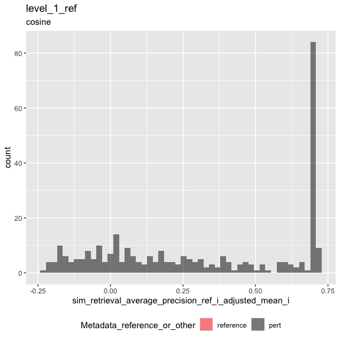
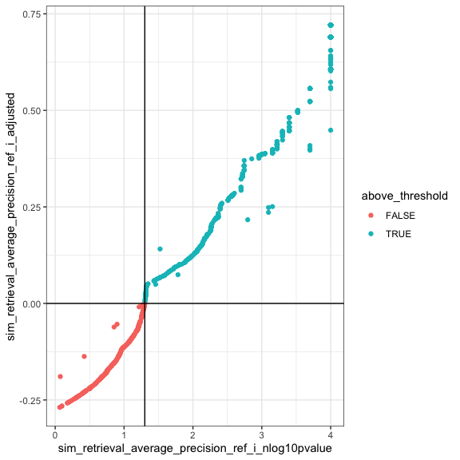
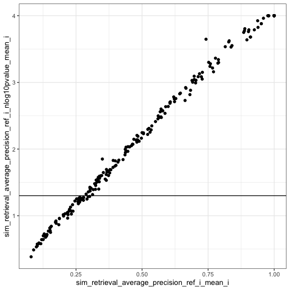
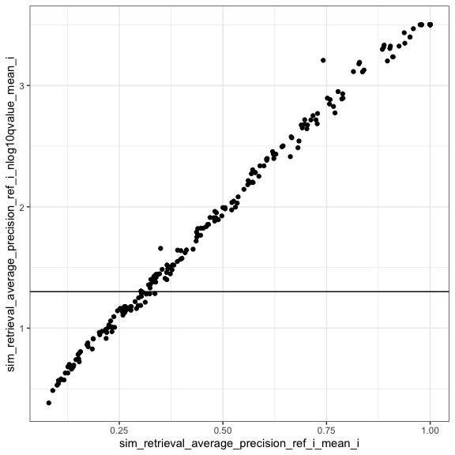
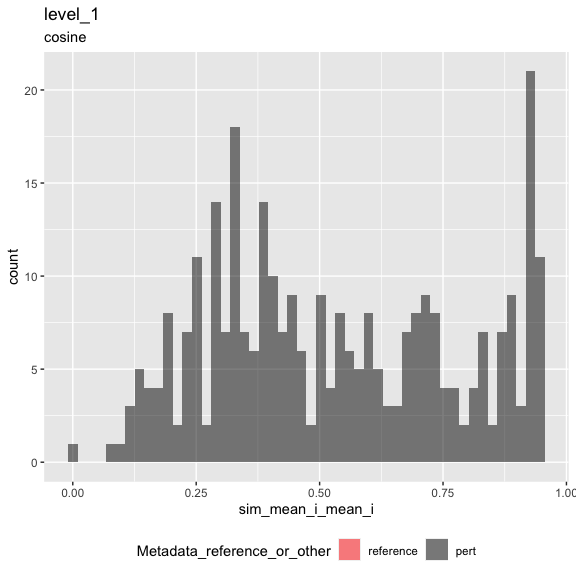
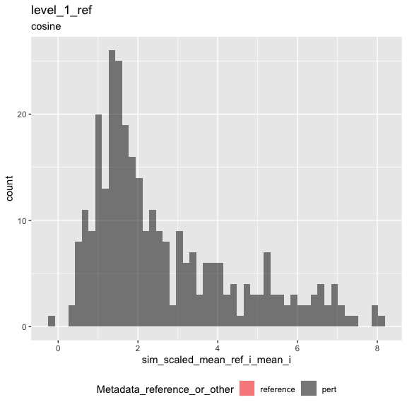
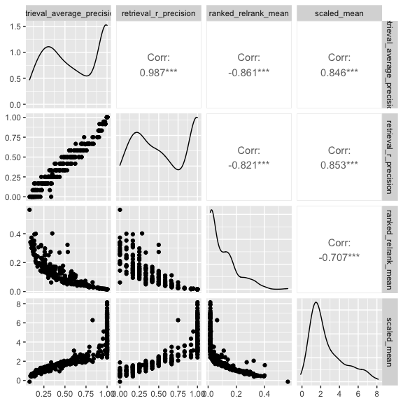

Inspect metrics
================

- <a href="#setup" id="toc-setup">1 Setup</a>
- <a href="#load-metrics" id="toc-load-metrics">2 Load metrics</a>
- <a href="#inspect-metrics" id="toc-inspect-metrics">3 Inspect
  metrics</a>
  - <a href="#functions" id="toc-functions">3.1 Functions</a>
  - <a href="#process-metrics" id="toc-process-metrics">3.2 Process
    metrics</a>
    - <a href="#level-1_0" id="toc-level-1_0">3.2.1 Level 1_0</a>
    - <a href="#level-1" id="toc-level-1">3.2.2 Level 1</a>
  - <a href="#compute-null-thresholds" id="toc-compute-null-thresholds">3.3
    Compute null thresholds</a>
  - <a href="#compute-p-values-and-adjust-metrics"
    id="toc-compute-p-values-and-adjust-metrics">3.4 Compute p-values and
    adjust metrics</a>
    - <a href="#level-1_0-1" id="toc-level-1_0-1">3.4.1 Level 1_0</a>
  - <a href="#aggregate-metrics" id="toc-aggregate-metrics">3.5 Aggregate
    metrics</a>
    - <a href="#level-1-1" id="toc-level-1-1">3.5.1 Level 1</a>
  - <a href="#plot-metrics" id="toc-plot-metrics">3.6 Plot metrics</a>
    - <a href="#level-1-2" id="toc-level-1-2">3.6.1 Level 1</a>

# 1 Setup

``` r
library(magrittr)
library(tidyverse)
library(glue)
library(arrow)
library(matric)
library(logger)
source("utils.R")
```

``` r
set.seed(params$random_seed)
```

``` r
knitr::opts_chunk$set(fig.height = 8, fig.width = 8, rows.print = 20)
```

``` r
cat(yaml::as.yaml(params))
```

    ## input_metrics_file_prefix: results/52185d5c/metrics
    ## background_type: ref
    ## random_seed: 42
    ## significance_threshold: 0.05

``` r
type <- params$background_type
```

# 2 Load metrics

``` r
metric_set_names <- c(glue("level_1_0_{type}"), glue("level_1_{type}"))

metric_sets <-
  map(metric_set_names, function(metric_set) {
    parquet_file <-
      with(params, glue("{input_metrics_file_prefix}_{metric_set}.parquet"))

    log_info("Reading {parquet_file} ...")

    arrow::read_parquet(glue(parquet_file))
  })

names(metric_sets) <- paste(metric_set_names, "metrics", sep = "_")

all_same_cols_rep <- attr(metric_sets[[1]], "all_same_cols_rep")
```

# 3 Inspect metrics

## 3.1 Functions

``` r
color_map <- c(
  "reference" = "red",
  "pert" = "black"
)

plot_metric <-
  function(metrics,
           metric_name,
           plot_title,
           plot_subtitle) {

    metric_sym <- sym(metric_name)

    p <-
      metrics %>%
      mutate(point_order = as.numeric(factor(
        Metadata_reference_or_other,
        levels = c("reference", "pert"),
        ordered = TRUE
      ))) %>%
      arrange(desc(point_order)) %>%
      ggplot(aes(!!metric_sym,
        fill = Metadata_reference_or_other
      )) +
      geom_histogram(
        position = "identity",
        alpha = 0.5,
        bins = 50
      ) +
      scale_fill_manual(values = color_map) +
      ggtitle(plot_title, subtitle = plot_subtitle) +
      theme(legend.position = "bottom")

    list(fig1 = p)
  }
```

``` r
#' Estimate statitics of the distribution of information retrieval metrics under the null hypothesis 
#'
#' @param m Number of positive examples (= number of replicates - 1)
#' @param n Number of negative examples (= number of controls, or number of non-replicates)
#' @param nn Number of simulations (default = 10000)
#'
#' @return statistics 
#'
retrieval_baseline <- function(m, n, nn = 10000, percentile = 0.95) {

  # average precision
  
  y_rank <- 1 - (seq(m + n) / (m + n))
  
  average_precision_null_samples <-
    map_dbl(seq(nn), function(i) {
      x <- as.factor(sample(c(rep(FALSE, n), rep(TRUE, m))))
      
      yardstick::average_precision_vec(x, y_rank, event_level = "second")
      
    })
  
  average_precision_stat <- quantile(average_precision_null_samples, c(percentile), names = FALSE)
  
  # R-precision

  k <- m
  
  r_precision_stat <-
    qhyper(p = percentile,
           m = m,
           n = n,
           k = k) / k
  
  data.frame(
    m = m, 
    n = n,
    sim_stat_average_precision_null = average_precision_stat,
    sim_stat_r_precision_null = r_precision_stat,
    sim_stat_average_precision_null_samples = average_precision_null_samples
  ) %>%
    nest(sim_stat_average_precision_null_samples = c(sim_stat_average_precision_null_samples))
  
}
retrieval_baseline(1, 1, 10)
```

|   m |   n | sim_stat_average_precision_null | sim_stat_r\_precision_null | sim_stat_average_precision_null_samples          |
|----:|----:|--------------------------------:|---------------------------:|:-------------------------------------------------|
|   1 |   1 |                               1 |                          1 | 0.5, 0.5, 1.0, 1.0, 0.5, 0.5, 0.5, 0.5, 1.0, 1.0 |

``` r
knitr::opts_chunk$set(fig.height = 6, fig.width = 6, rows.print = 20)
```

## 3.2 Process metrics

### 3.2.1 Level 1_0

``` r
level_1_0_metrics <-
  metric_sets[[glue("level_1_0_{type}_metrics")]]
```

``` r
cat(yaml::as.yaml(attr(level_1_0_metrics, "params")))
```

    ## prepare_data:
    ##   input_profile_files:
    ##   - tag: BR00116991
    ##     filename: /Users/shsingh/work/projects/2019_07_11_JUMP-CP/workspace/software/2021_Chandrasekaran_submitted/profiles/2020_11_04_CPJUMP1/BR00116991/BR00116991_normalized_feature_select_negcon_batch.csv.gz
    ##   - tag: BR00116992
    ##     filename: /Users/shsingh/work/projects/2019_07_11_JUMP-CP/workspace/software/2021_Chandrasekaran_submitted/profiles/2020_11_04_CPJUMP1/BR00116992/BR00116992_normalized_feature_select_negcon_batch.csv.gz
    ##   - tag: BR00116993
    ##     filename: /Users/shsingh/work/projects/2019_07_11_JUMP-CP/workspace/software/2021_Chandrasekaran_submitted/profiles/2020_11_04_CPJUMP1/BR00116993/BR00116993_normalized_feature_select_negcon_batch.csv.gz
    ##   - tag: BR00116994
    ##     filename: /Users/shsingh/work/projects/2019_07_11_JUMP-CP/workspace/software/2021_Chandrasekaran_submitted/profiles/2020_11_04_CPJUMP1/BR00116994/BR00116994_normalized_feature_select_negcon_batch.csv.gz
    ##   output_profile_file: results/52185d5c/profiles.parquet
    ##   data_path: /Users/shsingh/work/projects/2019_07_11_JUMP-CP/workspace/software/2021_Chandrasekaran_submitted/profiles/2020_11_04_CPJUMP1
    ##   reference_set:
    ##     Metadata_control_type: negcon
    ##   random_seed: 42
    ##   external_metadata:
    ##     file: /Users/shsingh/work/projects/2019_07_11_JUMP-CP/workspace/software/2021_Chandrasekaran_submitted/benchmark/input/JUMP-Target-1_compound_metadata_additional_annotations.tsv
    ##     include_cols:
    ##     - Metadata_broad_sample
    ##     - Metadata_target_list
    ##     join_cols:
    ##       Metadata_broad_sample: Metadata_broad_sample
    ##   subsample_fraction: 1
    ##   subsample_pert_strata: ~
    ##   subsample_reference_strata: ~
    ##   shuffle: no
    ##   shuffle_bad_groups_threshold: ~
    ##   shuffle_group: ~
    ##   shuffle_strata: ~
    ##   shuffle_exclude: ~
    ##   aggregate_by: ~
    ##   filter_by: ~
    ##   add_dummy_metadata_column: no
    ##   split_rows_on_column: ~
    ## calculate_index:
    ##   input_profile_file: results/52185d5c/profiles.parquet
    ##   output_index_file: results/52185d5c/index.parquet
    ##   output_collatedindex_file: results/52185d5c/collatedindex.parquet
    ##   sim_params:
    ##     reference:
    ##       Metadata_reference_or_other: reference
    ##     all_same_cols_ref: Metadata_Plate
    ##     all_same_cols_rep:
    ##     - Metadata_target_list
    ##     - Metadata_broad_sample
    ##     - Metadata_control_type
    ##     - Metadata_reference_or_other
    ##     all_same_cols_rep_ref: ~
    ##     any_different_cols_non_rep: ~
    ##     all_same_cols_non_rep: ~
    ##     all_different_cols_non_rep: ~
    ##     all_same_cols_group: ~
    ##     any_different_cols_group: ~
    ##     annotation_cols:
    ##     - Metadata_target_list
    ##     - Metadata_broad_sample
    ##     - Metadata_control_type
    ##     - Metadata_reference_or_other
    ## calculate_metrics:
    ##   input_profile_file: results/52185d5c/profiles.parquet
    ##   input_collatedindex_file: results/52185d5c/collatedindex.parquet
    ##   output_collatedsim_file: results/52185d5c/collatedsim.parquet
    ##   output_metrics_file_prefix: results/52185d5c/metrics
    ##   similarity_method: cosine
    ##   parallel_workers: 8

### 3.2.2 Level 1

``` r
level_1_metrics <-
  metric_sets[[glue("level_1_{type}_metrics")]]
```

``` r
cat(yaml::as.yaml(attr(level_1_metrics, "params")))
```

    ## prepare_data:
    ##   input_profile_files:
    ##   - tag: BR00116991
    ##     filename: /Users/shsingh/work/projects/2019_07_11_JUMP-CP/workspace/software/2021_Chandrasekaran_submitted/profiles/2020_11_04_CPJUMP1/BR00116991/BR00116991_normalized_feature_select_negcon_batch.csv.gz
    ##   - tag: BR00116992
    ##     filename: /Users/shsingh/work/projects/2019_07_11_JUMP-CP/workspace/software/2021_Chandrasekaran_submitted/profiles/2020_11_04_CPJUMP1/BR00116992/BR00116992_normalized_feature_select_negcon_batch.csv.gz
    ##   - tag: BR00116993
    ##     filename: /Users/shsingh/work/projects/2019_07_11_JUMP-CP/workspace/software/2021_Chandrasekaran_submitted/profiles/2020_11_04_CPJUMP1/BR00116993/BR00116993_normalized_feature_select_negcon_batch.csv.gz
    ##   - tag: BR00116994
    ##     filename: /Users/shsingh/work/projects/2019_07_11_JUMP-CP/workspace/software/2021_Chandrasekaran_submitted/profiles/2020_11_04_CPJUMP1/BR00116994/BR00116994_normalized_feature_select_negcon_batch.csv.gz
    ##   output_profile_file: results/52185d5c/profiles.parquet
    ##   data_path: /Users/shsingh/work/projects/2019_07_11_JUMP-CP/workspace/software/2021_Chandrasekaran_submitted/profiles/2020_11_04_CPJUMP1
    ##   reference_set:
    ##     Metadata_control_type: negcon
    ##   random_seed: 42
    ##   external_metadata:
    ##     file: /Users/shsingh/work/projects/2019_07_11_JUMP-CP/workspace/software/2021_Chandrasekaran_submitted/benchmark/input/JUMP-Target-1_compound_metadata_additional_annotations.tsv
    ##     include_cols:
    ##     - Metadata_broad_sample
    ##     - Metadata_target_list
    ##     join_cols:
    ##       Metadata_broad_sample: Metadata_broad_sample
    ##   subsample_fraction: 1
    ##   subsample_pert_strata: ~
    ##   subsample_reference_strata: ~
    ##   shuffle: no
    ##   shuffle_bad_groups_threshold: ~
    ##   shuffle_group: ~
    ##   shuffle_strata: ~
    ##   shuffle_exclude: ~
    ##   aggregate_by: ~
    ##   filter_by: ~
    ##   add_dummy_metadata_column: no
    ##   split_rows_on_column: ~
    ## calculate_index:
    ##   input_profile_file: results/52185d5c/profiles.parquet
    ##   output_index_file: results/52185d5c/index.parquet
    ##   output_collatedindex_file: results/52185d5c/collatedindex.parquet
    ##   sim_params:
    ##     reference:
    ##       Metadata_reference_or_other: reference
    ##     all_same_cols_ref: Metadata_Plate
    ##     all_same_cols_rep:
    ##     - Metadata_target_list
    ##     - Metadata_broad_sample
    ##     - Metadata_control_type
    ##     - Metadata_reference_or_other
    ##     all_same_cols_rep_ref: ~
    ##     any_different_cols_non_rep: ~
    ##     all_same_cols_non_rep: ~
    ##     all_different_cols_non_rep: ~
    ##     all_same_cols_group: ~
    ##     any_different_cols_group: ~
    ##     annotation_cols:
    ##     - Metadata_target_list
    ##     - Metadata_broad_sample
    ##     - Metadata_control_type
    ##     - Metadata_reference_or_other
    ## calculate_metrics:
    ##   input_profile_file: results/52185d5c/profiles.parquet
    ##   input_collatedindex_file: results/52185d5c/collatedindex.parquet
    ##   output_collatedsim_file: results/52185d5c/collatedsim.parquet
    ##   output_metrics_file_prefix: results/52185d5c/metrics
    ##   similarity_method: cosine
    ##   parallel_workers: 8

## 3.3 Compute null thresholds

``` r
level_1_0_metrics %>%
  distinct(across(all_of(c(
    glue("sim_stat_signal_n_{type}_i"),
    glue("sim_stat_background_n_{type}_i")
  ))))
```

| sim_stat_signal_n\_ref_i | sim_stat_background_n\_ref_i |
|-------------------------:|-----------------------------:|
|                        3 |                           64 |
|                        7 |                           64 |
|                        2 |                           64 |

``` r
pow <- 1.3
points <- level_1_0_metrics[[glue("sim_stat_background_n_{type}_i")]]
max_value <- max(points)
break_point <- ceiling(seq(1, ceiling((max_value)^(1/pow)), 1)**(pow))
points_mapped <- points %>% map_dbl(function(i) break_point[min(which(break_point > i))])

level_1_0_metrics <-
  level_1_0_metrics %>%
  mutate(sim_stat_background_n_mapped = points_mapped)
```

``` r
level_1_0_metrics %>%
  distinct(across(all_of(c(
    glue("sim_stat_signal_n_{type}_i"),
    "sim_stat_background_n_mapped"
    #glue("sim_stat_background_n_{type}_i")
  ))))
```

| sim_stat_signal_n\_ref_i | sim_stat_background_n\_mapped |
|-------------------------:|------------------------------:|
|                        3 |                            66 |
|                        7 |                            66 |
|                        2 |                            66 |

``` r
future::plan(future::multisession, workers = 14)
```

``` r
null_thresholds <-
  level_1_0_metrics %>%
  distinct(across(all_of(c(
    glue("sim_stat_signal_n_{type}_i"),
    "sim_stat_background_n_mapped"
    #glue("sim_stat_background_n_{type}_i")
  )))) %>%
  rename(m = 1, n = 2) %>%
  furrr::future_pmap_dfr(function(m, n)
  {
    log_info("Compute retrieval random baseline for m = {m}, n = {n}")
    retrieval_baseline(m = m, n = n, nn = 10000, percentile = 1 - params$significance_threshold)
  },
  .options = furrr::furrr_options(seed = params$random_seed))

null_thresholds %>% 
  select(-sim_stat_average_precision_null_samples) %>%
  arrange(m, n)
```

|   m |   n | sim_stat_average_precision_null | sim_stat_r\_precision_null |
|----:|----:|--------------------------------:|---------------------------:|
|   2 |  66 |                       0.2756410 |                  0.5000000 |
|   3 |  66 |                       0.3102739 |                  0.3333333 |
|   7 |  66 |                       0.2788273 |                  0.2857143 |

``` r
join_vars <- c("m", "n")
names(join_vars) <-
  c(glue("sim_stat_signal_n_{type}_i"),
    "sim_stat_background_n_mapped")
join_vars
```

    ##      sim_stat_signal_n_ref_i sim_stat_background_n_mapped 
    ##                          "m"                          "n"

``` r
level_1_0_metrics <-
  level_1_0_metrics %>%
  inner_join(null_thresholds,
             by = join_vars)
```

## 3.4 Compute p-values and adjust metrics

### 3.4.1 Level 1_0

``` r
sim_retrieval_average_precision_type_i_nlog10pvalue <-
  glue("sim_retrieval_average_precision_{type}_i_nlog10pvalue")

sim_retrieval_average_precision_type_i <-
  glue("sim_retrieval_average_precision_{type}_i")


sim_retrieval_average_precision_type_i_adjusted <-
  glue("sim_retrieval_average_precision_{type}_i_adjusted")

sim_retrieval_r_precision_type_i_adjusted <-
  glue("sim_retrieval_r_precision_{type}_i_adjusted")


level_1_0_metrics_null_adjusted <-
  level_1_0_metrics %>%
  rowwise() %>%
  mutate("{sim_retrieval_average_precision_type_i_nlog10pvalue}" :=
           -log10((
             1 + sum(
               sim_stat_average_precision_null_samples$sim_stat_average_precision_null_samples >
                 .data[[sim_retrieval_average_precision_type_i]]
             )
           ) /
             (
               1 + nrow(sim_stat_average_precision_null_samples)
             ))) %>%
  ungroup() %>%
  select(-sim_stat_average_precision_null_samples) %>%
  mutate(
    "{sim_retrieval_average_precision_type_i_adjusted}" :=
      .data[[glue("sim_retrieval_average_precision_{type}_i")]] - sim_stat_average_precision_null,
    "{sim_retrieval_r_precision_type_i_adjusted}" :=
      .data[[glue("sim_retrieval_r_precision_{type}_i")]] - sim_stat_r_precision_null
  )
```

## 3.5 Aggregate metrics

### 3.5.1 Level 1

``` r
summary_cols <- attr(level_1_0_metrics, "all_same_cols_rep")

annotation_cols <- attr(level_1_0_metrics, "params")$calculate_index$sim_params$annotation_cols

annotation_cols_full <- unique(c(summary_cols, annotation_cols))

metadata <-
  level_1_0_metrics %>%
  dplyr::distinct(across(all_of(annotation_cols_full)))
```

``` r
level_1_metrics_null_adjusted <- 
  level_1_0_metrics_null_adjusted %>%
  ungroup() %>%
  group_by(dplyr::across(dplyr::all_of(summary_cols))) %>%
  summarise(across(starts_with("sim_"),
                   list(mean_i = mean, median_i = median)),
            .groups = "keep") %>%
  dplyr::inner_join(metadata, by = summary_cols) %>%
  dplyr::select(all_of(annotation_cols_full), dplyr::everything()) %>%
  ungroup()
```

``` r
stopifnot(
  compare::compare(
    level_1_metrics_null_adjusted %>%
      select(all_of(names(level_1_metrics))),
    level_1_metrics,
    ignoreAttrs = TRUE
  )$result
)
```

``` r
metric_set <- glue("level_1_{type}_null_adjusted")

parquet_file <-
  with(params,
       glue("{input_metrics_file_prefix}_{metric_set}.parquet"))

log_info("Writing {parquet_file} ...")

level_1_metrics_null_adjusted %>%
  arrow::write_parquet(glue(parquet_file))
```

## 3.6 Plot metrics

### 3.6.1 Level 1

``` r
result <-
  plot_metric(
    level_1_metrics_null_adjusted,
    glue("sim_retrieval_average_precision_{type}_i_adjusted_mean_i"),
    glue("level_1_{type}"),
    attr(level_1_metrics, "metric_metadata")$method
  )
result$fig1
```

<!-- -->

``` r
level_1_metrics_null_adjusted %>%
  mutate(above_threshold =
           .data[[glue("sim_retrieval_average_precision_{type}_i_adjusted_mean_i")]] > 0) %>%
  count(above_threshold)
```

| above_threshold |   n |
|:----------------|----:|
| FALSE           |  71 |
| TRUE            | 235 |

``` r
level_1_metrics_null_adjusted %>%
  mutate(above_threshold =
           .data[[glue("sim_retrieval_average_precision_{type}_i_nlog10pvalue_mean_i")]] > -log10(params$significance_threshold)) %>%
  count(above_threshold)
```

| above_threshold |   n |
|:----------------|----:|
| FALSE           |  65 |
| TRUE            | 241 |

``` r
level_1_0_metrics_null_adjusted %>%
  mutate(above_threshold =
           (.data[[glue("sim_retrieval_average_precision_{type}_i_adjusted")]] > 0) &
           (.data[[glue("sim_retrieval_average_precision_{type}_i_nlog10pvalue")]] > -log10(params$significance_threshold))) %>%
  ggplot(aes_string(
    glue("sim_retrieval_average_precision_{type}_i_nlog10pvalue"),
    glue("sim_retrieval_average_precision_{type}_i_adjusted"),
    color = "above_threshold"
  )) +
  geom_point() +
  geom_hline(yintercept = 0) +
  geom_vline(xintercept = -log10(params$significance_threshold)) +
  theme_bw()
```

<!-- -->

``` r
result <-
  plot_metric(
    level_1_metrics_null_adjusted,
    glue("sim_retrieval_r_precision_{type}_i_adjusted_mean_i"),
    glue("level_1_{type}"),
    attr(level_1_metrics, "metric_metadata")$method
  )
result$fig1
```

<!-- -->

``` r
sim_retrieval_average_precision_type_i_nlog10qvalue_mean_i <-
  glue("sim_retrieval_average_precision_{type}_i_nlog10qvalue_mean_i")

sim_retrieval_average_precision_type_i_nlog10pvalue_mean_i <-
  glue("sim_retrieval_average_precision_{type}_i_nlog10pvalue_mean_i")

level_1_metrics_null_adjusted <-
  level_1_metrics_null_adjusted %>%
  mutate(
    "{sim_retrieval_average_precision_type_i_nlog10qvalue_mean_i}" := 
      -log10(p.adjust(10**-.data[[sim_retrieval_average_precision_type_i_nlog10pvalue_mean_i]], 
                      method = "BH")
             )
  )
```

``` r
level_1_metrics_null_adjusted %>%
  ggplot(aes_string(
    glue("sim_retrieval_average_precision_{type}_i_mean_i"), 
    glue("sim_retrieval_average_precision_{type}_i_nlog10pvalue_mean_i"))) +
  geom_point() +
  geom_hline(yintercept = -log10(params$significance_threshold)) +
  theme_bw()
```

<!-- -->

``` r
p <-
  level_1_metrics_null_adjusted %>%
  ggplot(aes_string(
    glue("sim_retrieval_average_precision_{type}_i_mean_i"),
    glue(
      "sim_retrieval_average_precision_{type}_i_nlog10qvalue_mean_i"
    )
  )) +
  geom_point(aes(
    text = names(level_1_0_metrics_null_adjusted) %>% str_subset("Metadata") %>% map_chr(function(x)
      sprintf("{%s}", x)) %>% paste(collapse = ":") %>% glue()
  )) +
  geom_hline(yintercept = -log10(params$significance_threshold)) +
  theme_bw()
```

    ## Warning: Ignoring unknown aesthetics: text

``` r
p
```

<!-- -->

``` r
l <- plotly::ggplotly(p)

htmlwidgets::saveWidget(l, with(params, glue("{input_metrics_file_prefix}_plot_1.html")))
```

``` r
level_1_metrics_null_adjusted %>%
  mutate(above_threshold =
           .data[[glue("sim_retrieval_r_precision_{type}_i_adjusted_mean_i")]] > 0) %>%
  count(above_threshold)
```

| above_threshold |   n |
|:----------------|----:|
| FALSE           | 119 |
| TRUE            | 187 |

``` r
result <-
  plot_metric(
    level_1_metrics,
    "sim_mean_i_mean_i",
    "level_1",
    attr(level_1_metrics, "metric_metadata")$method
  )
result$fig1
```

<!-- -->

``` r
result <-
  plot_metric(
    level_1_metrics,
    glue("sim_scaled_mean_{type}_i_mean_i"),
    glue("level_1_{type}"),
    attr(level_1_metrics, "metric_metadata")$method
  )
result$fig1
```

<!-- -->

``` r
level_1_metrics %>%
  arrange(across(everything())) %>%
  head()
```

| Metadata_target_list                                                           | Metadata_broad_sample  | Metadata_control_type | Metadata_reference_or_other | sim_scaled_mean_ref_i\_mean_i | sim_scaled_mean_ref_i\_median_i | sim_scaled_median_ref_i\_mean_i | sim_scaled_median_ref_i\_median_i | sim_ranked_relrank_mean_ref_i\_mean_i | sim_ranked_relrank_mean_ref_i\_median_i | sim_ranked_relrank_median_ref_i\_mean_i | sim_ranked_relrank_median_ref_i\_median_i | sim_mean_i\_mean_i | sim_mean_i\_median_i | sim_median_i\_mean_i | sim_median_i\_median_i | sim_mean_stat_ref_i\_mean_i | sim_mean_stat_ref_i\_median_i | sim_sd_stat_ref_i\_mean_i | sim_sd_stat_ref_i\_median_i | sim_stat_signal_n\_ref_i\_mean_i | sim_stat_signal_n\_ref_i\_median_i | sim_stat_background_n\_ref_i\_mean_i | sim_stat_background_n\_ref_i\_median_i | sim_retrieval_average_precision_ref_i\_mean_i | sim_retrieval_average_precision_ref_i\_median_i | sim_retrieval_r\_precision_ref_i\_mean_i | sim_retrieval_r\_precision_ref_i\_median_i |
|:-------------------------------------------------------------------------------|:-----------------------|:----------------------|:----------------------------|------------------------------:|--------------------------------:|--------------------------------:|----------------------------------:|--------------------------------------:|----------------------------------------:|----------------------------------------:|------------------------------------------:|-------------------:|---------------------:|---------------------:|-----------------------:|----------------------------:|------------------------------:|--------------------------:|----------------------------:|---------------------------------:|-----------------------------------:|-------------------------------------:|---------------------------------------:|----------------------------------------------:|------------------------------------------------:|-----------------------------------------:|-------------------------------------------:|
| ABCA1\|ABCB11\|ABCC8\|ABCC9\|CFTR\|CPT1A\|KCNJ1\|KCNJ11\|KCNJ5\|KCNJ8\|SLCO2B1 | BRD-K36927236-001-36-7 | NA                    | pert                        |                      1.315699 |                       1.3841538 |                        1.419897 |                          1.482594 |                             0.1263021 |                               0.1197917 |                               0.1015625 |                                 0.0937500 |          0.3248321 |            0.3375850 |            0.3472503 |              0.3605092 |                   0.0197275 |                     0.0158503 |                 0.2415727 |                   0.2343418 |                                3 |                                  3 |                                   64 |                                     64 |                                     0.3534808 |                                       0.2575864 |                                0.2500000 |                                  0.1666667 |
| ABCB11\|CAMLG\|FPR1\|PPIA\|PPIF\|PPP3R2\|SLC10A1\|SLCO1B1\|SLCO1B3             | BRD-K13533483-001-16-2 | NA                    | pert                        |                      5.306904 |                       5.3272929 |                        5.339947 |                          5.366828 |                             0.0156250 |                               0.0156250 |                               0.0156250 |                                 0.0156250 |          0.8876084 |            0.8958518 |            0.8937413 |              0.9056881 |                   0.0128783 |                     0.0098597 |                 0.1676918 |                   0.1683536 |                                3 |                                  3 |                                   64 |                                     64 |                                     1.0000000 |                                       1.0000000 |                                1.0000000 |                                  1.0000000 |
| ABCC1\|ABCC2\|FPR1\|SLC22A12                                                   | BRD-A36217750-001-16-3 | NA                    | pert                        |                      1.064537 |                       0.9914917 |                        1.155591 |                          1.112628 |                             0.1901042 |                               0.2135417 |                               0.1562500 |                                 0.1640625 |          0.2322951 |            0.2339533 |            0.2494078 |              0.2494078 |                   0.0177541 |                     0.0133272 |                 0.2042570 |                   0.2043558 |                                3 |                                  3 |                                   64 |                                     64 |                                     0.1723775 |                                       0.1483264 |                                0.0000000 |                                  0.0000000 |
| ABCC8\|KCNJ1\|KCNJ10\|KCNJ11                                                   | BRD-K52960356-001-13-0 | NA                    | pert                        |                      1.499614 |                       1.4153201 |                        1.534282 |                          1.535141 |                             0.1419271 |                               0.1562500 |                               0.1132812 |                                 0.1250000 |          0.3417210 |            0.3445769 |            0.3429311 |              0.3410191 |                   0.0039545 |                     0.0015709 |                 0.2219499 |                   0.2171123 |                                3 |                                  3 |                                   64 |                                     64 |                                     0.3651352 |                                       0.3455483 |                                0.2500000 |                                  0.3333333 |
| ABL1\|ACVR1\|RIPK2                                                             | BRD-K59831625-001-03-9 | NA                    | pert                        |                      3.100291 |                       3.6108949 |                        3.942533 |                          4.901993 |                             0.1106771 |                               0.1119792 |                               0.0664062 |                                 0.0156250 |          0.4990373 |            0.6078033 |            0.6304055 |              0.7804323 |                   0.0247579 |                     0.0232832 |                 0.1539646 |                   0.1534434 |                                3 |                                  3 |                                   64 |                                     64 |                                     0.6068713 |                                       0.7138158 |                                0.5833333 |                                  0.6666667 |
| ABL1\|BCR                                                                      | BRD-K87632963-001-03-0 | NA                    | pert                        |                      2.589816 |                       2.7104452 |                        2.888045 |                          3.035469 |                             0.0325521 |                               0.0312500 |                               0.0234375 |                                 0.0156250 |          0.5183792 |            0.5549907 |            0.5765818 |              0.6190263 |                   0.0153204 |                     0.0176269 |                 0.1933267 |                   0.1899909 |                                3 |                                  3 |                                   64 |                                     64 |                                     0.7777778 |                                       0.8333333 |                                0.6666667 |                                  0.6666667 |

``` r
level_1_metrics %>%
  select(all_of(c(
    glue("sim_retrieval_average_precision_{type}_i_mean_i"),
    glue("sim_retrieval_r_precision_{type}_i_mean_i"),
    glue("sim_ranked_relrank_mean_{type}_i_mean_i"),
    glue("sim_scaled_mean_{type}_i_mean_i")
  ))) %>%
  rename_with( ~ str_remove_all(., glue("sim_|_{type}_i_mean_i")), matches("sim_")) %>%
  GGally::ggpairs(progress = FALSE)
```

<!-- -->
\# Checks

``` r
profiles <-
  arrow::read_parquet(attributes(level_1_0_metrics)$params$calculate_metrics$input_profile_file)
```

``` r
metrics_counts <-
  level_1_metrics_null_adjusted %>% 
  count(across(all_of(c(glue("sim_stat_signal_n_{type}_i_mean_i"))))) %>%
  mutate(n_perts = .data[[glue("sim_stat_signal_n_{type}_i_mean_i")]] + 1) %>% 
  select(n_perts, n_groups = n) %>% 
  arrange(n_perts)

metrics_counts
```

| n_perts | n_groups |
|--------:|---------:|
|       3 |        1 |
|       4 |      291 |
|       8 |       14 |

``` r
if(!is.null(attributes(level_1_0_metrics)$params$prepare_data$split_rows_on_column)) {
  split_col <-
    str_c(
      attributes(level_1_0_metrics)$params$prepare_data$split_rows_on_column,
      "_split"
    )
  
  profiles_counts <-
    profiles %>%
    filter(Metadata_reference_or_other != "reference") %>%
    count(across(all_of(c(split_col))), name = "n_perts") %>%
    count(n_perts, name = "n_groups") %>%
    filter(n_perts > 1) %>%
    arrange(n_perts)
  
  stopifnot(compare::compare(metrics_counts, profiles_counts, ignoreAttrs = TRUE)$result)
}
```
