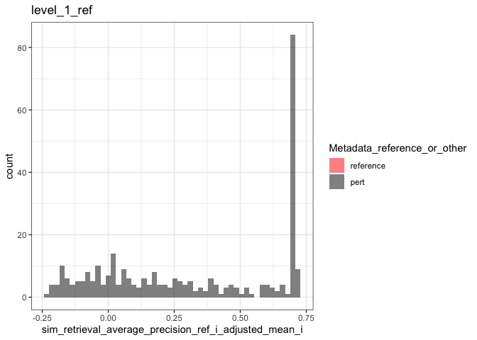
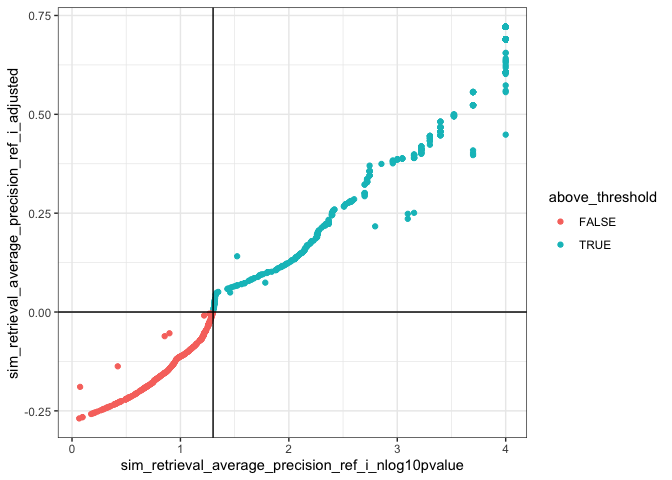
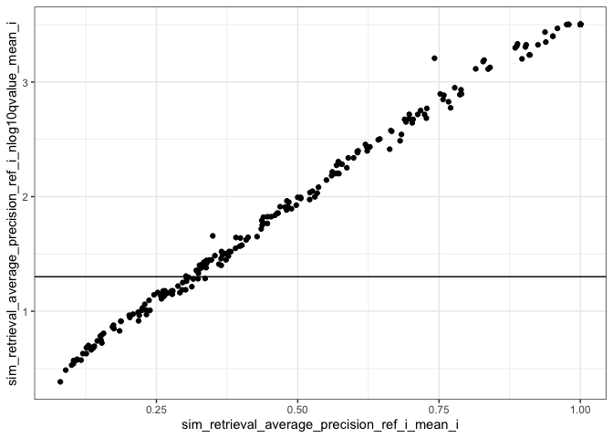
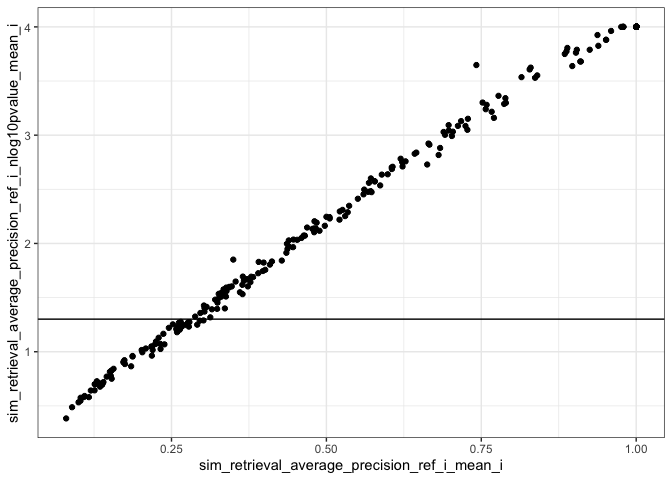
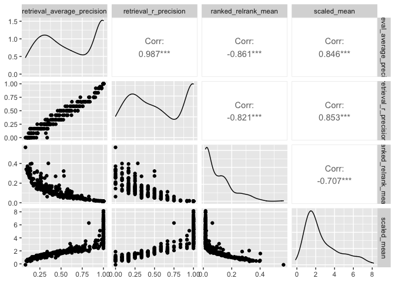

Inspect metrics
================

- <a href="#setup" id="toc-setup">1 Setup</a>
- <a href="#functions" id="toc-functions">2 Functions</a>
- <a href="#read" id="toc-read">3 Read</a>
- <a href="#plot-metrics" id="toc-plot-metrics">4 Plot metrics</a>
  - <a href="#level-1" id="toc-level-1">4.1 Level 1</a>

# 1 Setup

``` r
library(magrittr)
library(tidyverse)
library(glue)
library(arrow)
library(matric)
library(logger)
source("utils.R")
```

``` r
type <- params$background_type
```

# 2 Functions

``` r
plot_metric <-
  function(metrics,
           metric_name,
           plot_title,
           plot_subtitle) {
    color_map <- c("reference" = "red",
                   "pert" = "black")
    
    
    metric_sym <- sym(metric_name)
    
    p <-
      metrics %>%
      mutate(point_order = as.numeric(
        factor(
          Metadata_reference_or_other,
          levels = c("reference", "pert"),
          ordered = TRUE
        )
      )) %>%
      arrange(desc(point_order)) %>%
      ggplot(aes(!!metric_sym,
                 fill = Metadata_reference_or_other)) +
      geom_histogram(position = "identity",
                     alpha = 0.5,
                     bins = 50) +
      scale_fill_manual(values = color_map) +
      ggtitle(plot_title, subtitle = plot_subtitle) +
      theme(legend.position = "bottom") +
      theme_bw()
    
    list(fig1 = p)
  }
```

# 3 Read

``` r
metric_set <- glue("level_1_0_{type}_null_adjusted")

parquet_file <-
  with(params,
       glue("{input_metrics_file_prefix}_{metric_set}.parquet"))

log_info("Reading {parquet_file} ...")

level_1_0_metrics_null_adjusted <-
  arrow::read_parquet(glue(parquet_file))
```

``` r
metric_set <- glue("level_1_{type}_null_adjusted")

parquet_file <-
  with(params,
       glue("{input_metrics_file_prefix}_{metric_set}.parquet"))

log_info("Reading {parquet_file} ...")

level_1_metrics_null_adjusted <-
  arrow::read_parquet(glue(parquet_file))
```

``` r
significance_threshold <- 
  attr(level_1_0_metrics_null_adjusted, "significance_threshold")
```

# 4 Plot metrics

## 4.1 Level 1

``` r
result <-
  plot_metric(
    level_1_metrics_null_adjusted,
    glue("sim_retrieval_average_precision_{type}_i_adjusted_mean_i"),
    glue("level_1_{type}"),
    attr(level_1_metrics_null_adjusted, "metric_metadata")$method
  )
result$fig1
```

<!-- -->

``` r
level_1_metrics_null_adjusted %>%
  mutate(above_threshold =
           .data[[glue("sim_retrieval_average_precision_{type}_i_adjusted_mean_i")]] > 0) %>%
  count(above_threshold)
```

| above_threshold |   n |
|:----------------|----:|
| FALSE           |  71 |
| TRUE            | 235 |

``` r
level_1_metrics_null_adjusted %>%
  mutate(above_threshold =
           .data[[glue("sim_retrieval_average_precision_{type}_i_nlog10pvalue_mean_i")]] > -log10(significance_threshold)) %>%
  count(above_threshold)
```

| above_threshold |   n |
|:----------------|----:|
| FALSE           |  65 |
| TRUE            | 241 |

``` r
level_1_0_metrics_null_adjusted %>%
  mutate(above_threshold =
           (.data[[glue("sim_retrieval_average_precision_{type}_i_adjusted")]] > 0) &
           (.data[[glue("sim_retrieval_average_precision_{type}_i_nlog10pvalue")]] > -log10(significance_threshold))) %>%
  ggplot(aes_string(
    glue("sim_retrieval_average_precision_{type}_i_nlog10pvalue"),
    glue("sim_retrieval_average_precision_{type}_i_adjusted"),
    color = "above_threshold"
  )) +
  geom_point() +
  geom_hline(yintercept = 0) +
  geom_vline(xintercept = -log10(significance_threshold)) +
  theme_bw()
```

<!-- -->

``` r
result <-
  plot_metric(
    level_1_metrics_null_adjusted,
    glue("sim_retrieval_r_precision_{type}_i_adjusted_mean_i"),
    glue("level_1_{type}"),
    attr(level_1_metrics_null_adjusted, "metric_metadata")$method
  )
result$fig1
```

<!-- -->

``` r
level_1_metrics_null_adjusted %>%
  ggplot(aes_string(
    glue("sim_retrieval_average_precision_{type}_i_mean_i"), 
    glue("sim_retrieval_average_precision_{type}_i_nlog10pvalue_mean_i"))) +
  geom_point() +
  geom_hline(yintercept = -log10(significance_threshold)) +
  theme_bw()
```

<!-- -->

``` r
p <-
  level_1_metrics_null_adjusted %>%
  ggplot(aes_string(
    glue("sim_retrieval_average_precision_{type}_i_mean_i"),
    glue(
      "sim_retrieval_average_precision_{type}_i_nlog10qvalue_mean_i"
    )
  )) +
  geom_point(aes(
    text = names(level_1_0_metrics_null_adjusted) %>% str_subset("Metadata") %>% map_chr(function(x)
      sprintf("{%s}", x)) %>% paste(collapse = ":") %>% glue()
  )) +
  geom_hline(yintercept = -log10(significance_threshold)) +
  theme_bw()
```

    ## Warning: Ignoring unknown aesthetics: text

``` r
p
```

<!-- -->

``` r
l <- plotly::ggplotly(p)

htmlwidgets::saveWidget(l, with(params, glue("{input_metrics_file_prefix}_plot_1.html")))
```

``` r
level_1_metrics_null_adjusted %>%
  mutate(above_threshold =
           .data[[glue("sim_retrieval_r_precision_{type}_i_adjusted_mean_i")]] > 0) %>%
  count(above_threshold)
```

| above_threshold |   n |
|:----------------|----:|
| FALSE           | 119 |
| TRUE            | 187 |

``` r
result <-
  plot_metric(
    level_1_metrics_null_adjusted,
    "sim_mean_i_mean_i",
    "level_1",
    attr(level_1_metrics_null_adjusted, "metric_metadata")$method
  )
result$fig1
```

<!-- -->

``` r
result <-
  plot_metric(
    level_1_metrics_null_adjusted,
    glue("sim_scaled_mean_{type}_i_mean_i"),
    glue("level_1_{type}"),
    attr(level_1_metrics_null_adjusted, "metric_metadata")$method
  )
result$fig1
```

<!-- -->

``` r
level_1_metrics_null_adjusted %>%
  select(all_of(c(
    glue("sim_retrieval_average_precision_{type}_i_mean_i"),
    glue("sim_retrieval_r_precision_{type}_i_mean_i"),
    glue("sim_ranked_relrank_mean_{type}_i_mean_i"),
    glue("sim_scaled_mean_{type}_i_mean_i")
  ))) %>%
  rename_with( ~ str_remove_all(., glue("sim_|_{type}_i_mean_i")), matches("sim_")) %>%
  GGally::ggpairs(progress = FALSE)
```

<!-- -->
