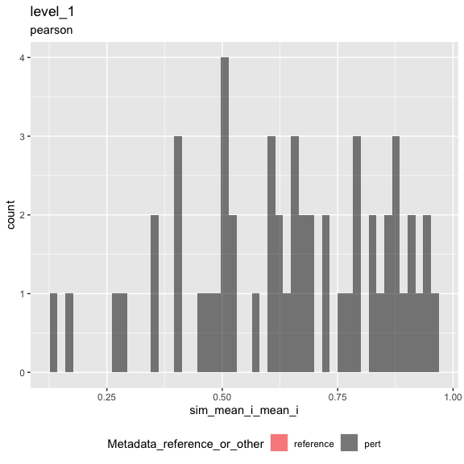
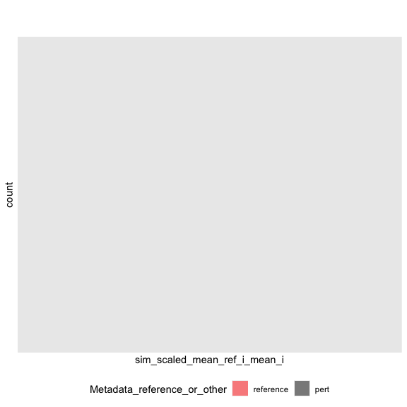
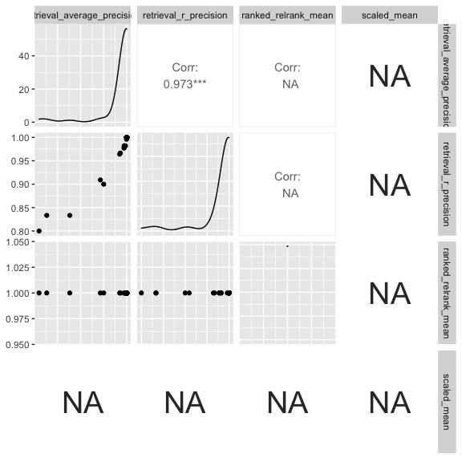

Inspect metrics
================

-   [1 Setup](#setup)
-   [2 Load metrics](#load-metrics)
-   [3 Inspect metrics](#inspect-metrics)
    -   [3.1 Functions](#functions)
    -   [3.2 Process metrics](#process-metrics)
        -   [3.2.1 Level 1](#level-1)
    -   [3.3 Plot metrics](#plot-metrics)
        -   [3.3.1 Level 1](#level-1-1)

# 1 Setup

``` r
library(magrittr)
library(tidyverse)
library(glue)
library(arrow)
library(matric)
library(logger)
source("utils.R")
```

``` r
knitr::opts_chunk$set(fig.height = 8, fig.width = 8, rows.print = 20)
```

``` r
cat(yaml::as.yaml(params))
```

    ## input_metrics_file_prefix: results/5d205c3f/metrics

# 2 Load metrics

``` r
metric_set_names <- c("level_1")

metric_sets <-
  map(metric_set_names, function(metric_set) {
    parquet_file <-
      with(params, glue("{input_metrics_file_prefix}_{metric_set}.parquet"))

    log_info("Reading {parquet_file} ...")

    arrow::read_parquet(glue(parquet_file))
  })

names(metric_sets) <- paste(metric_set_names, "metrics", sep = "_")

all_same_cols_rep <- attr(metric_sets[[1]], "all_same_cols_rep")
```

# 3 Inspect metrics

## 3.1 Functions

``` r
color_map <- c(
  "reference" = "red",
  "pert" = "black"
)

plot_metric <-
  function(metrics,
           metric_name,
           plot_title,
           plot_subtitle) {

    metric_sym <- sym(metric_name)

    p <-
      metrics %>%
      mutate(point_order = as.numeric(factor(
        Metadata_reference_or_other,
        levels = c("reference", "pert"),
        ordered = TRUE
      ))) %>%
      arrange(desc(point_order)) %>%
      ggplot(aes(!!metric_sym,
        fill = Metadata_reference_or_other
      )) +
      geom_histogram(
        position = "identity",
        alpha = 0.5,
        bins = 50
      ) +
      scale_fill_manual(values = color_map) +
      ggtitle(plot_title, subtitle = plot_subtitle) +
      theme(legend.position = "bottom")

    list(fig1 = p)
  }
```

``` r
knitr::opts_chunk$set(fig.height = 6, fig.width = 6, rows.print = 20)
```

## 3.2 Process metrics

### 3.2.1 Level 1

``` r
level_1_metrics <-
  metric_sets[["level_1_metrics"]]
```

``` r
cat(yaml::as.yaml(attr(level_1_metrics, "params")))
```

    ## prepare_data:
    ##   input_profile_files:
    ##   - tag: ''
    ##     filename: ~/Downloads//luad_dp.parquet
    ##   output_profile_file: results/5d205c3f/profiles.parquet
    ##   data_path: ~/Downloads/
    ##   reference_set:
    ##     Metadata_gene_name: EMPTY
    ##   random_seed: 42
    ##   subsample_fraction: 1
    ##   subsample_pert_strata: Metadata_gene_name
    ##   subsample_reference_strata: Metadata_Well
    ##   shuffle: no
    ##   shuffle_bad_groups_threshold: 0.1
    ##   shuffle_group: Metadata_gene_name
    ##   shuffle_strata: ~
    ##   shuffle_exclude:
    ##     Metadata_gene_name: EMPTY
    ##   aggregate_by:
    ##   - Metadata_cell_line
    ##   - Metadata_gene_name
    ##   - Metadata_pert_name
    ## calculate_index:
    ##   input_profile_file: results/5d205c3f/profiles.parquet
    ##   output_index_file: results/5d205c3f/index.parquet
    ##   output_collatedindex_file: results/5d205c3f/collatedindex.parquet
    ##   sim_params:
    ##     drop_group: ~
    ##     reference:
    ##       Metadata_reference_or_other: reference
    ##     all_same_cols_ref: Metadata_cell_line
    ##     all_same_cols_rep:
    ##     - Metadata_cell_line
    ##     - Metadata_gene_name
    ##     - Metadata_reference_or_other
    ##     all_same_cols_rep_ref: ~
    ##     any_different_cols_non_rep: ~
    ##     all_same_cols_non_rep: ~
    ##     all_different_cols_non_rep: ~
    ##     all_same_cols_group: ~
    ##     any_different_cols_group: ~
    ##     annotation_cols:
    ##     - Metadata_cell_line
    ##     - Metadata_gene_name
    ##     - Metadata_pert_name
    ##     - Metadata_reference_or_other
    ## calculate_metrics:
    ##   input_profile_file: results/5d205c3f/profiles.parquet
    ##   input_collatedindex_file: results/5d205c3f/collatedindex.parquet
    ##   output_collatedsim_file: results/5d205c3f/collatedsim.parquet
    ##   output_metrics_file_prefix: results/5d205c3f/metrics
    ##   similarity_method: pearson
    ##   parallel_workers: 8

## 3.3 Plot metrics

### 3.3.1 Level 1

``` r
result <-
  plot_metric(
    level_1_metrics,
    "sim_mean_i_mean_i",
    "level_1",
    attr(level_1_metrics, "metric_metadata")$method
  )
result$fig1
```

<!-- -->

``` r
result <-
  plot_metric(
    level_1_metrics,
    "sim_scaled_mean_ref_i_mean_i",
    "",
    ""
  )
result$fig1
```

    ## Warning: Removed 54 rows containing non-finite values (stat_bin).

<!-- -->

``` r
level_1_metrics %>%
  arrange(across(everything())) %>%
  head()
```

<div class="kable-table">

| Metadata\_cell\_line | Metadata\_gene\_name | Metadata\_reference\_or\_other | sim\_scaled\_mean\_ref\_i\_mean\_i | sim\_scaled\_mean\_ref\_i\_median\_i | sim\_scaled\_median\_ref\_i\_mean\_i | sim\_scaled\_median\_ref\_i\_median\_i | sim\_ranked\_relrank\_mean\_ref\_i\_mean\_i | sim\_ranked\_relrank\_mean\_ref\_i\_median\_i | sim\_ranked\_relrank\_median\_ref\_i\_mean\_i | sim\_ranked\_relrank\_median\_ref\_i\_median\_i | sim\_mean\_i\_mean\_i | sim\_mean\_i\_median\_i | sim\_median\_i\_mean\_i | sim\_median\_i\_median\_i | sim\_mean\_stat\_ref\_i\_mean\_i | sim\_mean\_stat\_ref\_i\_median\_i | sim\_sd\_stat\_ref\_i\_mean\_i | sim\_sd\_stat\_ref\_i\_median\_i | sim\_retrieval\_average\_precision\_ref\_i\_mean\_i | sim\_retrieval\_average\_precision\_ref\_i\_median\_i | sim\_retrieval\_r\_precision\_ref\_i\_mean\_i | sim\_retrieval\_r\_precision\_ref\_i\_median\_i |
|:---------------------|:---------------------|:-------------------------------|-----------------------------------:|-------------------------------------:|-------------------------------------:|---------------------------------------:|--------------------------------------------:|----------------------------------------------:|----------------------------------------------:|------------------------------------------------:|----------------------:|------------------------:|------------------------:|--------------------------:|---------------------------------:|-----------------------------------:|-------------------------------:|---------------------------------:|----------------------------------------------------:|------------------------------------------------------:|----------------------------------------------:|------------------------------------------------:|
| A549                 | ABCB9                | pert                           |                                 NA |                                   NA |                                   NA |                                     NA |                                           1 |                                             1 |                                             1 |                                               1 |             0.2823952 |               0.2895140 |               0.2781566 |                 0.2768693 |                       -0.0039079 |                          0.0016027 |                             NA |                               NA |                                             1.00000 |                                                     1 |                                     1.0000000 |                                               1 |
| A549                 | AKR1B1               | pert                           |                                 NA |                                   NA |                                   NA |                                     NA |                                           1 |                                             1 |                                             1 |                                               1 |             0.9063015 |               0.9197033 |               0.9127061 |                 0.9243223 |                       -0.0157051 |                         -0.0153981 |                             NA |                               NA |                                             1.00000 |                                                     1 |                                     1.0000000 |                                               1 |
| A549                 | AKT1                 | pert                           |                                 NA |                                   NA |                                   NA |                                     NA |                                           1 |                                             1 |                                             1 |                                               1 |             0.6181598 |               0.6226712 |               0.6181598 |                 0.6226712 |                       -0.0263392 |                         -0.0317858 |                             NA |                               NA |                                             1.00000 |                                                     1 |                                     1.0000000 |                                               1 |
| A549                 | ARAF                 | pert                           |                                 NA |                                   NA |                                   NA |                                     NA |                                           1 |                                             1 |                                             1 |                                               1 |             0.6113193 |               0.7135967 |               0.7455736 |                 0.9138345 |                       -0.0023386 |                         -0.0043271 |                             NA |                               NA |                                             1.00000 |                                                     1 |                                     1.0000000 |                                               1 |
| A549                 | ATF2                 | pert                           |                                 NA |                                   NA |                                   NA |                                     NA |                                           1 |                                             1 |                                             1 |                                               1 |             0.6447227 |               0.6932418 |               0.6870548 |                 0.7141004 |                        0.0054881 |                          0.0053304 |                             NA |                               NA |                                             1.00000 |                                                     1 |                                     1.0000000 |                                               1 |
| A549                 | BRAF                 | pert                           |                                 NA |                                   NA |                                   NA |                                     NA |                                           1 |                                             1 |                                             1 |                                               1 |             0.4865467 |               0.5673988 |               0.5438855 |                 0.6836047 |                       -0.0017621 |                         -0.0036909 |                             NA |                               NA |                                             0.99763 |                                                     1 |                                     0.9771242 |                                               1 |

</div>

``` r
level_1_metrics %>%
  select(
    sim_retrieval_average_precision_ref_i_mean_i,
    sim_retrieval_r_precision_ref_i_mean_i,
    sim_ranked_relrank_mean_ref_i_mean_i,
    sim_scaled_mean_ref_i_mean_i
  ) %>%
  rename_with(~ str_remove_all(., "sim_|_ref_i_mean_i"), matches("sim_")) %>%
  GGally::ggpairs(progress = FALSE)
```

    ## Registered S3 method overwritten by 'GGally':
    ##   method from   
    ##   +.gg   ggplot2

    ## Warning in cor(x, y): the standard deviation is zero

    ## Warning in cor(x, y): the standard deviation is zero

<!-- -->
