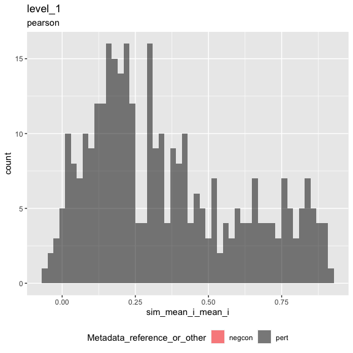
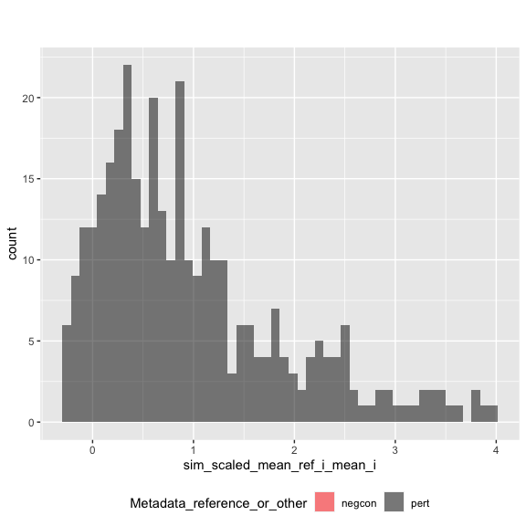
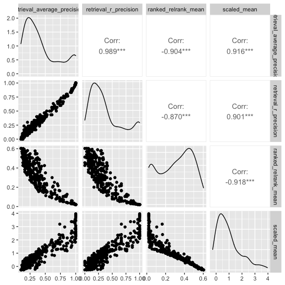

Inspect metrics
================

-   [1 Setup](#setup)
-   [2 Load metrics](#load-metrics)
-   [3 Inspect metrics](#inspect-metrics)
    -   [3.1 Functions](#functions)
    -   [3.2 Process metrics](#process-metrics)
        -   [3.2.1 Level 1](#level-1)
    -   [3.3 Plot metrics](#plot-metrics)
        -   [3.3.1 Level 1](#level-1-1)

# 1 Setup

``` r
library(magrittr)
library(tidyverse)
library(glue)
library(arrow)
library(matric)
library(logger)
source("utils.R")
```

``` r
knitr::opts_chunk$set(fig.height = 8, fig.width = 8, rows.print = 20)
```

``` r
cat(yaml::as.yaml(params))
```

    ## input_metrics_file_prefix: results/73cb54a8/metrics

# 2 Load metrics

``` r
metric_set_names <- c("level_1")

metric_sets <-
  map(metric_set_names, function(metric_set) {
    parquet_file <-
      with(params, glue("{input_metrics_file_prefix}_{metric_set}.parquet"))

    log_info("Reading {parquet_file} ...")

    arrow::read_parquet(glue(parquet_file))
  })

names(metric_sets) <- paste(metric_set_names, "metrics", sep = "_")

all_same_cols_rep <- attr(metric_sets[[1]], "all_same_cols_rep")
```

# 3 Inspect metrics

## 3.1 Functions

``` r
color_map <- c(
  "negcon" = "red",
  "pert" = "black"
)

plot_metric <-
  function(metrics,
           metric_name,
           plot_title,
           plot_subtitle) {
    # metrics <- level_1_metrics
    # metric_name <- "sim_scaled_mean_ref_i_mean_i"
    # plot_title <- experiment_tag
    # plot_subtitle <- data_level

    metric_sym <- sym(metric_name)

    p <-
      metrics %>%
      mutate(point_order = as.numeric(factor(
        Metadata_reference_or_other,
        levels = c("negcon", "pert"),
        ordered = TRUE
      ))) %>%
      arrange(desc(point_order)) %>%
      ggplot(aes(!!metric_sym,
        fill = Metadata_reference_or_other
      )) +
      geom_histogram(
        position = "identity",
        alpha = 0.5,
        bins = 50
      ) +
      scale_fill_manual(values = color_map) +
      ggtitle(plot_title, subtitle = plot_subtitle) +
      theme(legend.position = "bottom")

    list(fig1 = p)
  }
```

``` r
knitr::opts_chunk$set(fig.height = 6, fig.width = 6, rows.print = 20)
```

## 3.2 Process metrics

### 3.2.1 Level 1

``` r
level_1_metrics <-
  metric_sets[["level_1_metrics"]]
```

``` r
cat(yaml::as.yaml(attr(level_1_metrics, "params")))
```

    ## prepare_data:
    ##   input_profile_files:
    ##   - tag: ''
    ##     filename: https://github.com/broadinstitute/grit-benchmark/raw/main/1.calculate-metrics/cell-health/data//cell_health_merged_feature_select.csv.gz
    ##   output_profile_file: results/73cb54a8/profiles.parquet
    ##   data_path: https://github.com/broadinstitute/grit-benchmark/raw/main/1.calculate-metrics/cell-health/data/
    ##   reference_gene_codes:
    ##     Metadata_gene_name: Chr2
    ##   subsample_fraction: 1
    ## calculate_index:
    ##   input_profile_file: results/73cb54a8/profiles.parquet
    ##   output_index_file: results/73cb54a8/index.parquet
    ##   output_collatedindex_file: results/73cb54a8/collatedindex.parquet
    ##   sim_params:
    ##     drop_group:
    ##       Metadata_gene_name: EMPTY
    ##     reference:
    ##       Metadata_reference_or_other: reference
    ##     all_same_cols_ref:
    ##     - Metadata_cell_line
    ##     - Metadata_Plate
    ##     all_same_cols_rep:
    ##     - Metadata_cell_line
    ##     - Metadata_gene_name
    ##     - Metadata_pert_name
    ##     - Metadata_reference_or_other
    ##     all_same_cols_rep_ref: ~
    ##     any_different_cols_non_rep: ~
    ##     all_same_cols_non_rep: ~
    ##     all_different_cols_non_rep: ~
    ##     all_same_cols_group: ~
    ##     any_different_cols_group: ~
    ##     annotation_cols:
    ##     - Metadata_cell_line
    ##     - Metadata_gene_name
    ##     - Metadata_pert_name
    ##     - Metadata_reference_or_other
    ## calculate_metrics:
    ##   input_profile_file: results/73cb54a8/profiles.parquet
    ##   input_collatedindex_file: results/73cb54a8/collatedindex.parquet
    ##   output_collatedsim_file: results/73cb54a8/collatedsim.parquet
    ##   output_metrics_file_prefix: results/73cb54a8/metrics
    ##   similarity_method: pearson
    ##   parallel_workers: 8

## 3.3 Plot metrics

### 3.3.1 Level 1

``` r
result <-
  plot_metric(
    level_1_metrics,
    "sim_mean_i_mean_i",
    "level_1",
    attr(level_1_metrics, "metric_metadata")$method
  )
result$fig1
```

<!-- -->

``` r
result <-
  plot_metric(
    level_1_metrics,
    "sim_scaled_mean_ref_i_mean_i",
    "",
    ""
  )
result$fig1
```

<!-- -->

``` r
level_1_metrics %>%
  arrange(across(everything())) %>%
  head()
```

<div class="kable-table">

| Metadata\_cell\_line | Metadata\_gene\_name | Metadata\_pert\_name | Metadata\_reference\_or\_other | sim\_scaled\_mean\_ref\_i\_mean\_i | sim\_scaled\_mean\_ref\_i\_median\_i | sim\_scaled\_median\_ref\_i\_mean\_i | sim\_scaled\_median\_ref\_i\_median\_i | sim\_ranked\_relrank\_mean\_ref\_i\_mean\_i | sim\_ranked\_relrank\_mean\_ref\_i\_median\_i | sim\_ranked\_relrank\_median\_ref\_i\_mean\_i | sim\_ranked\_relrank\_median\_ref\_i\_median\_i | sim\_mean\_i\_mean\_i | sim\_mean\_i\_median\_i | sim\_median\_i\_mean\_i | sim\_median\_i\_median\_i | sim\_mean\_stat\_ref\_i\_mean\_i | sim\_mean\_stat\_ref\_i\_median\_i | sim\_sd\_stat\_ref\_i\_mean\_i | sim\_sd\_stat\_ref\_i\_median\_i | sim\_retrieval\_average\_precision\_ref\_i\_mean\_i | sim\_retrieval\_average\_precision\_ref\_i\_median\_i | sim\_retrieval\_r\_precision\_ref\_i\_mean\_i | sim\_retrieval\_r\_precision\_ref\_i\_median\_i |
|:---------------------|:---------------------|:---------------------|:-------------------------------|-----------------------------------:|-------------------------------------:|-------------------------------------:|---------------------------------------:|--------------------------------------------:|----------------------------------------------:|----------------------------------------------:|------------------------------------------------:|----------------------:|------------------------:|------------------------:|--------------------------:|---------------------------------:|-----------------------------------:|-------------------------------:|---------------------------------:|----------------------------------------------------:|------------------------------------------------------:|----------------------------------------------:|------------------------------------------------:|
| A549                 | AKT1                 | AKT1-1               | pert                           |                          0.0861706 |                            0.0012089 |                           -0.0552632 |                             -0.1624612 |                                   0.5034722 |                                     0.5062500 |                                     0.5520833 |                                       0.5625000 |             0.0617091 |               0.0795101 |               0.0243033 |                 0.0616828 |                        0.0547068 |                          0.0949572 |                      0.3055812 |                        0.3336165 |                                           0.1771228 |                                             0.1526126 |                                     0.1333333 |                                             0.1 |
| A549                 | AKT1                 | AKT1-2               | pert                           |                         -0.1225830 |                           -0.0862471 |                           -0.9746164 |                             -0.9646271 |                                   0.5805556 |                                     0.5812500 |                                     0.7951389 |                                       0.8333333 |            -0.0349481 |              -0.0191826 |              -0.3201035 |                -0.3286177 |                        0.0240564 |                          0.0263915 |                      0.3388420 |                        0.3314011 |                                           0.2083729 |                                             0.1848079 |                                     0.3000000 |                                             0.3 |
| A549                 | ARID1B               | ARID1B-1             | pert                           |                          0.1646574 |                            0.4169914 |                            0.2199456 |                              0.5253463 |                                   0.4784722 |                                     0.4083333 |                                     0.4444444 |                                       0.3020833 |             0.1563084 |               0.1631081 |               0.1583259 |                 0.2508668 |                        0.1257185 |                          0.1181960 |                      0.3313877 |                        0.3576681 |                                           0.1716065 |                                             0.1794520 |                                     0.1333333 |                                             0.1 |
| A549                 | ARID1B               | ARID1B-2             | pert                           |                          0.3526836 |                            0.3177805 |                            0.4703513 |                              0.5454097 |                                   0.4500000 |                                     0.4437500 |                                     0.4305556 |                                       0.4270833 |             0.3411283 |               0.3544606 |               0.3856576 |                 0.4036441 |                        0.2382836 |                          0.2705097 |                      0.3171494 |                        0.3030492 |                                           0.1496058 |                                             0.1250936 |                                     0.0666667 |                                             0.0 |
| A549                 | ATF4                 | ATF4-1               | pert                           |                          1.3004967 |                            1.3179452 |                            1.3751730 |                              1.3708906 |                                   0.0854167 |                                     0.0770833 |                                     0.0416667 |                                       0.0416667 |             0.7826972 |               0.8089662 |               0.8091594 |                 0.8328137 |                        0.3232566 |                          0.3275061 |                      0.3580464 |                        0.3626952 |                                           0.7054646 |                                             0.7383929 |                                     0.6333333 |                                             0.6 |
| A549                 | ATF4                 | ATF4-2               | pert                           |                          1.3184689 |                            1.2734981 |                            1.3451262 |                              1.3248038 |                                   0.0555556 |                                     0.0541667 |                                     0.0312500 |                                       0.0208333 |             0.8336925 |               0.8452391 |               0.8435776 |                 0.8562481 |                        0.3388308 |                          0.3314675 |                      0.3757381 |                        0.3891282 |                                           0.7885276 |                                             0.8172494 |                                     0.6666667 |                                             0.6 |

</div>

``` r
level_1_metrics %>%
  select(
    sim_retrieval_average_precision_ref_i_mean_i,
    sim_retrieval_r_precision_ref_i_mean_i,
    sim_ranked_relrank_mean_ref_i_mean_i,
    sim_scaled_mean_ref_i_mean_i
  ) %>%
  rename_with(~ str_remove_all(., "sim_|_ref_i_mean_i"), matches("sim_")) %>%
  GGally::ggpairs(progress = FALSE)
```

<!-- -->
