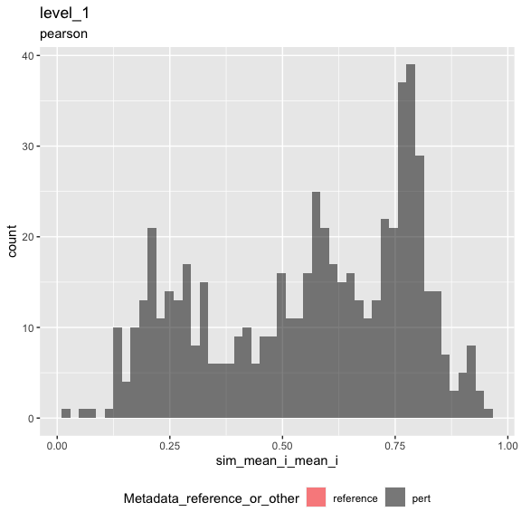
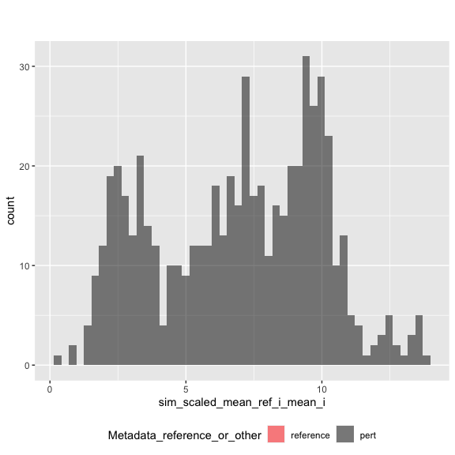
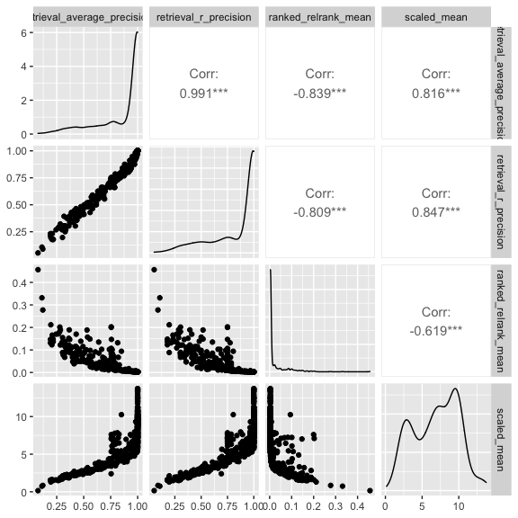

Inspect metrics
================

-   [1 Setup](#setup)
-   [2 Load metrics](#load-metrics)
-   [3 Inspect metrics](#inspect-metrics)
    -   [3.1 Functions](#functions)
    -   [3.2 Process metrics](#process-metrics)
        -   [3.2.1 Level 1](#level-1)
    -   [3.3 Plot metrics](#plot-metrics)
        -   [3.3.1 Level 1](#level-1-1)

# 1 Setup

``` r
library(magrittr)
library(tidyverse)
library(glue)
library(arrow)
library(matric)
library(logger)
source("utils.R")
```

``` r
knitr::opts_chunk$set(fig.height = 8, fig.width = 8, rows.print = 20)
```

``` r
cat(yaml::as.yaml(params))
```

    ## input_metrics_file_prefix: results/915ea671/metrics

# 2 Load metrics

``` r
metric_set_names <- c("level_1")

metric_sets <-
  map(metric_set_names, function(metric_set) {
    parquet_file <-
      with(params, glue("{input_metrics_file_prefix}_{metric_set}.parquet"))

    log_info("Reading {parquet_file} ...")

    arrow::read_parquet(glue(parquet_file))
  })

names(metric_sets) <- paste(metric_set_names, "metrics", sep = "_")

all_same_cols_rep <- attr(metric_sets[[1]], "all_same_cols_rep")
```

# 3 Inspect metrics

## 3.1 Functions

``` r
color_map <- c(
  "reference" = "red",
  "pert" = "black"
)

plot_metric <-
  function(metrics,
           metric_name,
           plot_title,
           plot_subtitle) {

    metric_sym <- sym(metric_name)

    p <-
      metrics %>%
      mutate(point_order = as.numeric(factor(
        Metadata_reference_or_other,
        levels = c("reference", "pert"),
        ordered = TRUE
      ))) %>%
      arrange(desc(point_order)) %>%
      ggplot(aes(!!metric_sym,
        fill = Metadata_reference_or_other
      )) +
      geom_histogram(
        position = "identity",
        alpha = 0.5,
        bins = 50
      ) +
      scale_fill_manual(values = color_map) +
      ggtitle(plot_title, subtitle = plot_subtitle) +
      theme(legend.position = "bottom")

    list(fig1 = p)
  }
```

``` r
knitr::opts_chunk$set(fig.height = 6, fig.width = 6, rows.print = 20)
```

## 3.2 Process metrics

### 3.2.1 Level 1

``` r
level_1_metrics <-
  metric_sets[["level_1_metrics"]]
```

``` r
cat(yaml::as.yaml(attr(level_1_metrics, "params")))
```

    ## prepare_data:
    ##   input_profile_files:
    ##   - tag: ''
    ##     filename: ~/Downloads//luad_dp.parquet
    ##   output_profile_file: results/915ea671/profiles.parquet
    ##   data_path: ~/Downloads/
    ##   reference_set:
    ##     Metadata_gene_name: EMPTY
    ##   random_seed: 42
    ##   subsample_fraction: 1
    ##   subsample_pert_strata: Metadata_Well
    ##   subsample_reference_strata: Metadata_Well
    ##   shuffle: no
    ##   shuffle_bad_groups_threshold: 0.1
    ##   shuffle_group: Metadata_pert_name
    ##   shuffle_strata: ~
    ##   shuffle_exclude:
    ##     Metadata_gene_name: EMPTY
    ##   aggregate_by: ~
    ## calculate_index:
    ##   input_profile_file: results/915ea671/profiles.parquet
    ##   output_index_file: results/915ea671/index.parquet
    ##   output_collatedindex_file: results/915ea671/collatedindex.parquet
    ##   sim_params:
    ##     drop_group: ~
    ##     reference:
    ##       Metadata_reference_or_other: reference
    ##     all_same_cols_ref: Metadata_cell_line
    ##     all_same_cols_rep:
    ##     - Metadata_cell_line
    ##     - Metadata_pert_name
    ##     - Metadata_gene_name
    ##     all_same_cols_rep_ref: ~
    ##     any_different_cols_non_rep:
    ##     - Metadata_cell_line
    ##     - Metadata_gene_name
    ##     all_same_cols_non_rep: Metadata_cell_line
    ##     all_different_cols_non_rep: ~
    ##     all_same_cols_group: ~
    ##     any_different_cols_group: ~
    ##     annotation_cols:
    ##     - Metadata_cell_line
    ##     - Metadata_gene_name
    ##     - Metadata_pert_name
    ##     - Metadata_reference_or_other
    ## calculate_metrics:
    ##   input_profile_file: results/915ea671/profiles.parquet
    ##   input_collatedindex_file: results/915ea671/collatedindex.parquet
    ##   output_collatedsim_file: results/915ea671/collatedsim.parquet
    ##   output_metrics_file_prefix: results/915ea671/metrics
    ##   similarity_method: pearson
    ##   parallel_workers: 8

## 3.3 Plot metrics

### 3.3.1 Level 1

``` r
result <-
  plot_metric(
    level_1_metrics,
    "sim_mean_i_mean_i",
    "level_1",
    attr(level_1_metrics, "metric_metadata")$method
  )
result$fig1
```

<!-- -->

``` r
result <-
  plot_metric(
    level_1_metrics,
    "sim_scaled_mean_ref_i_mean_i",
    "",
    ""
  )
result$fig1
```

<!-- -->

``` r
level_1_metrics %>%
  arrange(across(everything())) %>%
  head()
```

<div class="kable-table">

| Metadata\_cell\_line | Metadata\_pert\_name | Metadata\_gene\_name | Metadata\_reference\_or\_other | sim\_scaled\_mean\_ref\_i\_mean\_i | sim\_scaled\_mean\_ref\_i\_median\_i | sim\_scaled\_median\_ref\_i\_mean\_i | sim\_scaled\_median\_ref\_i\_median\_i | sim\_ranked\_relrank\_mean\_ref\_i\_mean\_i | sim\_ranked\_relrank\_mean\_ref\_i\_median\_i | sim\_ranked\_relrank\_median\_ref\_i\_mean\_i | sim\_ranked\_relrank\_median\_ref\_i\_median\_i | sim\_mean\_i\_mean\_i | sim\_mean\_i\_median\_i | sim\_median\_i\_mean\_i | sim\_median\_i\_median\_i | sim\_mean\_stat\_ref\_i\_mean\_i | sim\_mean\_stat\_ref\_i\_median\_i | sim\_sd\_stat\_ref\_i\_mean\_i | sim\_sd\_stat\_ref\_i\_median\_i | sim\_retrieval\_average\_precision\_ref\_i\_mean\_i | sim\_retrieval\_average\_precision\_ref\_i\_median\_i | sim\_retrieval\_r\_precision\_ref\_i\_mean\_i | sim\_retrieval\_r\_precision\_ref\_i\_median\_i |
|:---------------------|:---------------------|:---------------------|:-------------------------------|-----------------------------------:|-------------------------------------:|-------------------------------------:|---------------------------------------:|--------------------------------------------:|----------------------------------------------:|----------------------------------------------:|------------------------------------------------:|----------------------:|------------------------:|------------------------:|--------------------------:|---------------------------------:|-----------------------------------:|-------------------------------:|---------------------------------:|----------------------------------------------------:|------------------------------------------------------:|----------------------------------------------:|------------------------------------------------:|
| A549                 | ABCB9\_p.G443C       | ABCB9                | pert                           |                           2.344276 |                             2.383226 |                             2.507202 |                               2.376088 |                                   0.1146763 |                                     0.0745536 |                                     0.0285156 |                                       0.0203125 |             0.2010830 |               0.2003620 |               0.2144399 |                 0.2123185 |                       -0.0009610 |                         -0.0010368 |                      0.0854104 |                        0.0855953 |                                           0.4216855 |                                             0.4344725 |                                     0.3928571 |                                       0.4285714 |
| A549                 | ABCB9\_p.R281L       | ABCB9                | pert                           |                           2.103338 |                             2.026581 |                             2.002915 |                               2.054276 |                                   0.0873326 |                                     0.0959821 |                                     0.0464844 |                                       0.0343750 |             0.1908015 |               0.1832161 |               0.1815607 |                 0.1864496 |                       -0.0000453 |                         -0.0000184 |                      0.0905598 |                        0.0911410 |                                           0.3725886 |                                             0.3479101 |                                     0.3571429 |                                       0.3571429 |
| A549                 | ABCB9\_p.V140M       | ABCB9                | pert                           |                           1.841433 |                             1.987506 |                             1.966797 |                               2.128603 |                                   0.1518415 |                                     0.1087054 |                                     0.0843750 |                                       0.0312500 |             0.1608236 |               0.1715976 |               0.1719094 |                 0.1816867 |                       -0.0015814 |                         -0.0015706 |                      0.0882363 |                        0.0880329 |                                           0.3614756 |                                             0.3487252 |                                     0.3750000 |                                       0.3571429 |
| A549                 | ABCB9\_WT.c          | ABCB9                | pert                           |                           1.631268 |                             1.482356 |                             1.664910 |                               1.511180 |                                   0.1229353 |                                     0.1377232 |                                     0.0753906 |                                       0.0843750 |             0.1373500 |               0.1280790 |               0.1394135 |                 0.1305482 |                       -0.0007019 |                         -0.0006635 |                      0.0844766 |                        0.0869702 |                                           0.2051449 |                                             0.1757457 |                                     0.1785714 |                                       0.1428571 |
| A549                 | ABCB9\_WT.o          | ABCB9                | pert                           |                           1.956067 |                             1.868837 |                             1.838892 |                               1.795690 |                                   0.0840960 |                                     0.0859375 |                                     0.0562500 |                                       0.0406250 |             0.1712424 |               0.1630282 |               0.1603557 |                 0.1523498 |                        0.0000876 |                         -0.0000847 |                      0.0875928 |                        0.0876046 |                                           0.3203866 |                                             0.3056278 |                                     0.3035714 |                                       0.2857143 |
| A549                 | ACAA1\_WT.o          | ACAA1                | pert                           |                           8.895787 |                             9.033382 |                             9.119395 |                               9.324621 |                                   0.0031250 |                                     0.0031250 |                                     0.0031250 |                                       0.0031250 |             0.7376314 |               0.7535541 |               0.7562498 |                 0.7722570 |                       -0.0012967 |                         -0.0013617 |                      0.0830549 |                        0.0829456 |                                           1.0000000 |                                             1.0000000 |                                     1.0000000 |                                       1.0000000 |

</div>

``` r
level_1_metrics %>%
  select(
    sim_retrieval_average_precision_ref_i_mean_i,
    sim_retrieval_r_precision_ref_i_mean_i,
    sim_ranked_relrank_mean_ref_i_mean_i,
    sim_scaled_mean_ref_i_mean_i
  ) %>%
  rename_with(~ str_remove_all(., "sim_|_ref_i_mean_i"), matches("sim_")) %>%
  GGally::ggpairs(progress = FALSE)
```

    ## Registered S3 method overwritten by 'GGally':
    ##   method from   
    ##   +.gg   ggplot2

<!-- -->
