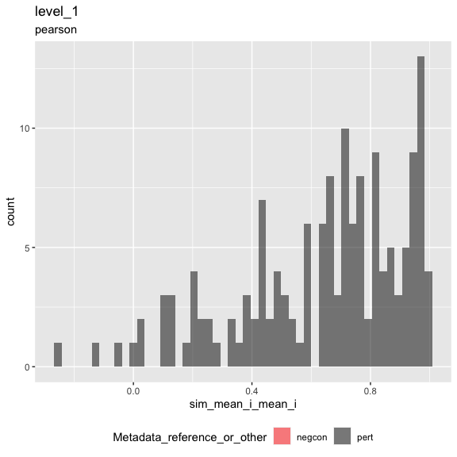
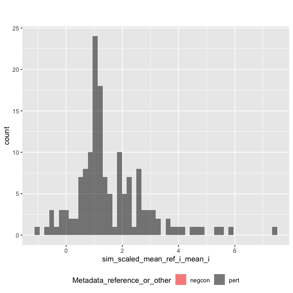
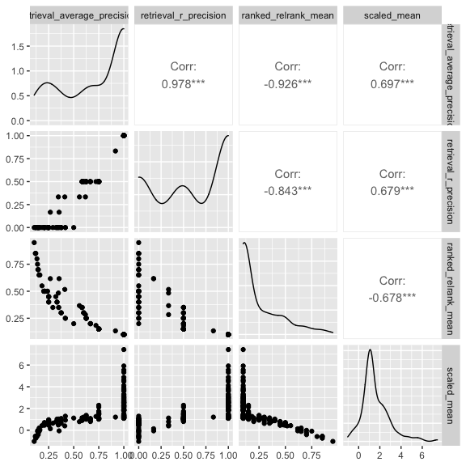

Inspect metrics
================

-   [1 Setup](#setup)
-   [2 Load metrics](#load-metrics)
-   [3 Inspect metrics](#inspect-metrics)
    -   [3.1 Functions](#functions)
    -   [3.2 Process metrics](#process-metrics)
        -   [3.2.1 Level 1](#level-1)
    -   [3.3 Plot metrics](#plot-metrics)
        -   [3.3.1 Level 1](#level-1-1)

# 1 Setup

``` r
library(magrittr)
library(tidyverse)
library(glue)
library(arrow)
library(matric)
library(logger)
source("utils.R")
```

``` r
knitr::opts_chunk$set(fig.height = 8, fig.width = 8, rows.print = 20)
```

``` r
cat(yaml::as.yaml(params))
```

    ## input_metrics_file_prefix: results/957845b2/metrics

# 2 Load metrics

``` r
metric_set_names <- c("level_1")

metric_sets <-
  map(metric_set_names, function(metric_set) {
    parquet_file <-
      with(params, glue("{input_metrics_file_prefix}_{metric_set}.parquet"))

    log_info("Reading {parquet_file} ...")

    arrow::read_parquet(glue(parquet_file))
  })

names(metric_sets) <- paste(metric_set_names, "metrics", sep = "_")

all_same_cols_rep <- attr(metric_sets[[1]], "all_same_cols_rep")
```

# 3 Inspect metrics

## 3.1 Functions

``` r
color_map <- c(
  "negcon" = "red",
  "pert" = "black"
)

plot_metric <-
  function(metrics,
           metric_name,
           plot_title,
           plot_subtitle) {
    # metrics <- level_1_metrics
    # metric_name <- "sim_scaled_mean_ref_i_mean_i"
    # plot_title <- experiment_tag
    # plot_subtitle <- data_level

    metric_sym <- sym(metric_name)

    p <-
      metrics %>%
      mutate(point_order = as.numeric(factor(
        Metadata_reference_or_other,
        levels = c("negcon", "pert"),
        ordered = TRUE
      ))) %>%
      arrange(desc(point_order)) %>%
      ggplot(aes(!!metric_sym,
        fill = Metadata_reference_or_other
      )) +
      geom_histogram(
        position = "identity",
        alpha = 0.5,
        bins = 50
      ) +
      scale_fill_manual(values = color_map) +
      ggtitle(plot_title, subtitle = plot_subtitle) +
      theme(legend.position = "bottom")

    list(fig1 = p)
  }
```

``` r
knitr::opts_chunk$set(fig.height = 6, fig.width = 6, rows.print = 20)
```

## 3.2 Process metrics

### 3.2.1 Level 1

``` r
level_1_metrics <-
  metric_sets[["level_1_metrics"]]
```

``` r
cat(yaml::as.yaml(attr(level_1_metrics, "params")))
```

    ## prepare_data:
    ##   input_profile_files:
    ##   - tag: ''
    ##     filename: https://github.com/broadinstitute/grit-benchmark/raw/main/1.calculate-metrics/cell-health/data//cell_health_merged_feature_select.csv.gz
    ##   output_profile_file: results/957845b2/profiles.parquet
    ##   data_path: https://github.com/broadinstitute/grit-benchmark/raw/main/1.calculate-metrics/cell-health/data/
    ##   reference_gene_codes:
    ##     Metadata_gene_name:
    ##     - Chr2
    ##     - Luc
    ##     - LacZ
    ##   subsample_fraction: 1
    ##   shuffle: no
    ##   shuffle_exclude:
    ##     Metadata_gene_name:
    ##     - Chr2
    ##     - Luc
    ##     - LacZ
    ##     - EMPTY
    ##   aggregate_by:
    ##   - Metadata_cell_line
    ##   - Metadata_gene_name
    ##   - Metadata_pert_name
    ## calculate_index:
    ##   input_profile_file: results/957845b2/profiles.parquet
    ##   output_index_file: results/957845b2/index.parquet
    ##   output_collatedindex_file: results/957845b2/collatedindex.parquet
    ##   sim_params:
    ##     drop_group:
    ##       Metadata_gene_name: EMPTY
    ##     reference:
    ##       Metadata_reference_or_other: reference
    ##     all_same_cols_ref: Metadata_cell_line
    ##     all_same_cols_rep:
    ##     - Metadata_cell_line
    ##     - Metadata_gene_name
    ##     - Metadata_reference_or_other
    ##     all_same_cols_rep_ref: ~
    ##     any_different_cols_non_rep: ~
    ##     all_same_cols_non_rep: ~
    ##     all_different_cols_non_rep: ~
    ##     all_same_cols_group: ~
    ##     any_different_cols_group: ~
    ##     annotation_cols:
    ##     - Metadata_cell_line
    ##     - Metadata_gene_name
    ##     - Metadata_pert_name
    ##     - Metadata_reference_or_other
    ## calculate_metrics:
    ##   input_profile_file: results/957845b2/profiles.parquet
    ##   input_collatedindex_file: results/957845b2/collatedindex.parquet
    ##   output_collatedsim_file: results/957845b2/collatedsim.parquet
    ##   output_metrics_file_prefix: results/957845b2/metrics
    ##   similarity_method: pearson
    ##   parallel_workers: 8

## 3.3 Plot metrics

### 3.3.1 Level 1

``` r
result <-
  plot_metric(
    level_1_metrics,
    "sim_mean_i_mean_i",
    "level_1",
    attr(level_1_metrics, "metric_metadata")$method
  )
result$fig1
```

<!-- -->

``` r
result <-
  plot_metric(
    level_1_metrics,
    "sim_scaled_mean_ref_i_mean_i",
    "",
    ""
  )
result$fig1
```

<!-- -->

``` r
level_1_metrics %>%
  arrange(across(everything())) %>%
  head()
```

<div class="kable-table">

| Metadata\_cell\_line | Metadata\_gene\_name | Metadata\_reference\_or\_other | sim\_scaled\_mean\_ref\_i\_mean\_i | sim\_scaled\_mean\_ref\_i\_median\_i | sim\_scaled\_median\_ref\_i\_mean\_i | sim\_scaled\_median\_ref\_i\_median\_i | sim\_ranked\_relrank\_mean\_ref\_i\_mean\_i | sim\_ranked\_relrank\_mean\_ref\_i\_median\_i | sim\_ranked\_relrank\_median\_ref\_i\_mean\_i | sim\_ranked\_relrank\_median\_ref\_i\_median\_i | sim\_mean\_i\_mean\_i | sim\_mean\_i\_median\_i | sim\_median\_i\_mean\_i | sim\_median\_i\_median\_i | sim\_mean\_stat\_ref\_i\_mean\_i | sim\_mean\_stat\_ref\_i\_median\_i | sim\_sd\_stat\_ref\_i\_mean\_i | sim\_sd\_stat\_ref\_i\_median\_i | sim\_retrieval\_average\_precision\_ref\_i\_mean\_i | sim\_retrieval\_average\_precision\_ref\_i\_median\_i | sim\_retrieval\_r\_precision\_ref\_i\_mean\_i | sim\_retrieval\_r\_precision\_ref\_i\_median\_i |
|:---------------------|:---------------------|:-------------------------------|-----------------------------------:|-------------------------------------:|-------------------------------------:|---------------------------------------:|--------------------------------------------:|----------------------------------------------:|----------------------------------------------:|------------------------------------------------:|----------------------:|------------------------:|------------------------:|--------------------------:|---------------------------------:|-----------------------------------:|-------------------------------:|---------------------------------:|----------------------------------------------------:|------------------------------------------------------:|----------------------------------------------:|------------------------------------------------:|
| A549                 | AKT1                 | pert                           |                          1.8857475 |                            1.8857475 |                            1.8857475 |                              1.8857475 |                                   0.1000000 |                                          0.10 |                                     0.1000000 |                                            0.10 |             0.7121593 |               0.7121593 |               0.7121593 |                 0.7121593 |                        0.0793564 |                          0.0793564 |                      0.3367990 |                        0.3367990 |                                           1.0000000 |                                             1.0000000 |                                     1.0000000 |                                             1.0 |
| A549                 | ARID1B               | pert                           |                          1.0999742 |                            1.0999742 |                            1.0999742 |                              1.0999742 |                                   0.2500000 |                                          0.25 |                                     0.2500000 |                                            0.25 |             0.7707023 |               0.7707023 |               0.7707023 |                 0.7707023 |                        0.2384475 |                          0.2384475 |                      0.4908080 |                        0.4908080 |                                           0.6250000 |                                             0.6250000 |                                     0.5000000 |                                             0.5 |
| A549                 | ATF4                 | pert                           |                          1.1806536 |                            1.1806536 |                            1.1806536 |                              1.1806536 |                                   0.1000000 |                                          0.10 |                                     0.1000000 |                                            0.10 |             0.9628017 |               0.9628017 |               0.9628017 |                 0.9628017 |                        0.3115576 |                          0.3115576 |                      0.5516414 |                        0.5516414 |                                           1.0000000 |                                             1.0000000 |                                     1.0000000 |                                             1.0 |
| A549                 | ATP50                | pert                           |                          0.5154094 |                            0.5154094 |                            0.5154094 |                              0.5154094 |                                   0.5000000 |                                          0.50 |                                     0.5000000 |                                            0.50 |             0.5140409 |               0.5140409 |               0.5140409 |                 0.5140409 |                        0.2587826 |                          0.2587826 |                      0.5207830 |                        0.5207830 |                                           0.2083333 |                                             0.2083333 |                                     0.0000000 |                                             0.0 |
| A549                 | BCL2                 | pert                           |                          0.9022461 |                            0.9022461 |                            0.9022461 |                              0.9022461 |                                   0.4000000 |                                          0.40 |                                     0.4000000 |                                            0.40 |             0.6423438 |               0.6423438 |               0.6423438 |                 0.6423438 |                        0.2127670 |                          0.2127670 |                      0.4764602 |                        0.4764602 |                                           0.2500000 |                                             0.2500000 |                                     0.0000000 |                                             0.0 |
| A549                 | BCL2L2               | pert                           |                         -0.0598092 |                            0.3639012 |                           -0.0598092 |                              0.3639012 |                                   0.6166667 |                                          0.55 |                                     0.6166667 |                                            0.55 |             0.0301770 |               0.0429705 |               0.0301770 |                 0.0429705 |                        0.1015549 |                          0.0360615 |                      0.3110222 |                        0.3312583 |                                           0.3543110 |                                             0.3095238 |                                     0.1666667 |                                             0.0 |

</div>

``` r
level_1_metrics %>%
  select(
    sim_retrieval_average_precision_ref_i_mean_i,
    sim_retrieval_r_precision_ref_i_mean_i,
    sim_ranked_relrank_mean_ref_i_mean_i,
    sim_scaled_mean_ref_i_mean_i
  ) %>%
  rename_with(~ str_remove_all(., "sim_|_ref_i_mean_i"), matches("sim_")) %>%
  GGally::ggpairs(progress = FALSE)
```

<!-- -->
