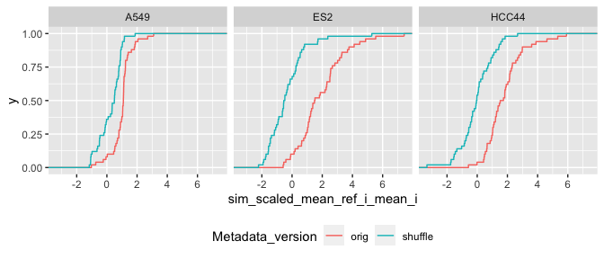
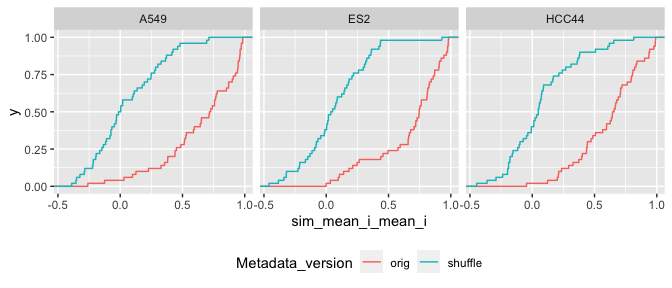
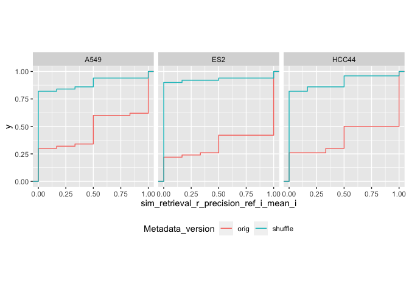
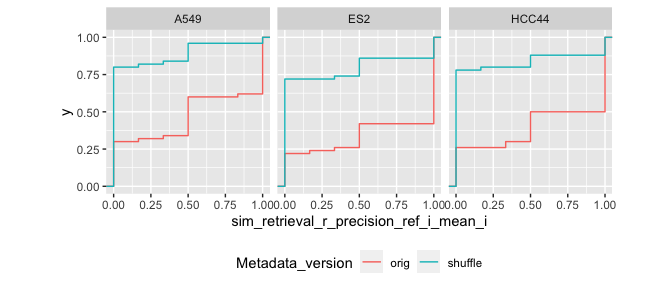
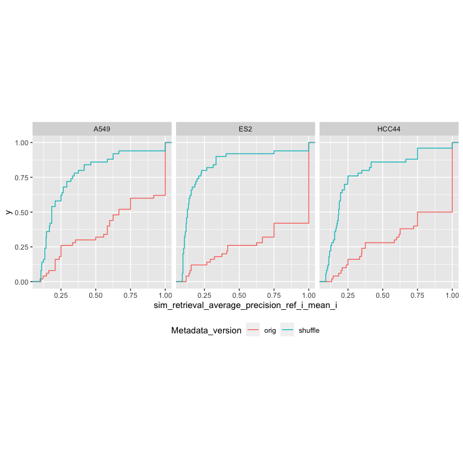
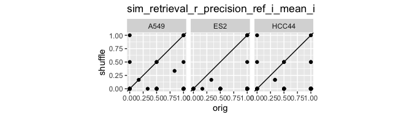

Compare shuffled vs non-shuffed
================

-   [1 Setup](#setup)

# 1 Setup

``` r
library(magrittr)
library(tidyverse)
library(glue)
library(arrow)
library(matric)
library(logger)
source("utils.R")
```

``` r
metrics_orig <-
  read_parquet(glue("results/{run}/metrics_level_1.parquet", run = params$orig_run))

metrics_shuffle <-
  read_parquet(glue("results/{run}/metrics_level_1.parquet", run = params$shuffle_run))
```

``` r
attr(metrics_orig, "params")$prepare_data$shuffle
```

    ## [1] FALSE

``` r
attr(metrics_shuffle, "params")$prepare_data$shuffle
```

    ## [1] TRUE

``` r
metrics_collated <-
  bind_rows(
    metrics_orig %>% mutate(Metadata_version = "orig"),
    metrics_shuffle %>% mutate(Metadata_version = "shuffle")
  )
```

``` r
metric_names <-
  c("sim_scaled_mean_ref_i_mean_i",
    "sim_mean_i_mean_i",
    "sim_retrieval_average_precision_ref_i_mean_i",
    "sim_retrieval_r_precision_ref_i_mean_i")
```

``` r
metric_names %>%
  walk(function(metric_name) {
    p <-
      metrics_collated %>%
      ggplot(aes_string(metric_name, color = "Metadata_version")) +
      stat_ecdf() +
      facet_wrap(as.formula(paste("~", params$facet_col))) +
      theme(legend.position = "bottom")
    if(str_detect(metric_name, "retrieval")) {
      p <- p + coord_equal()
    }
    plot(p)
  })
```

<!-- --><!-- --><!-- --><!-- -->

``` r
metric_names %>%
  walk(function(metric_name) {
    p <-
      metrics_collated %>%
      select(all_of(c("Metadata_version",
                      params$facet_col,
                      params$shuffle_group_col,
                      metric_name))) %>%
      pivot_wider(names_from = Metadata_version,
                  values_from = all_of(c(metric_name))) %>%
      ggplot(aes(orig, shuffle)) +
      geom_point() +
      geom_abline() +
      coord_equal() +
      ggtitle(metric_name) +
      facet_wrap(as.formula(paste("~", params$facet_col)))

    print(p)
  })
```

<!-- --><!-- --><!-- --><!-- -->
