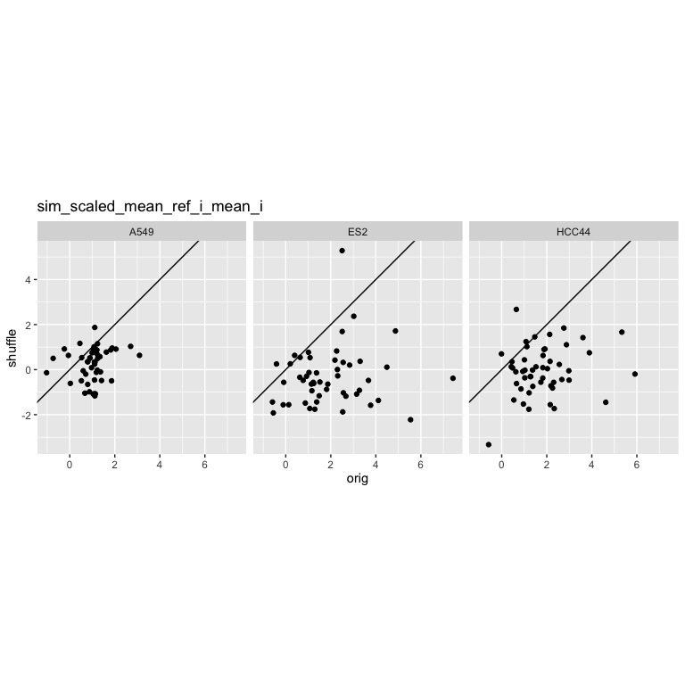
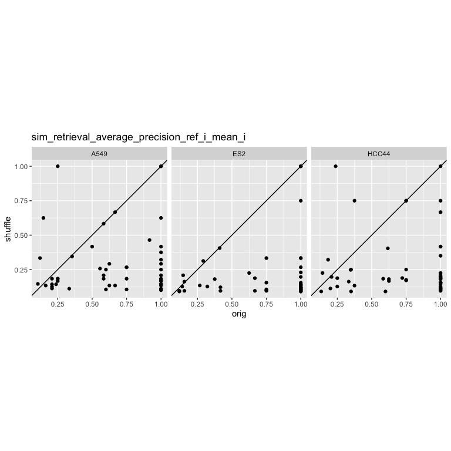
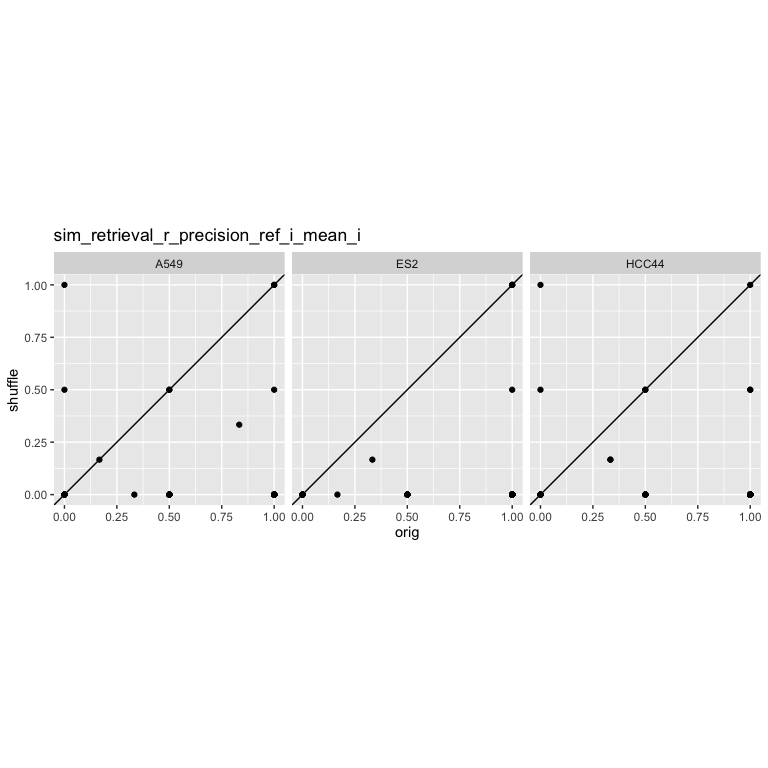
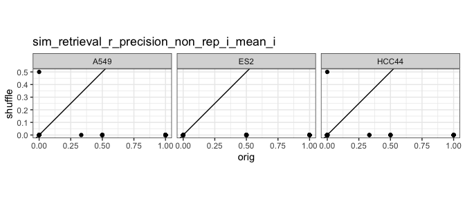

Compare shuffled vs non-shuffed
================

- <a href="#1-setup" id="toc-1-setup">1 Setup</a>

# 1 Setup

``` r
library(magrittr)
library(tidyverse)
library(glue)
library(arrow)
library(matric)
library(logger)
source("utils.R")
```

``` r
type <- params$background_type
```

``` r
metrics_orig <-
  read_parquet(with(params, glue("results/{orig_run}/metrics_level_1_{type}.parquet")))

metrics_shuffle <-
  read_parquet(with(params, glue("results/{shuffle_run}/metrics_level_1_{type}.parquet")))
```

After reading level_1, drop duplicates that may result from annotating
level 1_0 entities

``` r
all_same_cols_rep <- attr(metrics_orig, "all_same_cols_rep")

metrics_orig <-
  metrics_orig %>%
  select(all_of(all_same_cols_rep), matches("^sim_")) %>%
  distinct()

metrics_shuffle <-
  metrics_shuffle %>%
  select(all_of(all_same_cols_rep), matches("^sim_")) %>%
  distinct()
```

``` r
attr(metrics_shuffle, "params")$prepare_data$shuffle
```

    ## [1] TRUE

``` r
metrics_collated <-
  bind_rows(
    metrics_orig %>% mutate(Metadata_version = "orig"),
    metrics_shuffle %>% mutate(Metadata_version = "shuffle")
  )
```

``` r
metric_names <-
  c(glue("sim_scaled_mean_{type}_i_mean_i"),
    glue("sim_mean_i_mean_i"),
    glue("sim_retrieval_average_precision_{type}_i_mean_i"),
    glue("sim_retrieval_r_precision_{type}_i_mean_i"))
```

``` r
metric_names %>%
  walk(function(metric_name) {
    p <-
      metrics_collated %>%
      ggplot(aes_string(metric_name, color = "Metadata_version")) +
      stat_ecdf() +
      facet_wrap(as.formula(paste("~", params$facet_col))) +
      theme(legend.position = "bottom") +
      theme_bw()
    if(str_detect(metric_name, "retrieval")) {
      p <- p + coord_equal()
    }
    plot(p)
  })
```

<!-- --><!-- --><!-- --><!-- -->

``` r
metric_names %>%
  walk(function(metric_name) {
    message(metric_name)
    p <-
      metrics_collated %>%
      select(all_of(c("Metadata_version",
                      params$facet_col,
                      params$shuffle_group_col,
                      metric_name))) %>%
      pivot_wider(names_from = Metadata_version,
                  values_from = all_of(c(metric_name))) %>%
      ggplot(aes(orig, shuffle)) +
      geom_point() +
      geom_abline() +
      coord_equal() +
      ggtitle(metric_name) +
      facet_wrap(as.formula(paste("~", params$facet_col))) +
      theme_bw()

    print(p)
  })
```

    ## sim_scaled_mean_non_rep_i_mean_i

    ## sim_mean_i_mean_i

<!-- -->

    ## sim_retrieval_average_precision_non_rep_i_mean_i

<!-- -->

    ## sim_retrieval_r_precision_non_rep_i_mean_i

<!-- --><!-- -->
