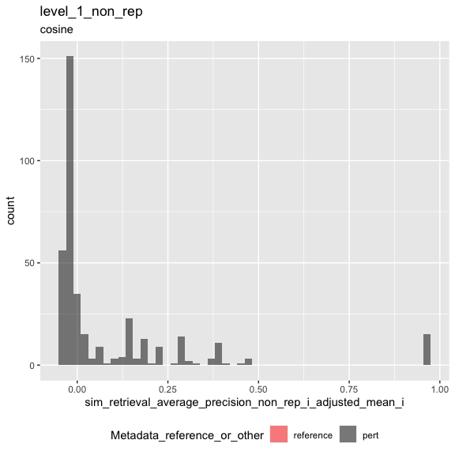
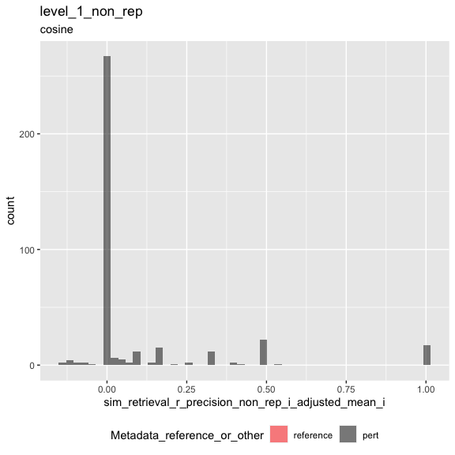
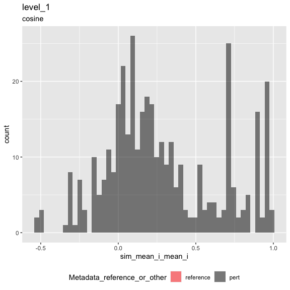
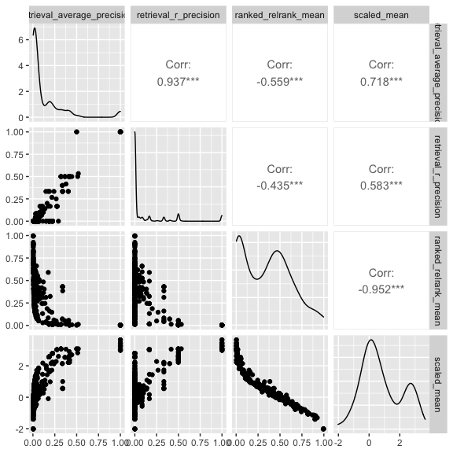

Inspect metrics
================

- <a href="#setup" id="toc-setup">1 Setup</a>
- <a href="#load-metrics" id="toc-load-metrics">2 Load metrics</a>
- <a href="#inspect-metrics" id="toc-inspect-metrics">3 Inspect
  metrics</a>
  - <a href="#functions" id="toc-functions">3.1 Functions</a>
  - <a href="#process-metrics" id="toc-process-metrics">3.2 Process
    metrics</a>
    - <a href="#level-1_0" id="toc-level-1_0">3.2.1 Level 1_0</a>
    - <a href="#level-1" id="toc-level-1">3.2.2 Level 1</a>
  - <a href="#compute-null-thresholds" id="toc-compute-null-thresholds">3.3
    Compute null thresholds</a>
  - <a href="#adjust-metrics" id="toc-adjust-metrics">3.4 Adjust metrics</a>
    - <a href="#level-1_0-1" id="toc-level-1_0-1">3.4.1 Level 1_0</a>
    - <a href="#level-1-1" id="toc-level-1-1">3.4.2 Level 1</a>
  - <a href="#plot-metrics" id="toc-plot-metrics">3.5 Plot metrics</a>
    - <a href="#level-1-2" id="toc-level-1-2">3.5.1 Level 1</a>

# 1 Setup

``` r
library(magrittr)
library(tidyverse)
library(glue)
library(arrow)
library(matric)
library(logger)
source("utils.R")
```

``` r
set.seed(params$random_seed)
```

``` r
knitr::opts_chunk$set(fig.height = 8, fig.width = 8, rows.print = 20)
```

``` r
cat(yaml::as.yaml(params))
```

    ## input_metrics_file_prefix: results/d895866b/metrics
    ## background_type: non_rep
    ## random_seed: 42

``` r
type <- params$background_type
```

# 2 Load metrics

``` r
metric_set_names <- c(glue("level_1_0_{type}"), glue("level_1_{type}"))

metric_sets <-
  map(metric_set_names, function(metric_set) {
    parquet_file <-
      with(params, glue("{input_metrics_file_prefix}_{metric_set}.parquet"))

    log_info("Reading {parquet_file} ...")

    arrow::read_parquet(glue(parquet_file))
  })

names(metric_sets) <- paste(metric_set_names, "metrics", sep = "_")

all_same_cols_rep <- attr(metric_sets[[1]], "all_same_cols_rep")
```

# 3 Inspect metrics

## 3.1 Functions

``` r
color_map <- c(
  "reference" = "red",
  "pert" = "black"
)

plot_metric <-
  function(metrics,
           metric_name,
           plot_title,
           plot_subtitle) {

    metric_sym <- sym(metric_name)

    p <-
      metrics %>%
      mutate(point_order = as.numeric(factor(
        Metadata_reference_or_other,
        levels = c("reference", "pert"),
        ordered = TRUE
      ))) %>%
      arrange(desc(point_order)) %>%
      ggplot(aes(!!metric_sym,
        fill = Metadata_reference_or_other
      )) +
      geom_histogram(
        position = "identity",
        alpha = 0.5,
        bins = 50
      ) +
      scale_fill_manual(values = color_map) +
      ggtitle(plot_title, subtitle = plot_subtitle) +
      theme(legend.position = "bottom")

    list(fig1 = p)
  }
```

``` r
#' Estimate statitics of the distribution of information retrieval metrics under the null hypothesis 
#'
#' @param m Number of positive examples (= number of replicates - 1)
#' @param n Number of negative examples (= number of controls, or number of non-replicates)
#' @param nn Number of simulations (default = 10000)
#'
#' @return statistics 
#'
retrieval_baseline <- function(m, n, nn = 10000, percentile = 0.90) {

  # average precision
  
  y_rank <- 1 - (seq(m + n) / (m + n))
  
  ap_empirical <-
    map_dbl(seq(nn), function(i) {
      x <- as.factor(sample(c(rep(FALSE, n), rep(TRUE, m))))
      
      yardstick::average_precision_vec(x, y_rank, event_level = "second")
      
    })
  
  average_precision_stat <- quantile(ap_empirical, c(percentile), names = FALSE)
  
  # R-precision

  k <- m
  
  r_precision_stat <-
    qhyper(p = percentile,
           m = m,
           n = n,
           k = k) / k
  
  data.frame(
    m = m, 
    n = n,
    sim_stat_average_precision_null = average_precision_stat,
    sim_stat_r_precision_null = r_precision_stat
  )
  
}
```

``` r
knitr::opts_chunk$set(fig.height = 6, fig.width = 6, rows.print = 20)
```

## 3.2 Process metrics

### 3.2.1 Level 1_0

``` r
level_1_0_metrics <-
  metric_sets[[glue("level_1_0_{type}_metrics")]]
```

``` r
cat(yaml::as.yaml(attr(level_1_0_metrics, "params")))
```

    ## prepare_data:
    ##   input_profile_files:
    ##   - tag: BR00116991
    ##     filename: /Users/shsingh/work/projects/2019_07_11_JUMP-CP/workspace/software/2021_Chandrasekaran_submitted/profiles/2020_11_04_CPJUMP1/BR00116991/BR00116991_normalized_feature_select_negcon_batch.csv.gz
    ##   - tag: BR00116992
    ##     filename: /Users/shsingh/work/projects/2019_07_11_JUMP-CP/workspace/software/2021_Chandrasekaran_submitted/profiles/2020_11_04_CPJUMP1/BR00116992/BR00116992_normalized_feature_select_negcon_batch.csv.gz
    ##   - tag: BR00116993
    ##     filename: /Users/shsingh/work/projects/2019_07_11_JUMP-CP/workspace/software/2021_Chandrasekaran_submitted/profiles/2020_11_04_CPJUMP1/BR00116993/BR00116993_normalized_feature_select_negcon_batch.csv.gz
    ##   - tag: BR00116994
    ##     filename: /Users/shsingh/work/projects/2019_07_11_JUMP-CP/workspace/software/2021_Chandrasekaran_submitted/profiles/2020_11_04_CPJUMP1/BR00116994/BR00116994_normalized_feature_select_negcon_batch.csv.gz
    ##   output_profile_file: results/d895866b/profiles.parquet
    ##   data_path: /Users/shsingh/work/projects/2019_07_11_JUMP-CP/workspace/software/2021_Chandrasekaran_submitted/profiles/2020_11_04_CPJUMP1
    ##   reference_set:
    ##     Metadata_control_type: negcon
    ##   random_seed: 42
    ##   external_metadata:
    ##     file: /Users/shsingh/work/projects/2019_07_11_JUMP-CP/workspace/software/2021_Chandrasekaran_submitted/benchmark/input/JUMP-Target-1_compound_metadata_additional_annotations.tsv
    ##     include_cols:
    ##     - Metadata_broad_sample
    ##     - Metadata_target_list
    ##     join_cols:
    ##       Metadata_broad_sample: Metadata_broad_sample
    ##   subsample_fraction: 1
    ##   subsample_pert_strata: ~
    ##   subsample_reference_strata: ~
    ##   shuffle: no
    ##   shuffle_bad_groups_threshold: ~
    ##   shuffle_group: ~
    ##   shuffle_strata: ~
    ##   shuffle_exclude: ~
    ##   aggregate_by:
    ##   - Metadata_broad_sample
    ##   - Metadata_control_type
    ##   - Metadata_Well
    ##   filter_by:
    ##     input_metrics_file_prefix: results/1f5aa646/metrics
    ##     metric_set: level_1_ref_null_adjusted
    ##     metric: sim_retrieval_average_precision_ref_i_adjusted_mean_i
    ##     threshold: 0
    ##   add_dummy_metadata_column: yes
    ##   split_rows_on_column: Metadata_target_list
    ## calculate_index:
    ##   input_profile_file: results/d895866b/profiles.parquet
    ##   output_index_file: results/d895866b/index.parquet
    ##   output_collatedindex_file: results/d895866b/collatedindex.parquet
    ##   sim_params:
    ##     reference:
    ##       Metadata_reference_or_other: reference
    ##     all_same_cols_ref: ~
    ##     all_same_cols_rep:
    ##     - Metadata_target_list_split
    ##     - Metadata_reference_or_other
    ##     all_same_cols_rep_ref: ~
    ##     any_different_cols_non_rep: Metadata_broad_sample
    ##     all_same_cols_non_rep: Metadata_dummy
    ##     all_different_cols_non_rep: Metadata_broad_sample
    ##     all_same_cols_group: ~
    ##     any_different_cols_group: ~
    ##     annotation_cols:
    ##     - Metadata_target_list_split
    ##     - Metadata_reference_or_other
    ## calculate_metrics:
    ##   input_profile_file: results/d895866b/profiles.parquet
    ##   input_collatedindex_file: results/d895866b/collatedindex.parquet
    ##   output_collatedsim_file: results/d895866b/collatedsim.parquet
    ##   output_metrics_file_prefix: results/d895866b/metrics
    ##   similarity_method: cosine
    ##   parallel_workers: 8

### 3.2.2 Level 1

``` r
level_1_metrics <-
  metric_sets[[glue("level_1_{type}_metrics")]]
```

``` r
cat(yaml::as.yaml(attr(level_1_metrics, "params")))
```

    ## prepare_data:
    ##   input_profile_files:
    ##   - tag: BR00116991
    ##     filename: /Users/shsingh/work/projects/2019_07_11_JUMP-CP/workspace/software/2021_Chandrasekaran_submitted/profiles/2020_11_04_CPJUMP1/BR00116991/BR00116991_normalized_feature_select_negcon_batch.csv.gz
    ##   - tag: BR00116992
    ##     filename: /Users/shsingh/work/projects/2019_07_11_JUMP-CP/workspace/software/2021_Chandrasekaran_submitted/profiles/2020_11_04_CPJUMP1/BR00116992/BR00116992_normalized_feature_select_negcon_batch.csv.gz
    ##   - tag: BR00116993
    ##     filename: /Users/shsingh/work/projects/2019_07_11_JUMP-CP/workspace/software/2021_Chandrasekaran_submitted/profiles/2020_11_04_CPJUMP1/BR00116993/BR00116993_normalized_feature_select_negcon_batch.csv.gz
    ##   - tag: BR00116994
    ##     filename: /Users/shsingh/work/projects/2019_07_11_JUMP-CP/workspace/software/2021_Chandrasekaran_submitted/profiles/2020_11_04_CPJUMP1/BR00116994/BR00116994_normalized_feature_select_negcon_batch.csv.gz
    ##   output_profile_file: results/d895866b/profiles.parquet
    ##   data_path: /Users/shsingh/work/projects/2019_07_11_JUMP-CP/workspace/software/2021_Chandrasekaran_submitted/profiles/2020_11_04_CPJUMP1
    ##   reference_set:
    ##     Metadata_control_type: negcon
    ##   random_seed: 42
    ##   external_metadata:
    ##     file: /Users/shsingh/work/projects/2019_07_11_JUMP-CP/workspace/software/2021_Chandrasekaran_submitted/benchmark/input/JUMP-Target-1_compound_metadata_additional_annotations.tsv
    ##     include_cols:
    ##     - Metadata_broad_sample
    ##     - Metadata_target_list
    ##     join_cols:
    ##       Metadata_broad_sample: Metadata_broad_sample
    ##   subsample_fraction: 1
    ##   subsample_pert_strata: ~
    ##   subsample_reference_strata: ~
    ##   shuffle: no
    ##   shuffle_bad_groups_threshold: ~
    ##   shuffle_group: ~
    ##   shuffle_strata: ~
    ##   shuffle_exclude: ~
    ##   aggregate_by:
    ##   - Metadata_broad_sample
    ##   - Metadata_control_type
    ##   - Metadata_Well
    ##   filter_by:
    ##     input_metrics_file_prefix: results/1f5aa646/metrics
    ##     metric_set: level_1_ref_null_adjusted
    ##     metric: sim_retrieval_average_precision_ref_i_adjusted_mean_i
    ##     threshold: 0
    ##   add_dummy_metadata_column: yes
    ##   split_rows_on_column: Metadata_target_list
    ## calculate_index:
    ##   input_profile_file: results/d895866b/profiles.parquet
    ##   output_index_file: results/d895866b/index.parquet
    ##   output_collatedindex_file: results/d895866b/collatedindex.parquet
    ##   sim_params:
    ##     reference:
    ##       Metadata_reference_or_other: reference
    ##     all_same_cols_ref: ~
    ##     all_same_cols_rep:
    ##     - Metadata_target_list_split
    ##     - Metadata_reference_or_other
    ##     all_same_cols_rep_ref: ~
    ##     any_different_cols_non_rep: Metadata_broad_sample
    ##     all_same_cols_non_rep: Metadata_dummy
    ##     all_different_cols_non_rep: Metadata_broad_sample
    ##     all_same_cols_group: ~
    ##     any_different_cols_group: ~
    ##     annotation_cols:
    ##     - Metadata_target_list_split
    ##     - Metadata_reference_or_other
    ## calculate_metrics:
    ##   input_profile_file: results/d895866b/profiles.parquet
    ##   input_collatedindex_file: results/d895866b/collatedindex.parquet
    ##   output_collatedsim_file: results/d895866b/collatedsim.parquet
    ##   output_metrics_file_prefix: results/d895866b/metrics
    ##   similarity_method: cosine
    ##   parallel_workers: 8

## 3.3 Compute null thresholds

``` r
level_1_0_metrics %>%
  distinct(across(all_of(c(
    glue("sim_stat_signal_n_{type}_i"),
    glue("sim_stat_background_n_{type}_i")
  ))))
```

| sim_stat_signal_n\_non_rep_i | sim_stat_background_n\_non_rep_i |
|-----------------------------:|---------------------------------:|
|                            1 |                              287 |
|                            2 |                              287 |
|                            3 |                              287 |
|                            4 |                              287 |
|                            9 |                              287 |
|                            6 |                              287 |
|                            5 |                              287 |
|                            8 |                              287 |
|                            1 |                              286 |
|                            4 |                              286 |
|                            3 |                              286 |
|                            5 |                              286 |
|                            7 |                              287 |
|                            2 |                              286 |
|                            8 |                              286 |
|                            6 |                              286 |

``` r
pow <- 1.3
points <- level_1_0_metrics[[glue("sim_stat_background_n_{type}_i")]]
max_value <- max(points)
break_point <- ceiling(seq(1, ceiling((max_value)^(1/pow)), 1)**(pow))
points_mapped <- points %>% map_dbl(function(i) break_point[min(which(break_point > i))])

level_1_0_metrics <-
  level_1_0_metrics %>%
  mutate(sim_stat_background_n_mapped = points_mapped)
```

``` r
level_1_0_metrics %>%
  distinct(across(all_of(c(
    glue("sim_stat_signal_n_{type}_i"),
    "sim_stat_background_n_mapped"
    #glue("sim_stat_background_n_{type}_i")
  ))))
```

| sim_stat_signal_n\_non_rep_i | sim_stat_background_n\_mapped |
|-----------------------------:|------------------------------:|
|                            1 |                           289 |
|                            2 |                           289 |
|                            3 |                           289 |
|                            4 |                           289 |
|                            9 |                           289 |
|                            6 |                           289 |
|                            5 |                           289 |
|                            8 |                           289 |
|                            7 |                           289 |

``` r
future::plan(future::multisession, workers = 14)
```

``` r
null_thresholds <-
  level_1_0_metrics %>%
  distinct(across(all_of(c(
    glue("sim_stat_signal_n_{type}_i"),
    "sim_stat_background_n_mapped"
    #glue("sim_stat_background_n_{type}_i")
  )))) %>%
  rename(m = 1, n = 2) %>%
  furrr::future_pmap_dfr(function(m, n)
  {
    log_info("Compute retrieval random baseline for m = {m}, n = {n}")
    retrieval_baseline(m = m, n = n)
  },
  .options = furrr::furrr_options(seed = params$random_seed))

null_thresholds %>%
  arrange(m, n)
```

|   m |   n | sim_stat_average_precision_null | sim_stat_r\_precision_null |
|----:|----:|--------------------------------:|---------------------------:|
|   1 | 289 |                       0.0344828 |                  0.0000000 |
|   2 | 289 |                       0.0434876 |                  0.0000000 |
|   3 | 289 |                       0.0490047 |                  0.0000000 |
|   4 | 289 |                       0.0554717 |                  0.0000000 |
|   5 | 289 |                       0.0601857 |                  0.0000000 |
|   6 | 289 |                       0.0657854 |                  0.1666667 |
|   7 | 289 |                       0.0706246 |                  0.1428571 |
|   8 | 289 |                       0.0717248 |                  0.1250000 |
|   9 | 289 |                       0.0767943 |                  0.1111111 |

``` r
join_vars <- c("m", "n")
names(join_vars) <-
  c(glue("sim_stat_signal_n_{type}_i"),
    "sim_stat_background_n_mapped")
join_vars
```

    ##  sim_stat_signal_n_non_rep_i sim_stat_background_n_mapped 
    ##                          "m"                          "n"

``` r
level_1_0_metrics <-
  level_1_0_metrics %>%
  inner_join(null_thresholds,
             by = join_vars)
```

## 3.4 Adjust metrics

### 3.4.1 Level 1_0

``` r
sim_retrieval_average_precision_type_i_adjusted <-
  glue("sim_retrieval_average_precision_{type}_i_adjusted")

sim_retrieval_r_precision_type_i_adjusted <-
  glue("sim_retrieval_r_precision_{type}_i_adjusted")

level_1_0_metrics_null_adjusted <-
  level_1_0_metrics %>%
  mutate(
    "{sim_retrieval_average_precision_type_i_adjusted}" :=
      .data[[glue("sim_retrieval_average_precision_{type}_i")]] - sim_stat_average_precision_null,
    "{sim_retrieval_r_precision_type_i_adjusted}" :=
      .data[[glue("sim_retrieval_r_precision_{type}_i")]] - sim_stat_r_precision_null
  )
```

### 3.4.2 Level 1

``` r
summary_cols <- attr(level_1_0_metrics, "all_same_cols_rep")

annotation_cols <- attr(level_1_0_metrics, "params")$calculate_index$sim_params$annotation_cols

annotation_cols_full <- unique(c(summary_cols, annotation_cols))

metadata <-
  level_1_0_metrics %>%
  dplyr::distinct(across(all_of(annotation_cols_full)))
```

``` r
level_1_metrics_null_adjusted <- 
  level_1_0_metrics_null_adjusted %>%
  ungroup() %>%
  group_by(dplyr::across(dplyr::all_of(summary_cols))) %>%
  summarise(across(starts_with("sim_"),
                   list(mean_i = mean, median_i = median)),
            .groups = "keep") %>%
  dplyr::inner_join(metadata, by = summary_cols) %>%
  dplyr::select(all_of(annotation_cols_full), dplyr::everything()) %>%
  ungroup()
```

``` r
stopifnot(
  compare::compare(
    level_1_metrics_null_adjusted %>%
      select(all_of(names(level_1_metrics))),
    level_1_metrics,
    ignoreAttrs = TRUE
  )$result
)
```

``` r
metric_set <- glue("level_1_{type}_null_adjusted")

parquet_file <-
  with(params,
       glue("{input_metrics_file_prefix}_{metric_set}.parquet"))

log_info("Writing {parquet_file} ...")

level_1_metrics_null_adjusted %>%
  arrow::write_parquet(glue(parquet_file))
```

## 3.5 Plot metrics

### 3.5.1 Level 1

``` r
result <-
  plot_metric(
    level_1_metrics_null_adjusted,
    glue("sim_retrieval_average_precision_{type}_i_adjusted_mean_i"),
    glue("level_1_{type}"),
    attr(level_1_metrics, "metric_metadata")$method
  )
result$fig1
```

<!-- -->

``` r
level_1_metrics_null_adjusted %>%
  mutate(above_threshold =
           .data[[glue("sim_retrieval_average_precision_{type}_i_adjusted_mean_i")]] > 0) %>%
  count(above_threshold)
```

| above_threshold |   n |
|:----------------|----:|
| FALSE           | 217 |
| TRUE            | 161 |

``` r
result <-
  plot_metric(
    level_1_metrics_null_adjusted,
    glue("sim_retrieval_r_precision_{type}_i_adjusted_mean_i"),
    glue("level_1_{type}"),
    attr(level_1_metrics, "metric_metadata")$method
  )
result$fig1
```

<!-- -->

``` r
level_1_metrics_null_adjusted %>%
  mutate(above_threshold =
           .data[[glue("sim_retrieval_r_precision_{type}_i_adjusted_mean_i")]] > 0) %>%
  count(above_threshold)
```

| above_threshold |   n |
|:----------------|----:|
| FALSE           | 278 |
| TRUE            | 100 |

``` r
result <-
  plot_metric(
    level_1_metrics,
    "sim_mean_i_mean_i",
    "level_1",
    attr(level_1_metrics, "metric_metadata")$method
  )
result$fig1
```

<!-- -->

``` r
result <-
  plot_metric(
    level_1_metrics,
    glue("sim_scaled_mean_{type}_i_mean_i"),
    glue("level_1_{type}"),
    attr(level_1_metrics, "metric_metadata")$method
  )
result$fig1
```

<!-- -->

``` r
level_1_metrics %>%
  arrange(across(everything())) %>%
  head()
```

| Metadata_target_list_split | Metadata_reference_or_other | sim_scaled_mean_non_rep_i\_mean_i | sim_scaled_mean_non_rep_i\_median_i | sim_scaled_median_non_rep_i\_mean_i | sim_scaled_median_non_rep_i\_median_i | sim_ranked_relrank_mean_non_rep_i\_mean_i | sim_ranked_relrank_mean_non_rep_i\_median_i | sim_ranked_relrank_median_non_rep_i\_mean_i | sim_ranked_relrank_median_non_rep_i\_median_i | sim_mean_i\_mean_i | sim_mean_i\_median_i | sim_median_i\_mean_i | sim_median_i\_median_i | sim_mean_stat_non_rep_i\_mean_i | sim_mean_stat_non_rep_i\_median_i | sim_sd_stat_non_rep_i\_mean_i | sim_sd_stat_non_rep_i\_median_i | sim_stat_signal_n\_non_rep_i\_mean_i | sim_stat_signal_n\_non_rep_i\_median_i | sim_stat_background_n\_non_rep_i\_mean_i | sim_stat_background_n\_non_rep_i\_median_i | sim_retrieval_average_precision_non_rep_i\_mean_i | sim_retrieval_average_precision_non_rep_i\_median_i | sim_retrieval_r\_precision_non_rep_i\_mean_i | sim_retrieval_r\_precision_non_rep_i\_median_i |
|:---------------------------|:----------------------------|----------------------------------:|------------------------------------:|------------------------------------:|--------------------------------------:|------------------------------------------:|--------------------------------------------:|--------------------------------------------:|----------------------------------------------:|-------------------:|---------------------:|---------------------:|-----------------------:|--------------------------------:|----------------------------------:|------------------------------:|--------------------------------:|-------------------------------------:|---------------------------------------:|-----------------------------------------:|-------------------------------------------:|--------------------------------------------------:|----------------------------------------------------:|---------------------------------------------:|-----------------------------------------------:|
| ABCB11                     | pert                        |                        -0.6070673 |                          -0.6070673 |                          -0.6070673 |                            -0.6070673 |                                 0.6951220 |                                   0.6951220 |                                   0.6951220 |                                     0.6951220 |         -0.0699479 |           -0.0699479 |           -0.0699479 |             -0.0699479 |                       0.0617107 |                         0.0617107 |                     0.2320693 |                       0.2320693 |                                    1 |                                      1 |                                      287 |                                        287 |                                         0.0050832 |                                           0.0050832 |                                    0.0000000 |                                              0 |
| ABCC8                      | pert                        |                        -0.6239571 |                          -0.6239571 |                          -0.6239571 |                            -0.6239571 |                                 0.7073171 |                                   0.7073171 |                                   0.7073171 |                                     0.7073171 |         -0.1702367 |           -0.1702367 |           -0.1702367 |             -0.1702367 |                      -0.0030107 |                        -0.0030107 |                     0.2686182 |                       0.2686182 |                                    1 |                                      1 |                                      287 |                                        287 |                                         0.0049077 |                                           0.0049077 |                                    0.0000000 |                                              0 |
| ABL1                       | pert                        |                         0.0532393 |                           0.1653979 |                           0.1154884 |                             0.1057715 |                                 0.4957027 |                                   0.4588850 |                                   0.4378630 |                                     0.4111498 |          0.0899669 |            0.1337278 |            0.1170768 |              0.1322495 |                       0.0879220 |                         0.0850243 |                     0.2781174 |                       0.2829045 |                                    5 |                                      5 |                                      287 |                                        287 |                                         0.0352972 |                                           0.0316371 |                                    0.0333333 |                                              0 |
| ADA                        | pert                        |                         0.8111158 |                           0.8111158 |                           0.8111158 |                             0.8111158 |                                 0.2090592 |                                   0.2090592 |                                   0.2090592 |                                     0.2090592 |          0.3231331 |            0.3231331 |            0.3231331 |              0.3231331 |                       0.0908182 |                         0.0908182 |                     0.2900055 |                       0.2900055 |                                    1 |                                      1 |                                      287 |                                        287 |                                         0.0164642 |                                           0.0164642 |                                    0.0000000 |                                              0 |
| ADAM28                     | pert                        |                        -0.1602428 |                          -0.1602428 |                          -0.1602428 |                            -0.1602428 |                                 0.5139373 |                                   0.5139373 |                                   0.5139373 |                                     0.5139373 |          0.0260308 |            0.0260308 |            0.0260308 |              0.0260308 |                       0.0721306 |                         0.0721306 |                     0.2852825 |                       0.2852825 |                                    1 |                                      1 |                                      287 |                                        287 |                                         0.0067341 |                                           0.0067341 |                                    0.0000000 |                                              0 |
| ADORA1                     | pert                        |                         0.4370031 |                           0.4370031 |                           0.4370031 |                             0.4370031 |                                 0.3484321 |                                   0.3484321 |                                   0.3484321 |                                     0.3484321 |          0.1740645 |            0.1740645 |            0.1740645 |              0.1740645 |                       0.0676084 |                         0.0676084 |                     0.2463685 |                       0.2463685 |                                    1 |                                      1 |                                      287 |                                        287 |                                         0.0108590 |                                           0.0108590 |                                    0.0000000 |                                              0 |

``` r
level_1_metrics %>%
  select(all_of(c(
    glue("sim_retrieval_average_precision_{type}_i_mean_i"),
    glue("sim_retrieval_r_precision_{type}_i_mean_i"),
    glue("sim_ranked_relrank_mean_{type}_i_mean_i"),
    glue("sim_scaled_mean_{type}_i_mean_i")
  ))) %>%
  rename_with( ~ str_remove_all(., glue("sim_|_{type}_i_mean_i")), matches("sim_")) %>%
  GGally::ggpairs(progress = FALSE)
```

<!-- -->
\# Checks

``` r
profiles <-
  arrow::read_parquet(attributes(level_1_0_metrics)$params$calculate_metrics$input_profile_file)
```

``` r
metrics_counts <-
  level_1_metrics_null_adjusted %>% 
  count(sim_stat_signal_n_non_rep_i_mean_i) %>% 
  mutate(n_perts = sim_stat_signal_n_non_rep_i_mean_i + 1) %>% 
  select(n_perts, n_groups = n) %>% 
  arrange(n_perts)

metrics_counts
```

| n_perts | n_groups |
|--------:|---------:|
|       2 |      205 |
|       3 |       79 |
|       4 |       50 |
|       5 |       18 |
|       6 |       13 |
|       7 |        6 |
|       8 |        3 |
|       9 |        2 |
|      10 |        2 |

``` r
if(!is.null(attributes(level_1_0_metrics)$params$prepare_data$split_rows_on_column)) {
  split_col <-
    str_c(
      attributes(level_1_0_metrics)$params$prepare_data$split_rows_on_column,
      "_split"
    )
  
  profiles_counts <-
    profiles %>%
    filter(Metadata_reference_or_other != "reference") %>%
    count(across(all_of(c(split_col))), name = "n_perts") %>%
    count(n_perts, name = "n_groups") %>%
    filter(n_perts > 1) %>%
    arrange(n_perts)
  
  stopifnot(compare::compare(metrics_counts, profiles_counts, ignoreAttrs = TRUE)$result)
}
```
