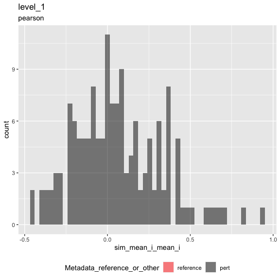
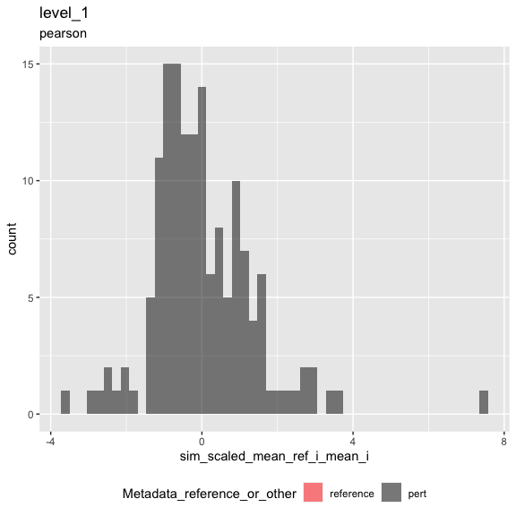
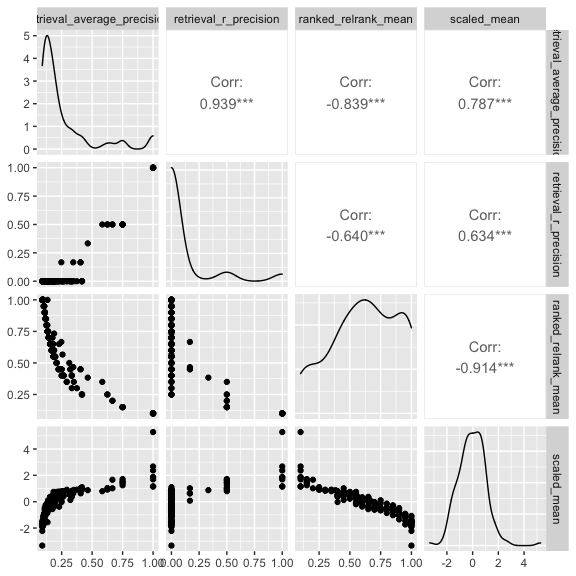

Inspect metrics
================

-   [1 Setup](#setup)
-   [2 Load metrics](#load-metrics)
-   [3 Inspect metrics](#inspect-metrics)
    -   [3.1 Functions](#functions)
    -   [3.2 Process metrics](#process-metrics)
        -   [3.2.1 Level 1](#level-1)
    -   [3.3 Plot metrics](#plot-metrics)
        -   [3.3.1 Level 1](#level-1-1)

# 1 Setup

``` r
library(magrittr)
library(tidyverse)
library(glue)
library(arrow)
library(matric)
library(logger)
source("utils.R")
```

``` r
knitr::opts_chunk$set(fig.height = 8, fig.width = 8, rows.print = 20)
```

``` r
cat(yaml::as.yaml(params))
```

    ## input_metrics_file_prefix: results/test/metrics

# 2 Load metrics

``` r
metric_set_names <- c("level_1")

metric_sets <-
  map(metric_set_names, function(metric_set) {
    parquet_file <-
      with(params, glue("{input_metrics_file_prefix}_{metric_set}.parquet"))

    log_info("Reading {parquet_file} ...")

    arrow::read_parquet(glue(parquet_file))
  })

names(metric_sets) <- paste(metric_set_names, "metrics", sep = "_")

all_same_cols_rep <- attr(metric_sets[[1]], "all_same_cols_rep")
```

# 3 Inspect metrics

## 3.1 Functions

``` r
color_map <- c(
  "reference" = "red",
  "pert" = "black"
)

plot_metric <-
  function(metrics,
           metric_name,
           plot_title,
           plot_subtitle) {

    metric_sym <- sym(metric_name)

    p <-
      metrics %>%
      mutate(point_order = as.numeric(factor(
        Metadata_reference_or_other,
        levels = c("reference", "pert"),
        ordered = TRUE
      ))) %>%
      arrange(desc(point_order)) %>%
      ggplot(aes(!!metric_sym,
        fill = Metadata_reference_or_other
      )) +
      geom_histogram(
        position = "identity",
        alpha = 0.5,
        bins = 50
      ) +
      scale_fill_manual(values = color_map) +
      ggtitle(plot_title, subtitle = plot_subtitle) +
      theme(legend.position = "bottom")

    list(fig1 = p)
  }
```

``` r
knitr::opts_chunk$set(fig.height = 6, fig.width = 6, rows.print = 20)
```

## 3.2 Process metrics

### 3.2.1 Level 1

``` r
level_1_metrics <-
  metric_sets[["level_1_metrics"]]
```

``` r
cat(yaml::as.yaml(attr(level_1_metrics, "params")))
```

    ## prepare_data:
    ##   data_path: https://github.com/broadinstitute/grit-benchmark/raw/main/1.calculate-metrics/cell-health/data/
    ##   input_profile_files:
    ##     a:
    ##       tag: cellhealth
    ##       filename: https://github.com/broadinstitute/grit-benchmark/raw/main/1.calculate-metrics/cell-health/data/cell_health_merged_feature_select.csv.gz
    ##   output_profile_file: results/test/profiles.parquet
    ##   aggregate_by:
    ##   - Metadata_cell_line
    ##   - Metadata_gene_name
    ##   - Metadata_pert_name
    ##   reference_set:
    ##     Metadata_gene_name:
    ##     - Chr2
    ##     - Luc
    ##     - LacZ
    ##   random_seed: 42
    ##   shuffle: yes
    ##   shuffle_bad_groups_threshold: 0.1
    ##   shuffle_group: Metadata_gene_name
    ##   shuffle_strata: ~
    ##   shuffle_exclude:
    ##     Metadata_gene_name:
    ##     - Chr2
    ##     - Luc
    ##     - LacZ
    ##     - EMPTY
    ##   subsample_fraction: 1
    ##   subsample_pert_strata: Metadata_gene_name
    ##   subsample_reference_strata: Metadata_Well
    ## calculate_index:
    ##   input_profile_file: results/test/profiles.parquet
    ##   output_index_file: results/test/index.parquet
    ##   output_collatedindex_file: results/test/collatedindex.parquet
    ##   sim_params:
    ##     drop_group:
    ##       Metadata_gene_name: EMPTY
    ##     reference:
    ##       Metadata_reference_or_other: reference
    ##     all_same_cols_ref: Metadata_cell_line
    ##     all_same_cols_rep:
    ##     - Metadata_cell_line
    ##     - Metadata_gene_name
    ##     - Metadata_reference_or_other
    ##     all_same_cols_rep_ref: ~
    ##     any_different_cols_non_rep: ~
    ##     all_same_cols_non_rep: ~
    ##     all_different_cols_non_rep: ~
    ##     all_same_cols_group: ~
    ##     any_different_cols_group: ~
    ##     annotation_cols:
    ##     - Metadata_cell_line
    ##     - Metadata_gene_name
    ##     - Metadata_reference_or_other
    ## calculate_metrics:
    ##   input_profile_file: results/test/profiles.parquet
    ##   input_collatedindex_file: results/test/collatedindex.parquet
    ##   output_collatedsim_file: results/test/collatedsim.parquet
    ##   output_metrics_file_prefix: results/test/metrics
    ##   similarity_method: pearson
    ##   parallel_workers: 4

## 3.3 Plot metrics

### 3.3.1 Level 1

``` r
result <-
  plot_metric(
    level_1_metrics,
    "sim_mean_i_mean_i",
    "level_1",
    attr(level_1_metrics, "metric_metadata")$method
  )
result$fig1
```

<!-- -->

``` r
result <-
  plot_metric(
    level_1_metrics,
    "sim_scaled_mean_ref_i_mean_i",
    "level_1",
    attr(level_1_metrics, "metric_metadata")$method
  )
result$fig1
```

<!-- -->

``` r
level_1_metrics %>%
  arrange(across(everything())) %>%
  head()
```

<div class="kable-table">

| Metadata\_cell\_line | Metadata\_gene\_name | Metadata\_reference\_or\_other | sim\_scaled\_mean\_ref\_i\_mean\_i | sim\_scaled\_mean\_ref\_i\_median\_i | sim\_scaled\_median\_ref\_i\_mean\_i | sim\_scaled\_median\_ref\_i\_median\_i | sim\_ranked\_relrank\_mean\_ref\_i\_mean\_i | sim\_ranked\_relrank\_mean\_ref\_i\_median\_i | sim\_ranked\_relrank\_median\_ref\_i\_mean\_i | sim\_ranked\_relrank\_median\_ref\_i\_median\_i | sim\_mean\_i\_mean\_i | sim\_mean\_i\_median\_i | sim\_median\_i\_mean\_i | sim\_median\_i\_median\_i | sim\_mean\_stat\_ref\_i\_mean\_i | sim\_mean\_stat\_ref\_i\_median\_i | sim\_sd\_stat\_ref\_i\_mean\_i | sim\_sd\_stat\_ref\_i\_median\_i | sim\_stat\_signal\_n\_ref\_i\_mean\_i | sim\_stat\_signal\_n\_ref\_i\_median\_i | sim\_stat\_background\_n\_ref\_i\_mean\_i | sim\_stat\_background\_n\_ref\_i\_median\_i | sim\_retrieval\_average\_precision\_ref\_i\_mean\_i | sim\_retrieval\_average\_precision\_ref\_i\_median\_i | sim\_retrieval\_r\_precision\_ref\_i\_mean\_i | sim\_retrieval\_r\_precision\_ref\_i\_median\_i |
|:---------------------|:---------------------|:-------------------------------|-----------------------------------:|-------------------------------------:|-------------------------------------:|---------------------------------------:|--------------------------------------------:|----------------------------------------------:|----------------------------------------------:|------------------------------------------------:|----------------------:|------------------------:|------------------------:|--------------------------:|---------------------------------:|-----------------------------------:|-------------------------------:|---------------------------------:|--------------------------------------:|----------------------------------------:|------------------------------------------:|--------------------------------------------:|----------------------------------------------------:|------------------------------------------------------:|----------------------------------------------:|------------------------------------------------:|
| A549                 | AKT1                 | pert                           |                          0.6502805 |                            0.6502805 |                            0.6502805 |                              0.6502805 |                                   0.5000000 |                                          0.50 |                                     0.5000000 |                                            0.50 |             0.2193151 |               0.2193151 |               0.2193151 |                 0.2193151 |                        0.1117065 |                          0.1117065 |                      0.2894872 |                        0.2894872 |                                     1 |                                       1 |                                        10 |                                          10 |                                           0.2380952 |                                             0.2380952 |                                     0.0000000 |                                             0.0 |
| A549                 | ARID1B               | pert                           |                          0.3974144 |                            0.3974144 |                            0.3974144 |                              0.3974144 |                                   0.4500000 |                                          0.45 |                                     0.4500000 |                                            0.45 |             0.3023586 |               0.3023586 |               0.3023586 |                 0.3023586 |                        0.1737847 |                          0.1737847 |                      0.4326716 |                        0.4326716 |                                     1 |                                       1 |                                        10 |                                          10 |                                           0.2500000 |                                             0.2500000 |                                     0.0000000 |                                             0.0 |
| A549                 | ATF4                 | pert                           |                          0.8586837 |                            0.8586837 |                            0.8586837 |                              0.8586837 |                                   0.3000000 |                                          0.30 |                                     0.3000000 |                                            0.30 |             0.6939861 |               0.6939861 |               0.6939861 |                 0.6939861 |                        0.2744908 |                          0.2744908 |                      0.5086210 |                        0.5086210 |                                     1 |                                       1 |                                        10 |                                          10 |                                           0.6000000 |                                             0.6000000 |                                     0.5000000 |                                             0.5 |
| A549                 | ATP50                | pert                           |                          0.8947959 |                            0.8947959 |                            0.8947959 |                              0.8947959 |                                   0.3500000 |                                          0.35 |                                     0.3500000 |                                            0.35 |             0.4614682 |               0.4614682 |               0.4614682 |                 0.4614682 |                        0.2042075 |                          0.2042075 |                      0.3924363 |                        0.3924363 |                                     1 |                                       1 |                                        10 |                                          10 |                                           0.5833333 |                                             0.5833333 |                                     0.5000000 |                                             0.5 |
| A549                 | BCL2                 | pert                           |                         -0.6206593 |                           -0.6206593 |                           -0.6206593 |                             -0.6206593 |                                   0.8500000 |                                          0.85 |                                     0.8500000 |                                            0.85 |            -0.1103330 |              -0.1103330 |              -0.1103330 |                -0.1103330 |                        0.1297423 |                          0.1297423 |                      0.3787795 |                        0.3787795 |                                     1 |                                       1 |                                        10 |                                          10 |                                           0.1180556 |                                             0.1180556 |                                     0.0000000 |                                             0.0 |
| A549                 | BCL2L2               | pert                           |                          1.3076121 |                            0.5969137 |                            1.3076121 |                              0.5969137 |                                   0.4166667 |                                          0.55 |                                     0.4166667 |                                            0.55 |             0.2839767 |               0.2387223 |               0.2839767 |                 0.2387223 |                        0.1061652 |                          0.1548000 |                      0.2432199 |                        0.3138621 |                                     2 |                                       2 |                                        10 |                                          10 |                                           0.4920635 |                                             0.2500000 |                                     0.3333333 |                                             0.0 |

</div>

``` r
level_1_metrics %>%
  select(
    sim_retrieval_average_precision_ref_i_mean_i,
    sim_retrieval_r_precision_ref_i_mean_i,
    sim_ranked_relrank_mean_ref_i_mean_i,
    sim_scaled_mean_ref_i_mean_i
  ) %>%
  rename_with(~ str_remove_all(., "sim_|_ref_i_mean_i"), matches("sim_")) %>%
  GGally::ggpairs(progress = FALSE)
```

<!-- -->
